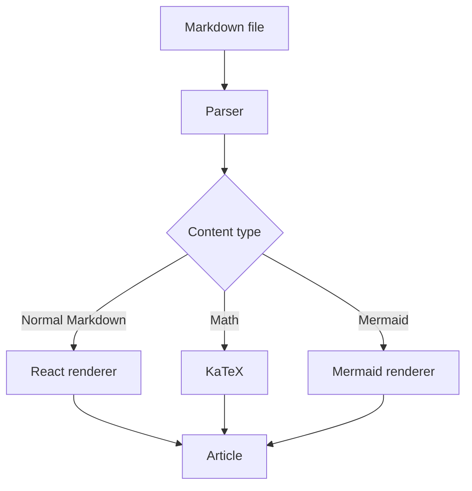
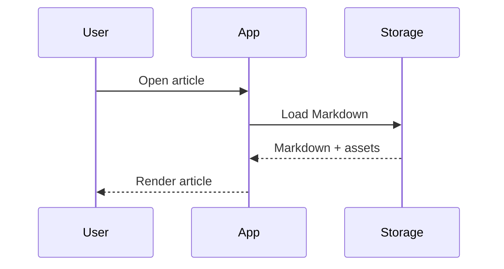
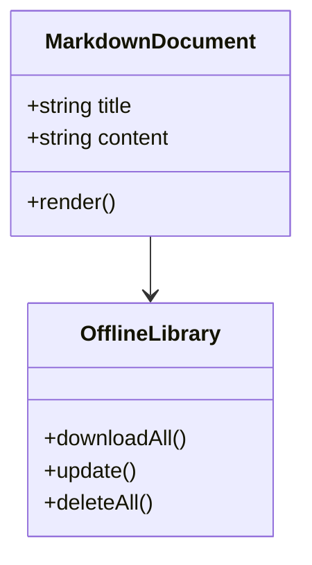

# MDHoriZon — Golden Test Document

This document is the permanent rendering fixture for MDHoriZon.

It is intentionally broad. It is not intended to be beautiful content; it is intended to expose rendering regressions.

---

# 1. Headings

## Heading level 2

### Heading level 3

#### Heading level 4

##### Heading level 5

###### Heading level 6

---

# 2. Paragraphs and Inline Formatting

This is a normal paragraph with **bold text**, *italic text*, ***bold italic text***, and ~~strikethrough~~.

Here is `inline code`, an escaped character \*that should not become italic\*, and special characters:

`& < > " ' © ® ™ € £ ¥`

---

# 3. Links

- External link: [GitHub](https://github.com/)
- Relative link: [Another article](../articles/example.md)
- Anchor link: [Go to Mermaid](#12-mermaid)
- Email-style text: `example@example.com`

---

# 4. Images

Remote image example:


Relative image example:


Missing image example:


Image used as a link:

[](https://github.com/)

---

# 5. Lists

## Unordered

- First item
- Second item
  - Nested item
  - Another nested item
    - Third level
- Final item

## Ordered

1. First
2. Second
   1. Nested first
   2. Nested second
3. Third

## Task list

- [x] Completed item
- [ ] Pending item
- [ ] Another pending item

---

# 6. Blockquotes

> This is a blockquote.
>
> It contains multiple paragraphs.

> Nested example:
>
> > Inner quotation.

---

# 7. Code Blocks

## Bash

```bash
#!/usr/bin/env bash

echo "Hello from MDHoriZon"
printf 'Current directory: %s\n' "$PWD"
```

## Python

```python
from pathlib import Path

root = Path(".")
for path in root.rglob("*.md"):
    print(path)
```

## JavaScript

```javascript
const message = "Hello, MDHoriZon!";
console.log(message);
```

## TypeScript

```typescript
interface Article {
  title: string;
  tags: string[];
  offline: boolean;
}

const article: Article = {
  title: "Golden Test",
  tags: ["markdown", "testing"],
  offline: true,
};
```

## JSON

```json
{
  "name": "MDHoriZon",
  "offline": true,
  "features": ["GFM", "KaTeX", "Mermaid"]
}
```

## HTML

```html
<article>
  <h1>Example</h1>
  <p>HTML should be handled according to the project's security policy.</p>
</article>
```

## CSS

```css
.article {
  max-width: 72rem;
  margin-inline: auto;
  padding: 1rem;
}
```

## Unknown language

```not-a-real-language
This must still render as readable code.
```

## Long line

```text
This is intentionally an extremely long line intended to verify horizontal scrolling rather than forcing the entire document or viewport to become unnecessarily wide on desktop or mobile devices.
```

---

# 8. Tables

## Small table

| Name | Type |
|---|---|
| Markdown | Content |
| React | UI |
| Mermaid | Diagram |

## Three columns

| Feature | Web | Mobile |
|---|---:|---:|
| Markdown | Yes | Yes |
| Offline | Optional | Yes |
| Mermaid | Yes | Yes |

## Wide table — 12 columns

| C1 | C2 | C3 | C4 | C5 | C6 | C7 | C8 | C9 | C10 | C11 | C12 |
|---|---|---|---|---|---|---|---|---|---|---|---|
| A1 | A2 | A3 | A4 | A5 | A6 | A7 | A8 | A9 | A10 | A11 | A12 |
| B1 | B2 | B3 | B4 | B5 | B6 | B7 | B8 | B9 | B10 | B11 | B12 |

## Formatted cells

| Feature | Example |
|---|---|
| Bold | **important** |
| Italic | *emphasis* |
| Code | `npm install` |
| Link | [GitHub](https://github.com/) |
| Long text | This is a deliberately long cell that should remain readable without breaking the table layout. |

---

# 9. Horizontal Rule

Content before the rule.

---

Content after the rule.

---

# 10. Escaping and Special Characters

Literal Markdown characters:

\*asterisk\*  
\_underscore\_  
\[brackets\]  
\# hash  
\> greater-than

HTML entities:

`&amp;` &amp;  
`&lt;` &lt;  
`&gt;` &gt;

---

# 11. Mathematics

## Inline

Einstein's famous equation is $E = mc^2$.

Another example: $a^2 + b^2 = c^2$.

## Display

$$
\int_0^\infty e^{-x}\,dx = 1
$$

## Fraction

$$
\frac{a}{b} + \frac{c}{d}
$$

## Sum

$$
\sum_{i=1}^{n} i = \frac{n(n+1)}{2}
$$

## Matrix

$$
\begin{bmatrix}
1 & 2 & 3 \\
4 & 5 & 6 \\
7 & 8 & 9
\end{bmatrix}
$$

## Long expression

$$
\frac{\partial}{\partial t}
\left(
\frac{1}{2}\rho |\mathbf{u}|^2
\right)
+
\nabla \cdot
\left[
\left(
\frac{1}{2}\rho |\mathbf{u}|^2 + p
\right)\mathbf{u}
\right]
= 0
$$

---

# 12. Mermaid

## Flowchart



## Sequence diagram



## Class-style example



---

# 13. Frontmatter

The following is an example of frontmatter syntax:

```yaml
---
title: Golden Test Document
description: MDHoriZon renderer validation fixture
date: 2026-09-13
tags:
  - markdown
  - testing
  - mdhorizon
---
```

The application must decide whether frontmatter is removed before rendering and how metadata is consumed.

---

# 14. Raw HTML and Security

The following is intentionally included to verify the project's raw-HTML policy.

```html
<strong>Raw HTML test</strong>
```

Potentially dangerous examples must be tested by automated security fixtures rather than relying on visual inspection:

```html
<script>alert("unsafe")</script>
```

```html

```

```html
<a href="javascript:alert('unsafe')">unsafe link</a>
```

Expected behavior is determined by the project's explicit sanitization policy.

---

# 15. Nested Content

> **Important note**
>
> - List inside a quote
> - Another item
>
> ```bash
> echo "code inside quote"
> ```

---

# 16. Content Mixing

A document can contain **bold**, `code`, [links](https://github.com/), formulas such as $x^2$, and lists together.

1. Install dependencies.
2. Run the application.
3. Open the article.
4. Test the Mermaid diagram.
5. Disable the network.
6. Open the same article from offline storage.

---

# 17. Offline Content Test

This section is specifically for the mobile offline feature.

The article must render correctly when loaded from:

1. Network.
2. Bundled application content.
3. Downloaded offline storage.

The rendered result should be equivalent regardless of source.

The application should also be able to resolve the relative image and relative link examples after the content has been downloaded.

---

# 18. Accessibility Checks

The rendered result should expose:

- A logical heading hierarchy.
- Keyboard-accessible links.
- Keyboard-accessible copy buttons.
- Meaningful image alternative text.
- Semantic tables.
- Visible focus indicators.
- Sufficient contrast.

---

# 19. Final Regression Checklist

- [ ] Headings render correctly.
- [ ] Inline formatting renders correctly.
- [ ] Links work.
- [ ] Images work or fail gracefully.
- [ ] Lists render correctly.
- [ ] Blockquotes render correctly.
- [ ] Code blocks highlight correctly.
- [ ] Long code lines scroll horizontally.
- [ ] Copy button works.
- [ ] Tables scroll horizontally on narrow screens.
- [ ] Wide tables do not break the viewport.
- [ ] KaTeX renders correctly.
- [ ] Mermaid renders correctly.
- [ ] Mermaid errors do not crash the article.
- [ ] Themes remain readable.
- [ ] Relative assets resolve correctly.
- [ ] Unsafe content is sanitized according to policy.
- [ ] The complete document works offline.
- [ ] The complete document works inside Android WebView.
- [ ] The complete document works inside iOS WebView when available.

---

**This file is a rendering specification and regression fixture. Do not simplify it merely because the current application does not yet support every feature. Unsupported sections should become explicit roadmap/test targets.**
