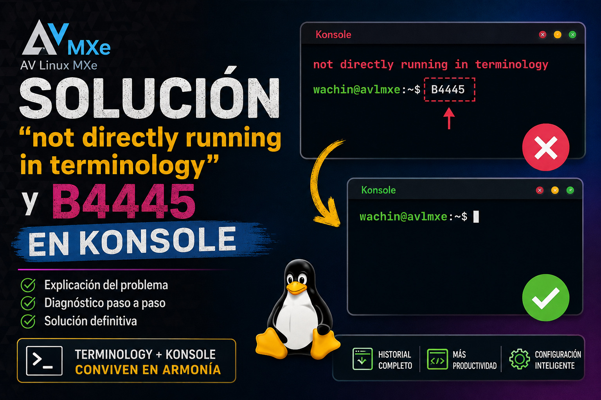

# Solución: Konsole muestra «not directly running in terminology» y caracteres extraños en AV Linux MXe



Si estás utilizando **[AV Linux MXe](https://www.bandshed.net/avlinux/)** y decides instalar **Konsole** como terminal alternativa a **Terminology**, es posible que al abrir Konsole aparezca un mensaje similar al siguiente:

```bash
not directly running in terminology
usuario@avlmxe:~
$ B4445
```

En mi caso, el problema más molesto era `B4445`, porque aparecía automáticamente en la línea de comandos y tenía que borrarlo manualmente antes de poder escribir.

En este tutorial veremos cuál es la causa y cómo solucionarlo sin desactivar las personalizaciones de AV Linux para Terminology.

## ¿Por qué instalar Konsole en AV Linux MXe?

AV Linux MXe incluye **Terminology** como uno de sus terminales. Sin embargo, puede resultar conveniente instalar Konsole, especialmente si utilizamos aplicaciones de línea de comandos que generan bastante información, como **Codex CLI**, herramientas de desarrollo, compilaciones, registros, etc. Konsole permite utilizar cómodamente el historial o *scrollback* de la terminal para revisar texto que apareció anteriormente.

Podemos instalarlo en AV Linux MXe con:

```bash
sudo apt update
sudo apt install konsole
```

## El problema

Después de instalar Konsole, al abrir una nueva terminal podía aparecer algo parecido a:

```bash
not directly running in terminology
usuario@avlmxe:~
$ B4445
```

El primer mensaje ya nos da una pista importante:

```bash
not directly running in terminology
```

Algún componente configurado para **Terminology** se está intentando ejecutar también dentro de **Konsole**.

## Comprobar si el problema está en `.bashrc`

Una manera muy sencilla de comprobar si el comportamiento procede de nuestra configuración de Bash es iniciar una instancia de Bash que no cargue el archivo `.bashrc`:

```bash
bash --norc
```

En mi caso apareció:

```bash
bash-5.2$
```

Entonces hice una prueba:

```bash
echo "Prueba"
```

y obtuve:

```bash
Prueba
bash-5.2$
```

Ya no aparecía el problema.

Esto era una señal clara de que había que revisar la configuración cargada normalmente por Bash.

## Buscar referencias a Terminology

Podemos buscar algunas instrucciones relacionadas con terminales dentro de nuestros archivos de configuración:

```bash
grep -nEi 'terminology|term|printf|echo|escape|osc|4445' \
  ~/.bashrc ~/.profile ~/.bash_profile ~/.bash_login 2>/dev/null
```

En mi instalación de AV Linux MXe apareció, entre otras cosas:

```bash
/home/usuario/.bashrc:128:#AVL-MXe TERMINAL CUSTOMIZATION
/home/usuario/.bashrc:171:function setTextStyle() { echo -en "$1"; }
/home/usuario/.bashrc:173:#TERMINAL_TEXT_IMAGE (OPTIONAL)
/home/usuario/.bashrc:174:tycat /usr/local/share/icons/custom/terminal-text.png
```

Aquí encontramos una pista especialmente importante:

```bash
tycat /usr/local/share/icons/custom/terminal-text.png
```

## El origen del problema: `tycat`

`tycat` es una herramienta relacionada con **Terminology** que permite mostrar contenido gráfico dentro de esa terminal.

AV Linux MXe tiene en el archivo:

```bash
~/.bashrc
```

una personalización que ejecuta:

```bash
tycat /usr/local/share/icons/custom/terminal-text.png
```

El problema es que `.bashrc` también se carga cuando abrimos **Konsole**.

Por lo tanto, la instrucción diseñada para Terminology termina ejecutándose dentro de Konsole.

Podemos comprobar también algunas variables de nuestro terminal con:

```bash
echo "TERM=$TERM"
echo "TERMINOLOGY=$TERMINOLOGY"
echo "SHELL=$SHELL"
```

En Konsole, en mi caso, obtuve algo parecido a:

```bash
TERM=xterm-256color
TERMINOLOGY=
SHELL=/bin/bash
```

La parte interesante es:

```bash
TERMINOLOGY=
```

La variable está vacía porque estamos ejecutando **Konsole**, no Terminology.

Podemos aprovechar precisamente esto para solucionar el problema.

# Solución

Primero es recomendable crear una copia de seguridad de nuestro `.bashrc`:

```bash
cp ~/.bashrc ~/.bashrc.backup
```

Ahora lo editamos:

```bash
gedit ~/.bashrc
```

Buscamos estas líneas:

```bash
#TERMINAL_TEXT_IMAGE (OPTIONAL)
tycat /usr/local/share/icons/custom/terminal-text.png
```

y las reemplazamos por:

```bash
#TERMINAL_TEXT_IMAGE (OPTIONAL)
# Mostrar la imagen únicamente dentro de Terminology
if [ -n "$TERMINOLOGY" ]; then
    tycat /usr/local/share/icons/custom/terminal-text.png
fi
```

Guardamos el archivo 

## ¿Qué hace esta modificación?

La condición:

```bash
if [ -n "$TERMINOLOGY" ]; then
```

comprueba si la variable `TERMINOLOGY` contiene algún valor.

Si estamos dentro de Terminology, se ejecutará:

```bash
tycat /usr/local/share/icons/custom/terminal-text.png
```

y después finalizará la condición:

```bash
fi
```

Por el contrario, si abrimos Konsole y la variable `TERMINOLOGY` está vacía, Bash simplemente omitirá la ejecución de `tycat`.

De esta manera no necesitamos eliminar la personalización que AV Linux MXe preparó para Terminology.

## Aplicar los cambios

Podemos aplicar inmediatamente la nueva configuración ejecutando:

```bash
source ~/.bashrc
```

También podemos cerrar completamente Konsole y volver a abrirlo.

Ahora debería aparecer el prompt normalmente:

```bash
usuario@avlmxe:~
$
```

sin:

```bash
not directly running in terminology
```

y, especialmente, sin los caracteres extraños como:

```bash
B4445
```

# ¿Por qué no simplemente eliminar `tycat`?

También podríamos comentar la línea:

```bash
#tycat /usr/local/share/icons/custom/terminal-text.png
```

pero eso desactivaría esa personalización también cuando utilizáramos Terminology.

La solución condicional es más limpia:

```bash
if [ -n "$TERMINOLOGY" ]; then
    tycat /usr/local/share/icons/custom/terminal-text.png
fi
```

Así podemos utilizar **Terminology y Konsole en el mismo sistema**, y cada terminal recibe únicamente la configuración que le corresponde.

## Restaurar la configuración anterior

Si cometimos algún error o queremos volver al `.bashrc` original, podemos utilizar la copia de seguridad:

```bash
cp ~/.bashrc.backup ~/.bashrc
```

y recargarla:

```bash
source ~/.bashrc
```

# Conclusión

El problema no estaba realmente en **Konsole**, sino en una personalización incluida en el `.bashrc` de AV Linux MXe para **Terminology**.

La instrucción:

```bash
tycat /usr/local/share/icons/custom/terminal-text.png
```

se ejecutaba también al iniciar Konsole, aunque `tycat` está pensado para trabajar con Terminology.

La solución consiste en ejecutarla condicionalmente:

```bash
if [ -n "$TERMINOLOGY" ]; then
    tycat /usr/local/share/icons/custom/terminal-text.png
fi
```

Después de realizar este cambio, Konsole puede abrirse normalmente sin mostrar:

```bash
not directly running in terminology
```

ni dejar `B4445` escrito en la línea de comandos.

Esta solución resulta especialmente útil si queremos mantener **Terminology** instalado y conservar las personalizaciones de AV Linux MXe, pero utilizar **Konsole** como nuestro terminal habitual.


