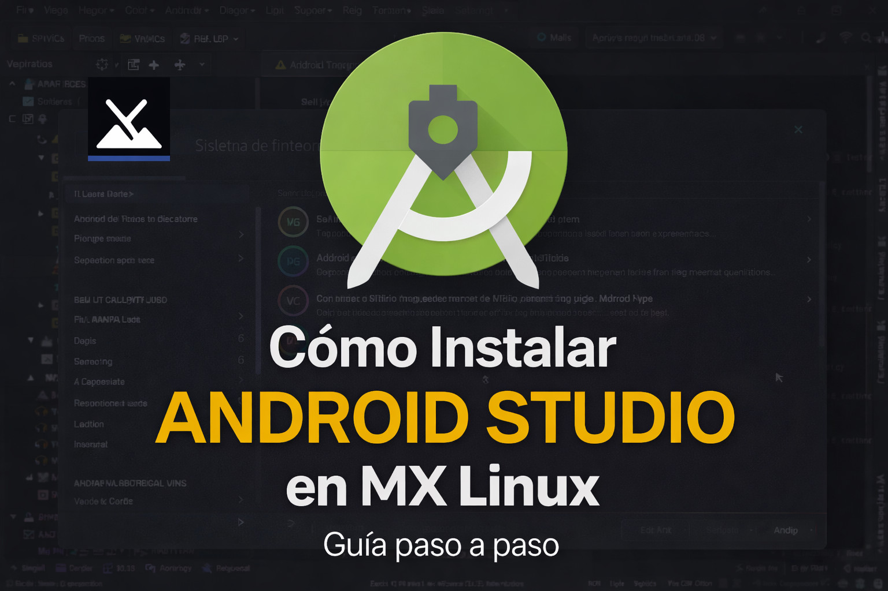

# Cómo instalar Android Studio en MX Linux - Guía paso a paso




Si usas **MX Linux** y quieres comenzar a desarrollar aplicaciones Android, en esta guía aprenderás a instalar correctamente **Android Studio** paso a paso, incluyendo la configuración de virtualización para usar el emulador de forma rápida.

---

## Requisitos previos

Antes de empezar, asegúrate de tener:

* ✔ MX Linux instalado (basado en Debian)
* ✔ Conexión a internet
* ✔ Al menos 8 GB de espacio libre (recomendado)
* ✔ Procesador con virtualización (Intel o AMD)

---

## Paso 1: Descargar Android Studio

1. Ve a la página oficial:
   👉 [https://developer.android.com/studio](https://developer.android.com/studio)

2. Descarga la versión para Linux (`.tar.gz`)

---

## Paso 2: Extraer el archivo

> **📌 Si vienes de Windows:** el archivo que descargaste (`.tar.gz`) es simplemente un archivo comprimido, como un `.zip` o un `.rar`. "Extraer" significa descomprimirlo para poder usar su contenido. Además, en Linux las **carpetas** también se llaman **directorios**: son dos nombres para la misma cosa.

Tienes dos maneras de hacerlo. Elige la que te resulte más cómoda:

### Opción A: Con clic derecho, sin comandos (la más fácil)

1. Abre el **administrador de archivos** (en MX Linux se llama **Thunar**; sería el equivalente al Explorador de Windows).
2. Entra en la carpeta **Descargas**, o en la carpeta donde tengas guardado el archivo si lo moviste a otro sitio.
3. Haz **clic derecho** sobre el archivo `android-studio-....tar.gz` y elige **"Extraer aquí"** (según el sistema también puede decir "Extraer en esta carpeta" o algo parecido).

¡Listo! No necesitas escribir ningún comando. Verás que aparece una carpeta nueva llamada:

```bash
android-studio
```

### Opción B: Con la terminal

**1. Colócate en la carpeta donde está el archivo.** De nuevo tienes dos caminos:

* **Desde el administrador de archivos (recomendado):** entra en la carpeta **Descargas** (o donde tengas el archivo), haz **clic derecho sobre un espacio vacío** de la carpeta —no sobre ningún archivo— y elige **"Abrir terminal aquí"** (o "Abrir en terminal", según el sistema). Prácticamente todos los administradores de archivos de Linux actuales tienen esta opción, y te abre la terminal ya situada dentro de esa carpeta, sin necesidad de navegar con comandos.

* **Navegando manualmente:** abre una terminal y escribe:

```bash
cd ~/Descargas
```

(`cd` significa "cambiar de directorio", es decir, moverte a otra carpeta, y `~` es tu carpeta personal, el equivalente a `C:\Users\TuUsuario` en Windows. Si guardaste el archivo en otra carpeta, sustituye `Descargas` por el nombre de esa carpeta.)

**2. Extrae el archivo:**

```bash
tar -xvzf android-studio-*.tar.gz
```

Con esto también se creará la carpeta:

```bash
android-studio
```

---

## Paso 3: Mover a /opt (esta es la instalación que yo hago)

> **📌 ¿Qué es `/opt`?** Es un **directorio** (carpeta) del sistema donde se instalan programas adicionales que no vienen con el sistema operativo, como es el caso de Android Studio. Vendría a ser el equivalente a `C:\Program Files` en Windows. Para escribir en ella hacen falta permisos de administrador, y de ahí el `sudo`, que funciona como el "Ejecutar como administrador" de Windows: te pedirá tu contraseña (no te preocupes si al teclearla **no aparece nada en pantalla**, es normal: escríbela y pulsa Enter).

Si tienes la terminal abierta en la carpeta donde quedó `android-studio` (por ejemplo **Descargas**, usando el truco del clic derecho sobre un espacio vacío → "Abrir terminal aquí"), muévela a `/opt` con:

```bash
sudo mv android-studio /opt/
```

## Paso 3.1: Permitir las actualizaciones automáticas del IDE

Si instalaste Android Studio en `/opt`, la carpeta probablemente pertenezca al usuario `root`. En ese caso, cuando Android Studio detecte una nueva versión mostrará un mensaje indicando que no tiene permisos para escribir y no podrá actualizarse automáticamente.

Para permitir que el propio IDE pueda instalar sus actualizaciones, cambia el propietario de la carpeta a tu usuario:

```bash
sudo chown -R $USER:$USER /opt/android-studio
```

Puedes comprobar que el cambio se realizó correctamente con:

```bash
ls -ld /opt/android-studio
```

La salida debería mostrar tu nombre de usuario como propietario.

A partir de ese momento, Android Studio podrá descargar e instalar sus propias actualizaciones desde:

**Help → Check for Updates...**

> **Nota:** Esto solo cambia el propietario de la carpeta de Android Studio. No afecta al resto del directorio `/opt` ni supone un problema de seguridad para un equipo de uso personal.

---

## ▶Paso 4: Ejecutar Android Studio

```bash
/opt/android-studio/bin/studio
```

---

## Paso 5: Configuración inicial

Al abrirse por primera vez:

1. Selecciona:
   👉 **Standard**

2. Acepta todas las licencias

3. Espera que descargue:

   * Android SDK
   * Herramientas necesarias
   * Emulador

---

---

## Paso 5.1: Android Studio solicita crear una cartera KDE (KWallet)

**Importante.-** Lo siguiente puede ocurrir o no, depende de las herramientas que vienen en su sistema operativo, si su sistema operativo Linux trae alguna herramienta de cifrado como ejemplo gnome-keyring y no KWallet funcionará con el que venga instalado

Lo siguiente me suceió al instalar Android Studio en AV Linux MXe desde (y podría suceder en otro Sistema Operativo Linux):

[https://www.bandshed.net/](https://www.bandshed.net/)

y al ejecutar **Android Studio** por primera vez me apareció una ventana similar a esta:

> **Servicio de cartera de KDE**
>
> La aplicación ha solicitado crear una nueva cartera llamada **kdewallet**.

Esto es completamente **normal** y **no indica ningún error**.

Android Studio necesita un lugar seguro donde almacenar información confidencial, por ejemplo:

- ✔ Credenciales de tu cuenta de Google
- ✔ Tokens de acceso
- ✔ Contraseñas de plugins
- ✔ Credenciales de Git
- ✔ Otros datos sensibles

En Linux, este tipo de información suele almacenarse en un **gestor de credenciales** (Keyring). En tu sistema se ha detectado **KWallet**, el administrador de contraseñas del proyecto KDE.

### ¿Qué opción elegir?

La ventana ofrece dos opciones:

- **Clásico, archivo cifrado con Blowfish**
- **Usar cifrado GPG, para una mejor protección**

### ✔ Recomendación para la mayoría de usuarios

Selecciona:

**Clásico, archivo cifrado con Blowfish**

y haz clic en:

**Siguiente**

Después se solicitará crear una contraseña para la cartera.

Puedes utilizar la misma contraseña con la que inicias sesión en Linux o una diferente.

Esta opción es la más sencilla y funciona perfectamente para la gran mayoría de usuarios.

### ¿Cuándo usar GPG?

La opción:

**Usar cifrado GPG**

está orientada a usuarios avanzados que ya utilizan **GnuPG (GPG)** para cifrar archivos o firmar digitalmente documentos y que ya disponen de una clave GPG configurada.

Si nunca has utilizado GPG, lo más recomendable es utilizar la opción **Clásico (Blowfish)**.

### ¿Qué ocurre si pulso "Cancelar"?

Android Studio normalmente continuará iniciándose.

Sin embargo:

- algunos servicios podrían pedirte iniciar sesión nuevamente cada vez que abras el IDE;
- algunos plugins podrían no recordar sus credenciales;
- las contraseñas no se almacenarán de forma segura.

Por ello, se recomienda crear la cartera la primera vez que aparezca este asistente.

### ¿Puedo cambiar esto más adelante?

Sí.

Si más adelante deseas cambiar la configuración de KWallet o eliminar la cartera creada, puedes hacerlo desde las herramientas de administración de KWallet sin necesidad de reinstalar Android Studio.

> **Nota:** La creación de esta cartera solo ocurre la primera vez que una aplicación necesita almacenar credenciales de forma segura. Una vez creada, Android Studio la reutilizará automáticamente en futuras ejecuciones.

---

## Paso 6: Activar virtualización

Si usted desea usar el Emulador (podría no usarlo y solo conectar su celular al ordenador para que en su celular pruebe la App), para que el emulador funcione rápido, debes habilitar **KVM**.

### Verificar soporte de CPU

```bash
egrep -c '(vmx|svm)' /proc/cpuinfo
```

Si devuelve un número mayor que 0 → ✔ compatible

---

### Instalar herramientas necesarias

```bash
sudo apt update
sudo apt install cpu-checker qemu-kvm libvirt-daemon-system libvirt-clients bridge-utils
```

---

### Verificar KVM

```bash
kvm-ok
```

Debe aparecer:

```
KVM acceleration can be used
```

---

### Dar permisos al usuario

```bash
sudo usermod -aG kvm $USER
sudo usermod -aG libvirt $USER
```

👉 Reinicia el sistema después de esto

---

### 🔍 Verificar grupos

```bash
groups
```

Debe incluir:

```
kvm libvirt
```

---

## Paso 7: Crear un acceso directo (recomendado)

Para no usar la terminal cada vez:

```bash
gedit ~/.local/share/applications/android-studio.desktop
```

Contenido:

```
[Desktop Entry]
Version=1.0
Type=Application
Name=Android Studio
Exec=/opt/android-studio/bin/studio
Icon=/opt/android-studio/bin/studio.png
Categories=Development;IDE;
Terminal=false
```

Guarda y listo.

---

## Paso 8: Probar el emulador

1. Abre Android Studio
2. Ve a **Device Manager**
3. Crea un dispositivo (ejemplo: Pixel)
4. Inicia el emulador

👉 Gracias a KVM, funcionará rápido

# Referencias

* Cómo configurar la aceleración de VM en Linux  
[https://developer.android.com/studio/run/emulator-acceleration?utm_source=android-studio-app&utm_medium=app&hl=es-419#vm-linux](https://developer.android.com/studio/run/emulator-acceleration?utm_source=android-studio-app&utm_medium=app&hl=es-419#vm-linux)  

* Android Studio Official Download  
  [https://developer.android.com/studio](https://developer.android.com/studio)  

* Install Android Studio on Linux  
  [https://developer.android.com/studio/install#linux](https://developer.android.com/studio/install#linux)  

* KVM Virtualization Guide (Linux)  
  [https://help.ubuntu.com/community/KVM](https://help.ubuntu.com/community/KVM)  

* Debian Wiki - KVM  
  [https://wiki.debian.org/KVM](https://wiki.debian.org/KVM)  

* Android Developers Documentation  
  [https://developer.android.com/docs](https://developer.android.com/docs)  


---