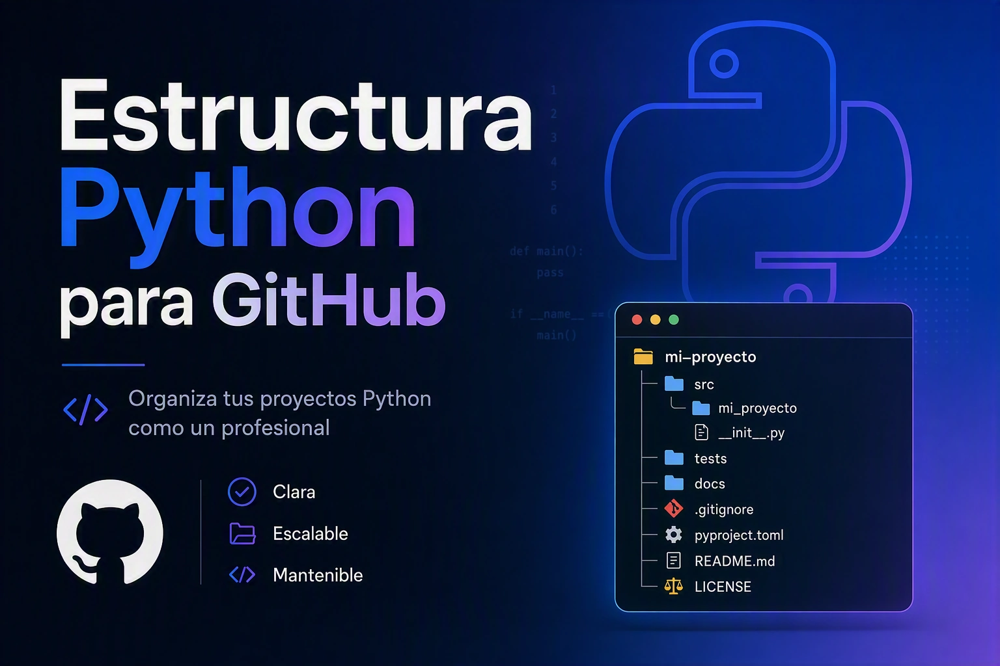

# Cómo estructurar un proyecto Python para GitHub sin perderte



Si estás empezando a publicar tu primer programa en GitHub es fácil caer en la trampa de poner todo en la raíz, mezclar código con datos y usar nombres con mayúsculas. Después, cuando quieres instalarlo, testearlo o compartirlo, todo se rompe.

Esta guía explica la estructura mínima profesional que uso hoy en día y por qué funciona.

## 1. Nombre del repositorio vs nombre del paquete

* **Repositorio en GitHub:** `kebab-case`, todo en minúsculas con guiones. Ejemplo: `pdf-to-video-ai`. Es legible en URLs y es la convención de PyPI y GitHub.
* **Paquete Python:** `snake_case`, todo en minúsculas con guiones bajos. Ejemplo: `pdf_to_video_ai`. Python no permite guiones en nombres de import.
* **Clases y módulos:** `PascalCase` para clases, `snake_case` para módulos y funciones.

No uses mayúsculas ni espacios. Un nombre consistente evita errores de import y problemas en Windows y Linux.

## 2. Layout recomendado: `src/`

```
pdf-to-video-ai/
├── src/
│   └── pdf_to_video_ai/
│       ├── __init__.py
│       ├── cli.py
│       └── ...
├── tests/
├── docs/
├── config.yaml
├── pyproject.toml
├── README.md
└── LICENSE
```

Por qué `src/`:
* Evita importar el código fuente por accidente mientras desarrollas.
* Permite instalar el paquete en modo editable y testear el artefacto real que se publicará.
* Mantiene `tests/`, `docs/` y archivos de configuración fuera del paquete.

## 3. Archivos esenciales

**pyproject.toml**: es el estándar actual. Define nombre, versión, dependencias y cómo construir el paquete.

**README.md**: 30 líneas máximo con qué hace el programa, cómo instalar y un ejemplo.

**requirements.txt / requirements-dev.txt**: separa dependencias de producción y de desarrollo.

**LICENSE**: MIT o Apache-2.0 para proyectos abiertos.

## 4. CLI y entrada

Usa `__main__.py` para `python -m pdf_to_video_ai` y un `cli.py` con `argparse`. Declara un entry point en `pyproject.toml`:

```
[project.scripts]
pdf-to-video-ai = "pdf_to_video_ai.cli:main"
```

Así el usuario instala y ejecuta `pdf-to-video-ai --help` sin saber de rutas.

## 5. Configuración y i18n

* Carga configuración con dataclasses desde `config.yaml`.
* Código y UI en inglés, contenido en el idioma del usuario. Traduce después con gettext/Babel, sin tocar el código.
* Registra decisiones no triviales en `docs/decisions/`.

## 6. Buenas prácticas que ahorran dolor

* Un paquete, un propósito.
* Tests en `tests/` con pytest.
* Lint con ruff/black y tipado con mypy.
* Logs estructurados.
* No mezcles datos de entrada con código.

Con esta estructura tu proyecto es instalable, testeable y listo para publicar en PyPI o GitHub sin refactorizaciones de última hora.

---

### Referencias

* Python Packaging User Guide. Packaging Python Projects. https://packaging.python.org/
* The Hitchhiker’s Guide to Python. Best practices. https://docs.python-guide.org/
* PEP 621 -- Determining Project Metadata via pyproject.toml. https://peps.python.org/pep-0621/
* Google Python Style Guide. https://google.github.io/styleguide/pyguide.html
* Real Python. Python Project Structure. https://realpython.com/python-package-structure/
