# 📘 Guía Didáctica: Píxeles vs Resolución (PPP/PPI) en GIMP

# El Concepto Clave: La Resolución

La resolución actúa como un puente entre el mundo digital (píxeles) y el mundo físico (centímetros, pulgadas). Se mide en **ppp** (píxeles por pulgada) o **dpi** (dots per inch) .

La fórmula es: **Tamaño Físico = Número de Píxeles / Resolución**

Por ejemplo, una imagen de 3000 píxeles de ancho puede imprimirse a 10 pulgadas (25.4 cm) si usamos una resolución de 300 ppp, o a 41.6 pulgadas (105 cm) si usamos 72 ppp. En pantalla, siempre se ven por píxeles.

## Objetivo de la lectura
Al finalizar este tutorial el lector podrá:

- Diferenciar claramente entre píxeles y resolución.
- Calcular el tamaño real de impresión.
- Entender por qué en pantalla el PPP no afecta la imagen.
- Aplicar correctamente estos conceptos en GIMP.

---

## Idea Central
Una imagen digital tiene DOS propiedades independientes:

1. Tamaño en píxeles (px)
2. Resolución (PPP / PPI)

⚠️ Son conceptos diferentes.
⚠️ Cumplen funciones distintas.

---

# Diferencia entre **tamaño en píxeles** y **resolución (ppp / ppi / dpi)**

## 1. EXPLICACIONES PREVIAS

Una imagen digital tiene DOS cosas diferentes:

1️⃣ Tamaño en píxeles  
2️⃣ Resolución de impresión  

Nunca son lo mismo.

---

## 2. ¿QUÉ ES UN PÍXEL?

Un píxel es el cuadrito más pequeño de una imagen digital.

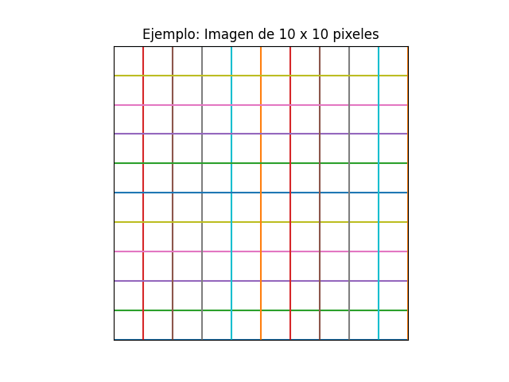

Si una imagen mide 10 x 10 píxeles, tiene 100 cuadritos.

En pantalla SOLO importa esto.

---

## 3. ¿QUÉ ES RESOLUCIÓN?

Resolución significa:

¿Cuántos píxeles caben en una unidad física cuando se imprime?

Puede mostrarse como:

- pixeles/mm
- pixeles/cm
- pixeles/ft
- etc.

> Las unidades mm, cm, ft, etc son medidas que la persona puede medir físicamente con una regla, metro, etc

Eso es lo mismo que decir PPI o PPP.

---

## 📏 PPP, PPI y DPI

PPP = Píxeles Por Pulgada  
PPI = Pixels Per Inch (lo mismo ue PPP pero en inglés)  
DPI = Dots Per Inch (puntos físicos de tinta)

👉 En GIMP realmente trabajamos con PPI aunque no aparezca escrito así.

---

## 🖨 MISMA IMAGEN, DISTINTA IMPRESIÓN (Comprendiendo la Impresión)

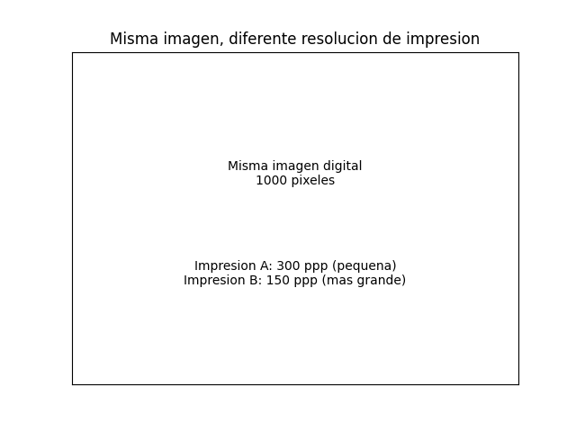

Si una imagen tiene 1000 píxeles:

- A 300 ppp se imprime pequeña y nítida.
- A 150 ppp se imprime más grande pero menos detallada.

Pero la imagen digital NO cambió.

---

# UNIDADES EN GIMP

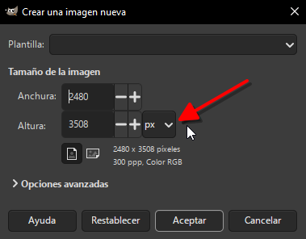

## Anchura y Altura

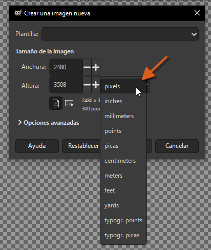

pixeles  
inches  
milimeters  
points  
picas  
centimeters  
meters  
feet  
yards  
tupogr.points  
typogr.picas  

### Unidades de "Tamaño de imagen" (Anchura / Altura)

Estas unidades definen las **dimensiones totales del lienzo**.

- **¿Qué controlan?** El tamaño del lienzo sobre el que estás trabajando.
- **¿Por qué hay tantas?** Te permiten definir el tamaño de tu lienzo pensando en el resultado final.
    - Si estás diseñando algo **para una pantalla** (redes sociales, web, etc.), lo más lógico es usar **píxeles (px)**. Sabes que una imagen para Instagram debe tener, por ejemplo, 1080 px de ancho.
    - Si estás diseñando algo **para imprimir** (un folleto, una foto, un cartel), es mucho más intuitivo pensar en **milímetros (mm)** o **centímetros (cm)**. Así puedes crear un lienzo del tamaño exacto de una tarjeta de presentación (85 mm x 55 mm) sin tener que hacer cálculos mentales.

## Resolución X / Y

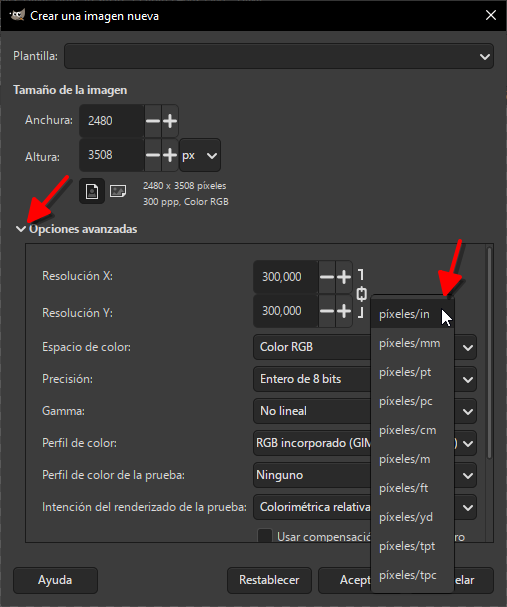

pixeles/in
pixeles/mm
pixeles/pt
pixeles/pc
pixeles/cm
pixeles/m
pixeles/ft
pixeles/yd
pixeles/tpt
pixeles/tpc 

Estas cambian la densidad de impresión.

### Unidades de "Opciones avanzadas" (Resolución X / Y)

Estas unidades definen la **densidad de píxeles**. Responden a la pregunta: "Si mi imagen tiene que medir 10 cm en el mundo real, ¿cuántos píxeles debo meter dentro de esos 10 cm?".

- **¿Qué controlan?** La relación entre el mundo digital (píxeles) y el mundo físico (centímetros, pulgadas...).
- **¿Por qué hay tantas?** Para que puedas trabajar con la unidad de medida física que te resulte más cómoda para tu proyecto de impresión. Simplemente le estás diciendo a GIMP: "La regla con la que voy a medir mi densidad de píxeles será esta".

    *   **píxeles/in (pulgada):** Esta es la unidad **más importante y famosa** de todas. Seguro que has oído hablar de **ppp (píxeles por pulgada) o dpi (dots per inch)**. Es el estándar de la industria. Una calidad de impresión profesional suele ser de 300 píxeles/in.
    *   **píxeles/mm (milímetro):** Cuántos píxeles hay en un milímetro. Es una unidad muy precisa para trabajos de alta calidad, pero los números suelen ser pequeños (por ejemplo, 11.8 píxeles/mm equivalen a 300 píxeles/pulgada).
    *   **píxeles/pt (punto tipográfico):** Muy útil para diseño editorial y maquetación. Un punto (pt) es una unidad de medida clásica en tipografía (1 pt = 1/72 de pulgada). Si sabes que tu texto va a ir a un tamaño de cuerpo de 12 pt, configurar la resolución en píxeles/pt te ayuda a visualizar y calcular mejor.
    *   **píxeles/pc (pica):** Otra unidad tipográfica. Una pica equivale a 12 puntos. Es muy usada en diseño gráfico y periodístico en algunos países.
    *   **píxeles/cm (centímetro):** Es la versión del milímetro pero más "gruesa". Se usa mucho porque el centímetro es una unidad familiar para todos.
    *   **píxeles/m (metro):** Para proyectos enormes, como vallas publicitarias o lonas gigantes. Nadie habla de píxeles por milímetro para una lona de 10 metros, pero sí de píxeles por metro para hacerse una idea de la calidad final.
    *   **píxeles/ft (pie):** La versión del sistema imperial (pies) para quienes trabajan con él.
    *   **píxeles/yd (yarda):** La versión del sistema imperial (yardas) para quienes trabajan con él.
    *   **píxeles/tpt (punto tipográfico tradicional):** Es una unidad de medida tipográfica "antigua" o tradicional, que tiene una diferencia mínima con el punto moderno (pt). Es para usos muy específicos en tipografía de alto nivel o para mantener la fidelidad con documentos históricos.
    *   **píxeles/tpc (pica tipográfica tradicional):** Lo mismo que el tpt, pero para la pica tradicional. Un complemento para tipografía de alto nivel.

### En Resumen y para la práctica diaria:

- **Usa las unidades de "Tamaño de imagen"** para decirle a GIMP **lo grande que quieres que sea tu lienzo**. Si es para web o pantallas, usa **píxeles**. Si es para impresión, usa **centímetros** o **milímetros**.
- **Usa las unidades de "Resolución"** para decirle a GIMP **con qué densidad vas a imprimir**. En el 99% de los casos de impresión, usarás **píxeles/cm** o **píxeles/mm** (dependiendo de si piensas en cm o mm), o la más famosa de todas: **píxeles/pulgada (ppp o dpi)**.

**El truco:** No te compliques. Si vas a hacer algo para imprimir, pon el tamaño en **centímetros** en la parte de arriba y, en las opciones avanzadas, busca el equivalente de 300 píxeles por pulgada (que son 118 píxeles/cm o 11.8 píxeles/mm). Si es para pantalla, asegúrate de que la unidad de arriba sean **píxeles** y la resolución te dará igual, déjala en píxeles/mm o en lo que esté por defecto.

## 🔍 7. DIFERENCIA CLAVE 

| Tamaño (Anchura & Altura) (Comportamiento en Pantalla) | Resolución X y Y (Comprendiendo la Impresión) |
| ------------------------------------------------------ | --------------------------------------------- |
| Cambia cómo se ve en pantalla                          | No cambia pantalla                            |
| Cambia peso del archivo                                | No cambia peso                                |
| Afecta calidad real                                    | Solo afecta impresión                         |

---

# ¿Por qué existen PPP, PPI y DPI si en GIMP no aparecen?

En realidad…

👉 **Muchas veces significan prácticamente lo mismo**,
pero se usan en contextos distintos.

## 1️⃣ PPP (píxeles por pulgada)

En español decimos:

**PPP = Píxeles Por Pulgada**

Es simplemente la traducción de:

**PPI = Pixels Per Inch**

Entonces:

> ✅ PPP = PPI
> (son lo mismo, pero en distinto idioma)

---

## 2️⃣ PPI (Pixels Per Inch)

Este es el término técnico correcto cuando hablamos de:


---
## 🖥 Sección: Comportamiento en Pantalla
---

* Pantallas
* Imágenes digitales
* Resolución en programas como GIMP
* Fotografía digital

Significa:

> Cuántos píxeles hay en una pulgada.

Ejemplo:
300 PPI significa que en 1 pulgada caben 300 píxeles.

En GIMP, cuando ves algo como:

```
pixeles/mm
pixeles/cm
```

Eso es lo mismo que PPI pero en otra unidad.

---

## 3️⃣ DPI (Dots Per Inch)

Aquí viene la confusión 👇

**DPI no es exactamente lo mismo que PPI**, aunque mucha gente los usa como si fueran iguales.

DPI significa:

> Dots Per Inch (puntos por pulgada)

Pero los "dots" no son píxeles digitales.
Son puntos físicos de tinta que una impresora coloca en el papel.

---

### 📌 Diferencia real

| Término |          Se usa para          |   Qué mide realmente    |
| ------- | ----------------------------- | ----------------------- |
| PPI     | Imágenes digitales            | Píxeles en pantalla     |
| PPP     | Lo mismo que PPI (en español) | Píxeles                 |
| DPI     | Impresoras                    | Puntos físicos de tinta |

---

# Entonces… ¿por qué la gente los mezcla?

Porque:

* Para imprimir, necesitas convertir píxeles en tinta.
* Entonces 300 PPI normalmente se imprime como 300 DPI.
* En la práctica, muchas personas dicen DPI cuando realmente hablan de PPI.

Es como si todos dijeran “caballos de fuerza” aunque estén hablando de kilovatios.

---

# En GIMP

GIMP trabaja con:

✔ PPI (aunque no lo llame así directamente)
✔ Lo muestra como pixeles/mm, pixeles/cm, etc.

No usa la palabra DPI porque GIMP no controla la impresora,
solo guarda la información de densidad.

---

# Ejemplo sencillo

Imagina una imagen de 3000 píxeles de ancho.

Si la imprimes a:

* 300 PPI → 10 pulgadas
* 150 PPI → 20 pulgadas

Pero la imagen digital sigue teniendo 3000 píxeles.
No cambió.

> DPI = puntos físicos de impresión
> En GIMP hablamos realmente de PPI aunque no aparezca escrito así.

## ¿Qué significa cada dato en GIMP?

En **Imagen → Propiedades de la imagen**, GIMP muestra (entre otras cosas):

- **Tamaño en píxeles:** el tamaño real digital.
- **Tamaño de la impresión:** cuántos **mm/cm** ocuparía al imprimir.
- **Resolución:** ppp (píxeles por pulgada) o a veces píxeles/mm.

### Ejemplo real (200×200 px)

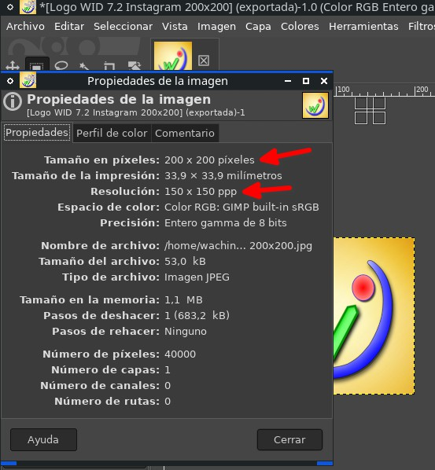

En la captura se ve:

- **Tamaño en píxeles: 200×200 px** (esto define cuánta información tiene la imagen).  
- **Resolución: 150×150 ppp** (esto sirve para calcular el tamaño en papel).  

Piensa así:

- **px = cuántos LEGO tienes**.  
- **ppp = qué tan apretados pones esos LEGO cuando los imprimes**.  

---

### En pantalla (web, YouTube, redes, iconos)

- La pantalla trabaja con **píxeles**.
- Si tu imagen es **256×256 px**, en pantalla se verá “como” 256×256 píxeles (dependiendo del zoom/escala).
- Cambiar ppp normalmente **no cambia nada visible** en pantalla.

**Para Internet:** casi siempre solo te preocupa **px**.

---

### En impresión (hojas, afiches, trípticos)

Aquí sí importa la resolución:

- Si tienes pocos px y quieres imprimir muy grande, se verá **pixelado**.  
- Si tienes muchos px, puedes imprimir más grande y con mejor detalle.  

**Para imprimir:** debes pensar en **(px) ÷ (ppp)** para saber el tamaño en pulgadas.

## GIMP por defecto crea imágenes a 300 ppp

Cuando creas una imagen nueva en GIMP, por defecto suele venir con **300 ppp**.

Ruta: **Archivo → Nuevo** y luego abrir **Opciones avanzadas**:

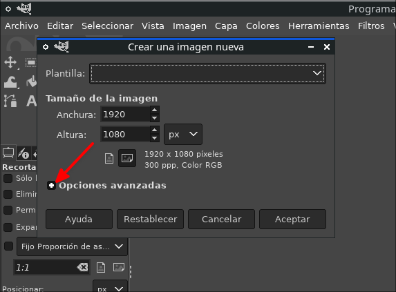

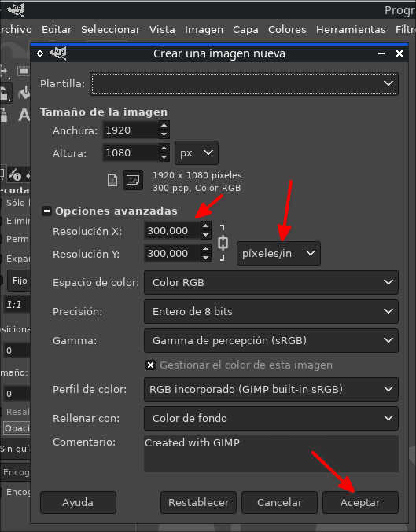

Luego puedes verificarlo en **Imagen → Propiedades de la imagen**:

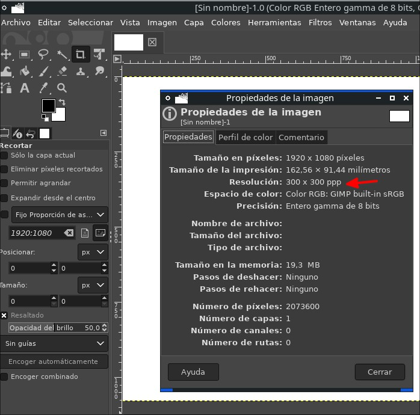

## GIMP no siempre escribe **ppp (píxeles por pulgada)** con esas letras.

En realidad, cuando ves unidades como:

- pixeles/mm
- pixeles/cm
- pixeles/ft

Eso ES la resolución.

👉 **ppp = pixeles por pulgada (pixeles por inch)**

Si trabajas en pulgadas y colocas 300, estás usando **300 ppp**.

## 1️⃣ Unidades que aparecen en 'Anchura' y 'Altura'

Estas unidades afectan el TAMAÑO de la imagen.

Aparecen exactamente así en GIMP:

```
pixeles
inches
milimeters
points
picas
centimeters
meters
feet
yards
tupogr.points
typogr.picas
```

**¿Qué significa cada una?**

**pixeles** → tamaño digital real (lo más importante para pantalla).
**inches** → pulgadas (1 inch = 2.54 cm).
**milimeters** → milímetros.
**centimeters** → centímetros.
**meters** → metros.
**feet** → pies.
**yards** → yardas.

Ahora las unidades menos conocidas:

**points** → puntos tipográficos (1 point = 1/72 pulgada).
**picas** → 1 pica = 12 points.
**tupogr.points** → puntos tipográficos tradicionales.
**typogr.picas** → picas tipográficas tradicionales.

Estas últimas se usan en imprentas y diseño editorial profesional.


## Entonces… ¿Dónde está el famoso '300 ppp'?

Si eliges pulgadas como unidad y pones 300 en resolución,
eso equivale a **300 pixeles por pulgada (300 ppp)**.

Si estás en pixeles/mm y ves algo como 11.81 pixeles/mm,
eso también equivale a 300 ppp porque:

300 ÷ 25.4 ≈ 11.81

## Diferencia CLARA entre Tamaño y Resolución

|         Anchura / Altura         |         Resolución X / Y         |
| -------------------------------- | -------------------------------- |
| Cambia el tamaño real en píxeles | Cambia la densidad de impresión  |
| Afecta cómo se ve en pantalla    | No cambia cómo se ve en pantalla |
| Puede perder calidad si reduces  | No cambia calidad digital        |

## Regla sencilla 

- Para YouTube, web, iconos → usa pixeles.
- Para imprimir → usa centímetros o pulgadas + resolución (300 ppp recomendado).

## 5) Lo más importante: cambiar ppp NO cambia los píxeles

En GIMP hay dos cosas distintas:

1) **Cambiar el tamaño en píxeles** (esto sí cambia el archivo, y puede perder o ganar detalle).
2) **Cambiar la resolución (ppp)** sin tocar los píxeles (esto cambia solo el “dato para impresión”).

**Mira este ejemplo**
En Gimp con una imagen abierta, y dando clic en:

**Imagen → Escalar la imagen…**

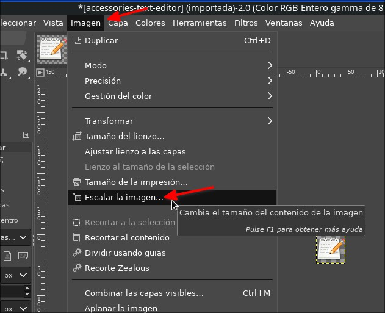

y he colocado un comentario, en el texto de la imagen dice que si cambias la resolución, **no afecta** el tamaño en pantalla:

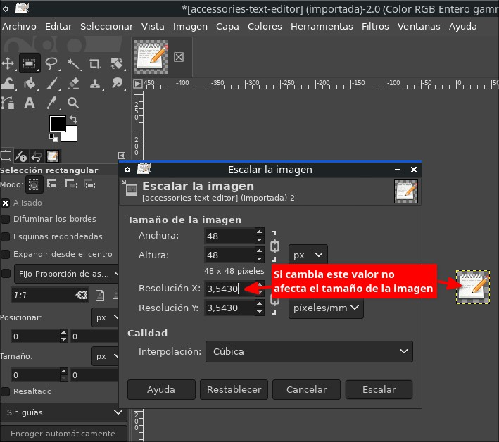

**y ¿Cómo se cambia el tamaño real (px)?**

En esa ventana:

- Si cambias **Anchura/Altura (px)** → i cambias el tamaño real de la imagen (en la imágen de arriba dice 48 x48 px).
- Si cambias **Resolución X/Y** → solo cambias el dato de impresión (en la imagen de arriba los valores están en pixeles/mm, pero depende esto de la imagen pues puede estar con otras unidades de longitud).

## ¿ppp (ppi/dpi) y píxeles/mm son lo mismo?

Son lo mismo pero en **unidades distintas**:

- **ppp / ppi / dpi** = píxeles por **pulgada**.
- **píxeles/mm** = píxeles por **milímetro**.

Conversión:

- 1 pulgada = **25.4 mm**
- Entonces: **ppp = (px/mm) × 25.4**
- Y: **px/mm = ppp ÷ 25.4**

Ejemplo: si ves **3.543 px/mm**, entonces:

- 3.543 × 25.4 ≈ **90 ppp** (aprox.)

## 7) Ejemplo con iconos de Linux (por qué hay carpetas 48×48, 256×256, etc.)

En Linux, los temas de iconos guardan **varias versiones** del mismo icono en diferentes tamaños:

- 16×16, 22×22, 32×32, 48×48…
- 256×256, 512×512…

Así el sistema puede elegir el tamaño correcto y verse nítido.

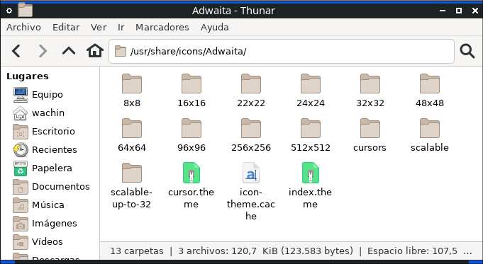

### Comparación: el mismo icono en 48×48 vs 256×256

#### Icono 48×48

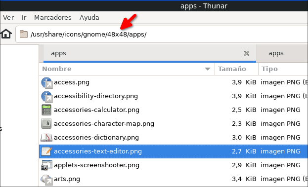

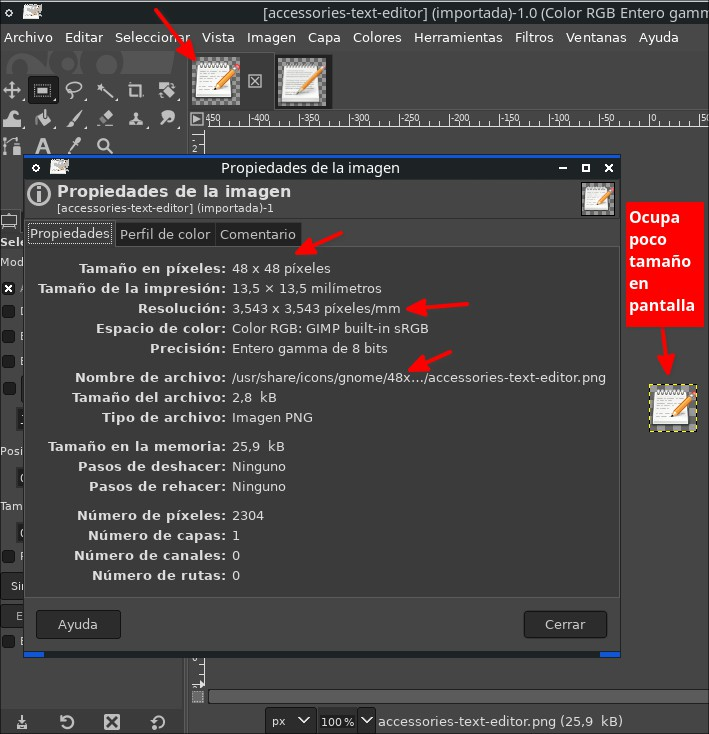


---
## Sección: Comportamiento en Pantalla
---
Aquí el icono es pequeño (48×48 px), por eso ocupa poco en pantalla.

### Icono 256×256

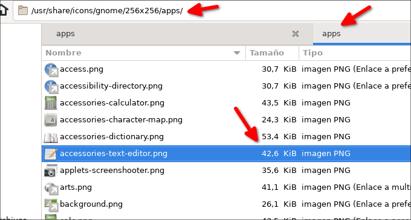

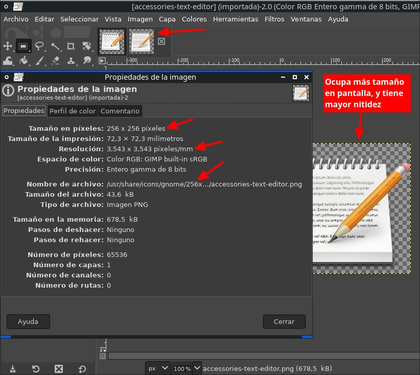

Aquí el icono tiene más píxeles (256×256), por eso se puede ver **más grande** y normalmente con **más detalle**.

### Ojo: el ppp puede ser igual, pero el tamaño en px cambia todo

Fíjate que en las capturas de 48×48 y 256×256 aparece el mismo valor de **píxeles/mm**, pero **el tamaño en px** es diferente.


---
# Sección: Comportamiento en Pantalla

**Conclusión:** para pantalla, lo que manda es el **tamaño en píxeles**.

## ¿Cuándo me importa el ppp?

- ✅ **Web / redes / miniaturas / UI / iconos:** piensa en **px**.


## Sección: Comprendiendo la Impresión

- ✅ **Impresión:** piensa en **cm + ppp**.


## Sección: Comprendiendo la Impresión

Valores típicos de impresión (regla práctica):

- **300 ppp**: calidad alta (revistas, folletos, textos pequeños).
- **150 ppp**: aceptable para impresiones grandes vistas a distancia.


## Sección: Comportamiento en Pantalla

- **72–96 ppp**: suele ser “histórico de pantallas”, **no** es una regla moderna; hoy lo importante es px.

## Ejercicios rápidos (para comprobar que entendiste)

1) Tienes una imagen de **1200×900 px**. ¿Qué tamaño máximo en papel da a 300 ppp?
- Pulgadas: 1200/300 = 4 in, 900/300 = 3 in
- En cm: 4×2.54 = 10.16 cm, 3×2.54 = 7.62 cm

2) Si cambias solo el ppp en GIMP, ¿cambia el peso del archivo o la nitidez en pantalla?
- Respuesta esperada: **no** (si no cambias px).

3) ¿Por qué los temas de iconos tienen varias carpetas (48×48, 256×256, etc.)?
- Respuesta esperada: para que el sistema elija el tamaño correcto y se vea nítido.

## 1Resumen final (para recordar)

- **px** = tamaño digital real.
- **ppp** = densidad para imprimir (convierte px ↔ cm/pulgadas).


## Sección: Comprendiendo la Impresión


## Sección: Comportamiento en Pantalla

- Cambiar **ppp** sin cambiar **px**: cambia “tamaño de impresión”, no la imagen en pantalla.
- Cambiar **px** (escalar): sí cambia la imagen.
