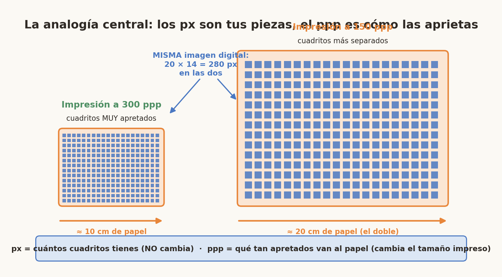
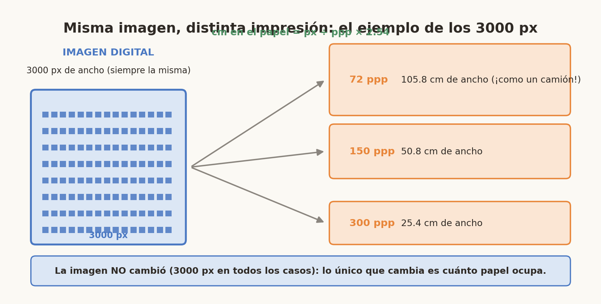
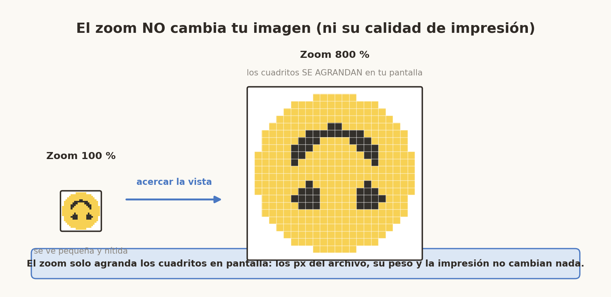
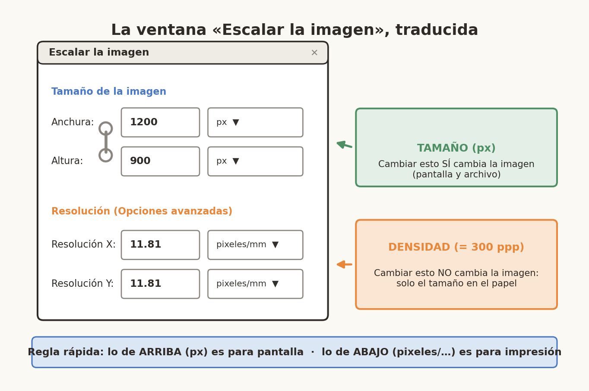
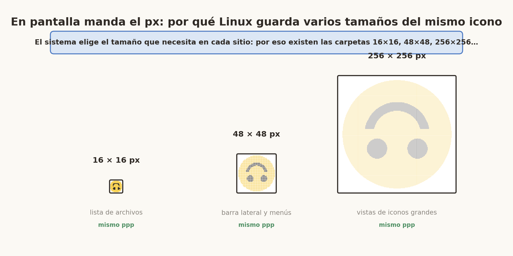
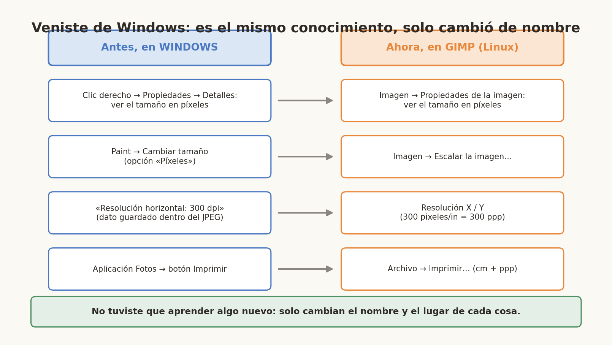
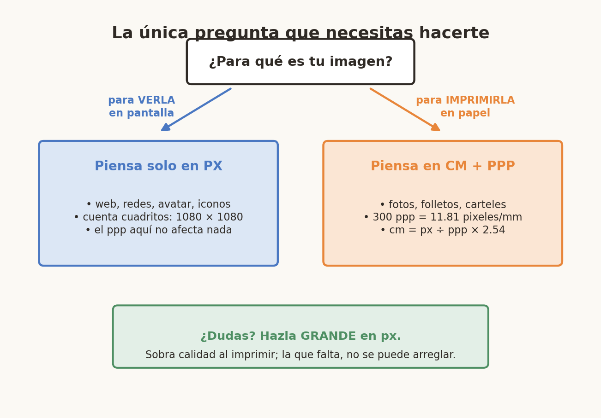

# 📘 Guía Didáctica: Píxeles vs Resolución (PPP/PPI) en GIMP

> Manual pensado para personas que llegan de Windows a Linux y se topan con GIMP: nada de números misteriosos.

**Versión de GIMP de las capturas:** GIMP 2.10. En GIMP 3.x los menús cambian un poco (por ejemplo, *Imagen → Escalar la imagen* se llama *Imagen → Escalar imagen*), pero los conceptos son exactamente los mismos.

---

# Capítulo 0 · La idea en 30 segundos

**La resolución actúa como un puente** entre el mundo digital (píxeles) y el mundo físico (centímetros, pulgadas). Se mide en **ppp** (píxeles por pulgada) o **dpi** (*dots per inch*).

La fórmula es: **Tamaño físico = Número de píxeles ÷ Resolución**

Por ejemplo, una imagen de **3000 px** de ancho puede imprimirse:

- a **300 ppp** → 10 pulgadas (**25.4 cm**) de ancho,
- a **150 ppp** → 20 pulgadas (**50.8 cm**),
- a **72 ppp** → ≈ 41.7 pulgadas (**≈ 105.8 cm**).

En pantalla, en cambio, las imágenes siempre se ven **por píxeles**: el ppp no pinta nada.



## Objetivo de la lectura

Al finalizar este tutorial el lector podrá:

- Diferenciar claramente entre píxeles y resolución.
- Calcular el tamaño real de impresión.
- Entender por qué en pantalla el ppp no afecta la imagen.
- Aplicar correctamente estos conceptos en GIMP.

**Idea central:** una imagen digital tiene **DOS propiedades independientes** que nunca son lo mismo:

1. **Tamaño en píxeles (px)** → *cuántos cuadritos tiene la imagen.*
2. **Resolución (ppp / PPI)** → *con qué densidad se colocan esos cuadritos al imprimir.*

---

# Capítulo 1 · ¿Qué es un píxel?

Un píxel es el **cuadrito más pequeño** de una imagen digital.


Si una imagen mide 10 × 10 píxeles, tiene 100 cuadritos.

**En pantalla SOLO importa esto.**

Para acercarte al 800 % cualquier imagen en GIMP lo comprobarás con tus propios ojos: los cuadritos se agrandan… pero eso lo vemos en el Capítulo 4.

---

# Capítulo 2 · ¿Qué es la resolución?

La resolución responde a una pregunta:

> ¿Cuántos píxeles caben en una unidad física **cuando se imprime**?

Puede mostrarse como:

- pixeles/mm
- pixeles/cm
- pixeles/ft
- etc.

> Las unidades mm, cm, ft, etc. son medidas que la persona puede medir físicamente con una regla, un metro, etc.

Eso es lo mismo que decir **PPI** o **PPP**.

## 🖨 Misma imagen, distinta impresión


Si una imagen tiene 1000 píxeles:

- A **300 ppp** se imprime pequeña y nítida.
- A **150 ppp** se imprime más grande pero menos detallada.

Pero la imagen digital **NO cambió**.



---

# Capítulo 3 · PPP, PPI y DPI: la familia de siglas

## 1️⃣ PPP (píxeles por pulgada)

En español decimos:

**PPP = Píxeles Por Pulgada**

Es simplemente la traducción de:

**PPI = Pixels Per Inch**

Entonces:

> ✅ PPP = PPI (son lo mismo, pero en distinto idioma)

## 2️⃣ PPI (Pixels Per Inch)

Este es el término técnico correcto cuando hablamos de:

- Pantallas
- Imágenes digitales
- Resolución en programas como GIMP
- Fotografía digital

Significa:

> Cuántos píxeles hay en una pulgada.

Ejemplo: **300 PPI** significa que en 1 pulgada caben 300 píxeles.

En GIMP, cuando ves algo como `pixeles/mm` o `pixeles/cm`, es lo mismo que PPI pero en otra unidad.

## 3️⃣ DPI (Dots Per Inch)

Aquí viene la confusión 👇

**DPI no es exactamente lo mismo que PPI**, aunque mucha gente los usa como si fueran iguales.

DPI significa:

> Dots Per Inch (puntos por pulgada)

Pero los "dots" no son píxeles digitales: son **puntos físicos de tinta** que una impresora coloca en el papel.

### 📌 Diferencia real

| Término | Se usa para | Qué mide realmente |
| ------- | ----------- | ------------------ |
| PPI | Imágenes digitales | Píxeles |
| PPP | Lo mismo que PPI (en español) | Píxeles |
| DPI | Impresoras | Puntos físicos de tinta |

## Entonces… ¿por qué la gente los mezcla?

Porque:

- Para imprimir, necesitas convertir píxeles en tinta.
- Entonces 300 PPI normalmente se imprime como 300 DPI.
- En la práctica, muchas personas dicen DPI cuando realmente hablan de PPI.

Es como si todos dijeran "caballos de fuerza" aunque estén hablando de kilovatios.

## 🖥 ¿Y en pantalla? El "72 ppp" de los monitores viejos

- **72–96 ppp** suele ser el "histórico de pantallas": **no** es una regla moderna. Hoy lo importante en pantalla son los **px**.
- En pantalla, **cambiar el ppp no cambia nada visible**.

**Para Internet:** casi siempre solo te preocupa **px**.

## En GIMP

GIMP trabaja con:

- ✔ PPI (aunque no lo llame así directamente)
- ✔ Lo muestra como pixeles/mm, pixeles/cm, etc.

No usa la palabra DPI porque GIMP no controla la impresora: **solo guarda la información de densidad** dentro del archivo (es el mismo dato "Resolución horizontal: 300 dpi" que veías en las propiedades de un JPEG en Windows).

---

# Capítulo 4 · Pantalla vs Impresión: las dos caras de una moneda

## En pantalla (web, YouTube, redes, iconos)

- La pantalla trabaja con **píxeles**.
- Si tu imagen es **256 × 256 px**, en pantalla se verá "como" 256 × 256 píxeles (dependiendo del zoom/escala).
- Cambiar el ppp normalmente **no cambia nada visible** en pantalla.

## El zoom engaña: acercar la vista no cambia la imagen



Si acercas la vista al 800 % y ves "cuadritos", la imagen **no se estropeó**: el zoom solo agranda los píxeles en tu pantalla. Los px del archivo, su peso y la calidad de impresión **no cambian**. Aléjate al 100 % y todo vuelve a verse nítido.

## En impresión (hojas, afiches, trípticos)

Aquí sí importa la resolución:

- Si tienes pocos px y quieres imprimir muy grande, se verá **pixelado**.
- Si tienes muchos px, puedes imprimir más grande y con mejor detalle.

**Para imprimir:** debes pensar en **(px) ÷ (ppp)** para saber el tamaño en pulgadas.

## 🔍 Diferencia clave (memoriza esta tabla)

| Tamaño en px (Anchura y Altura) | Resolución (ppp / pixeles/mm…) |
| ------------------------------- | ------------------------------ |
| Cambia cómo se ve en pantalla | No cambia la pantalla |
| Cambia el peso del archivo | No cambia el peso |
| Afecta la calidad real | Solo afecta la impresión |

## El dato escondido: el ppp vive dentro del archivo

Cuando guardas un JPEG, GIMP guarda también la resolución como metadato (en Windows lo veías como "Resolución horizontal: 300 dpi" en *Propiedades → Detalles*). Ese número **no** cambia cuántos píxeles tiene el archivo ni cuánto pesa: solo espera, pacientemente, a que alguien imprima.

## Regla sencilla

- Para YouTube, web, iconos → usa **píxeles**.
- Para imprimir → usa **centímetros o pulgadas + resolución** (300 ppp recomendado).

---

# Capítulo 5 · Las unidades en GIMP

Cuando creas una imagen nueva (**Archivo → Nuevo**) GIMP te enseña dos grupos de números distintos:


## 5.1 Anchura y Altura (el tamaño del lienzo)


Aparecen exactamente así en GIMP (as ajustar si tu versión difiere):

```
pixeles
inches
milimeters
points
picas
centimeters
meters
feet
yards
typogr.points
typogr.picas
```

**¿Qué significa cada una?**

**pixeles** → tamaño digital real (lo más importante para pantalla).
**inches** → pulgadas (1 inch = 2.54 cm).
**milimeters** → milímetros.
**centimeters** → centímetros.
**meters** → metros.
**feet** → pies.
**yards** → yardas.

Ahora las unidades menos conocidas:

**points** → puntos tipográficos (1 point = 1/72 pulgada).
**picas** → 1 pica = 12 points.
**typogr.points** → puntos tipográficos tradicionales.
**typogr.picas** → picas tipográficas tradicionales.

Estas últimas se usan en imprentas y diseño editorial profesional.

### ¿Por qué hay tantas unidades de tamaño?

Te permiten definir el lienzo pensando en el resultado final:

- Si diseñas algo **para una pantalla** (redes sociales, web, etc.), lo más lógico es usar **píxeles (px)**: sabes que una imagen para Instagram debe tener, por ejemplo, 1080 px de ancho.
- Si diseñas algo **para imprimir** (un folleto, una foto, un cartel), es mucho más intuitivo pensar en **milímetros (mm)** o **centímetros (cm)**: puedes crear un lienzo del tamaño exacto de una tarjeta de presentación (85 mm × 55 mm) sin hacer cálculos mentales.

## 5.2 Resolución X / Y (la densidad de impresión)


Aparecen exactamente así en GIMP:

```
pixeles/in
pixeles/mm
pixeles/pt
pixeles/pc
pixeles/cm
pixeles/m
pixeles/ft
pixeles/yd
pixeles/tpt
pixeles/tpc
```

Estas cambian la **densidad de impresión**. Responden a la pregunta: *"Si mi imagen tiene que medir 10 cm en el mundo real, ¿cuántos píxeles debo meter dentro de esos 10 cm?"*.

Las más importantes:

- **píxeles/in (pulgada):** la unidad **más famosa**. Es el **ppp** de toda la vida. Calidad de impresión profesional: 300 píxeles/in.
- **píxeles/mm (milímetro):** muy precisa; los números son pequeños: **11.81 píxeles/mm = 300 ppp** (porque 1 pulgada = 25.4 mm).
- **píxeles/cm (centímetro):** la versión "familiar" del mm: **118.1 píxeles/cm = 300 ppp**.
- **píxeles/m (metro):** para proyectos enormes (lonas, vallas publicitarias).
- **píxeles/pt y píxeles/pc:** unidades tipográficas (1 pt = 1/72 de pulgada; 1 pc = 12 pt). Útiles en diseño editorial y maquetación.
- **pixeles/ft, pixeles/yd, pixeles/tpt, pixeles/tpc:** versiones imperial y tipográficas "tradicionales", para usos muy específicos.

> 👉 En todos los casos es **la misma resolución** escrita con distinta regla: **300 ppp = 11.81 pixeles/mm = 118.1 pixeles/cm**.

## 5.3 GIMP por defecto crea imágenes a 300 ppp

Cuando creas una imagen nueva en GIMP, por defecto suele venir con **300 ppp**.

Ruta: **Archivo → Nuevo** y luego abrir **Opciones avanzadas**:


Luego puedes verificarlo en **Imagen → Propiedades de la imagen**:


## 5.4 El truco (no te compliques)

- Si vas a hacer algo **para imprimir**: pon el tamaño en **centímetros** en la parte de arriba y, en las opciones avanzadas, usa **300 pixeles/in** (o su equivalente: 11.81 pixeles/mm / 118.1 pixeles/cm).
- Si es **para pantalla**: asegúrate de que la unidad de arriba sean **píxeles** y olvídate de la resolución: déjala como esté.

---

# Capítulo 6 · Los números en pantalla: dónde mirar en GIMP

## 6.1 Propiedades de la imagen

En **Imagen → Propiedades de la imagen**, GIMP muestra (entre otras cosas):

- **Tamaño en píxeles:** el tamaño real digital.
- **Tamaño de la impresión:** cuántos **mm/cm** ocuparía al imprimir.
- **Resolución:** ppp (píxeles por pulgada) o a veces pixeles/mm.

### Ejemplo real (200 × 200 px)


En la captura se ve:

- **Tamaño en píxeles: 200 × 200 px** → define cuánta información tiene la imagen.
- **Resolución: 150 × 150 ppp** → sirve para calcular el tamaño en papel.

¿Y cuánto mediría impresa? Se calcula solito:

- 200 px ÷ 150 ppp = **1.33 pulgadas ≈ 3.39 cm por lado**

Piensa así:

- **px = cuántos LEGO tienes.**
- **ppp = qué tan apretados pones esos LEGO cuando los imprimes.**

## 6.2 ¿ppp (ppi/dpi) y píxeles/mm son lo mismo?

Son lo mismo pero en **unidades distintas**:

- **ppp / ppi / dpi** = píxeles por **pulgada**.
- **píxeles/mm** = píxeles por **milímetro**.

Conversión:

- 1 pulgada = **25.4 mm**
- Entonces: **ppp = (px/mm) × 25.4**
- Y: **px/mm = ppp ÷ 25.4**

Ejemplo: si ves **3.543 px/mm**, entonces 3.543 × 25.4 ≈ **90 ppp** (aprox.).

## 6.3 Lo más importante: cambiar ppp NO cambia los píxeles

En GIMP hay dos cosas distintas:

1. **Cambiar el tamaño en píxeles** (esto sí cambia el archivo, y puede perder o ganar detalle).
2. **Cambiar la resolución (ppp)** sin tocar los píxeles (esto cambia solo el "dato para impresión").

**Mira este ejemplo.** En GIMP, con una imagen abierta, haz clic en:

**Imagen → Escalar la imagen…**


He colocado un comentario en la imagen: como dice el texto, si cambias la resolución, **no afecta** el tamaño en pantalla:


**¿Y cómo se cambia el tamaño real (px)?**

En esa ventana:

- Si cambias **Anchura/Altura (px)** → cambias el tamaño real de la imagen (en la imagen de arriba dice 48 × 48 px).
- Si cambias **Resolución X/Y** → solo cambias el dato de impresión (en la imagen de arriba los valores están en pixeles/mm, pero depende de la imagen: puede estar con otras unidades de longitud).

### La ventana "Escalar la imagen", traducida



- **Arriba (Anchura/Altura):** cambias los px → la imagen **sí** cambia.
- **Abajo (Resolución X/Y):** cambias el ppp → la imagen **no** cambia, solo el "tamaño de impresión".

### ¿Y si mi imagen ya está creada?

La misma ventana sirve para las dos cosas:

- **¿Solo quieres cambiar el ppp** (p. ej., la impresora te pide 300 ppp)? Abre **Imagen → Escalar la imagen…** y cambia **únicamente** Resolución X/Y, sin tocar Anchura/Altura. La imagen no pierde ni gana píxeles.
- **¿Quieres cambiar el tamaño en px?** Cambia Anchura/Altura. Ojo: si **reduces**, GIMP tira píxeles que luego no puedes recuperar (guarda una copia antes).
- **¿Cambiar el tamaño sin perder calidad ni recortar?** Prueba **Imagen → Lienzo → Tamaño del lienzo** para el papel/recorte, o simplemente exporta de nuevo con otra resolución. (El zoom de la vista, como vimos, nunca cambia nada.)

## 6.4 Ejemplo con iconos de Linux (por qué hay carpetas 48×48, 256×256, etc.)

En Linux, los temas de iconos guardan **varias versiones** del mismo icono en diferentes tamaños:

- 16×16, 22×22, 32×32, 48×48…
- 256×256, 512×512…

Así el sistema puede elegir el tamaño correcto y verse nítido.




### Comparación: el mismo icono en 48×48 vs 256×256

#### Icono 48×48


Aquí el icono es pequeño (48 × 48 px), por eso ocupa poco en pantalla.

#### Icono 256×256


Aquí el icono tiene más píxeles (256 × 256), por eso se puede ver **más grande** y normalmente con **más detalle**.

### Ojo: el ppp puede ser igual, pero el tamaño en px cambia todo

Fíjate que en las capturas de 48×48 y 256×256 aparece el mismo valor de **píxeles/mm**, pero **el tamaño en px** es diferente. En pantalla manda el px, no el ppp.

---

# Capítulo 7 · ¿Vienes de Windows? Es lo mismo con otro nombre



No estás perdido. Windows ya te mostraba estos mismos números, solo que en otras ventanas y con otros nombres:

| Lo que hacías en Windows | Dónde está ahora en GIMP | El número que miras |
| --- | --- | --- |
| Clic derecho en la foto → **Propiedades → Detalles** | **Imagen → Propiedades de la imagen** | Tamaño en píxeles (px) |
| **Paint → Cambiar tamaño** (opción "Píxeles") | **Imagen → Escalar la imagen…** | Anchura / Altura en px |
| La línea "Resolución horizontal: 300 dpi" de las propiedades | "Resolución X / Y" en GIMP | Es el ppp (aunque diga pixeles/mm o pixeles/cm) |
| Aplicación **Fotos** → botón Imprimir | **Archivo → Imprimir…** | cm en el papel + ppp |

👉 Es **el mismo conocimiento con otra ropa**. Como cuando cambias de ciudad: la farmacia sigue existiendo, solo que ya no está en la esquina de siempre.

---

# Capítulo 8 · ¿Pantalla o papel? El traductor de números



Cuando GIMP te muestre un número raro, pregúntate **una sola cosa**:

> ¿Este número habla de **píxeles** o de **papel**?

| Si GIMP muestra… | Es… | ¿Cuándo me importa? |
| --- | --- | --- |
| `1920 × 1080` con unidad **px** | El tamaño digital real (cuántos LEGO tienes) | **Siempre** |
| `300` con unidad **pixeles/in** | La densidad de impresión: **300 ppp** | Solo al imprimir |
| `11.81` con unidad **pixeles/mm** | **Lo mismo que 300 ppp** (300 ÷ 25.4 ≈ 11.81) | Solo al imprimir |
| `118.1` con unidad **pixeles/cm** | **Lo mismo que 300 ppp** | Solo al imprimir |
| `10.16 × 7.62` con unidad **cm** | Lo que ocupará en el papel (px ÷ ppp) | Solo al imprimir |

**Truco infalible para no perderte:**

- La unidad es **px** → es **tamaño** (cuenta cuadritos).
- La unidad es **pixeles/ALGO** (in, mm, cm…) → es **densidad para imprimir**.
- La unidad es **solo cm/mm** (sin "pixeles/") → es **tamaño en el papel**.

## Valores típicos de impresión (regla práctica)

| Valor | ¿Para qué sirve? |
| --- | --- |
| **300 ppp** | Calidad alta: revistas, folletos, fotos, textos pequeños |
| **150 ppp** | Aceptable para cosas grandes que se ven de lejos (carteles, lonas) |

### 📐 Chuleta: cuántos px necesito para imprimir bien (a 300 ppp)

| Quiero imprimir… | Necesito una imagen de al menos… |
| --- | --- |
| Foto clásica 10 × 15 cm | ≈ 1181 × 1772 px |
| Hoja A4 completa (21 × 29.7 cm) | ≈ 2480 × 3508 px |
| Tarjeta de presentación 85 × 55 mm | ≈ 1004 × 650 px |

El cálculo es siempre el mismo: **centímetros ÷ 2.54 × 300**.

---

# Capítulo 9 · 🎓 ¿Cuánto has comprendido? (con soluciones paso a paso)

Esta es la parte más importante del tutorial: **el repaso fácil**. Si llegaste hasta aquí, ya viste todos los conceptos. Ahora vamos a ordenarlos como se los explicarías a un amigo que acaba de llegar de Windows y abre GIMP por primera vez. 😊

## 🧠 El repaso de 30 segundos

> 🧱 **px (píxeles) = cuántos LEGO tienes.**
> 🖨 **ppp = qué tan apretados pones esos LEGO cuando los imprimes.**

Y dos verdades que nunca cambian:

1. **En pantalla solo importan los px.** Cambiar el ppp no mueve ni un píxel.
2. **El ppp solo importa al imprimir.** Es el traductor que convierte px → centímetros de papel.

## ✍️ Ejercicios (con solución paso a paso)

Hazlos de verdad en GIMP si puedes: estos números se aprenden con las manos. 💪

### Ejercicio 1 — El avatar para el foro (pantalla)

Te registras en un foro de Linux y pide un avatar de **256 × 256 px**. ¿Tienes que preocuparte por el ppp?

**Solución:** No. En pantalla manda el px.

1. **Archivo → Nuevo**.
2. Anchura: `256`, Altura: `256`, unidad **px**.
3. Abre **Opciones avanzadas** y deja la resolución como esté (300 ppp por defecto): es irrelevante para la pantalla.
4. Comprueba en **Imagen → Propiedades de la imagen**: debe decir `256 × 256 píxeles`.

### Ejercicio 2 — La foto para el marco (impresión)

Quieres imprimir una foto de **10 × 15 cm** con buena calidad (**300 ppp**). ¿Cuántos px necesita?

**Solución paso a paso:**

- Ancho: 10 cm ÷ 2.54 = **3.94 pulgadas** → 3.94 × 300 ≈ **1181 px**
- Alto: 15 cm ÷ 2.54 = **5.91 pulgadas** → 5.91 × 300 ≈ **1772 px**

Y en GIMP ni siquiera tienes que calcular:

1. **Archivo → Nuevo**.
2. Haz clic en la unidad `px` (junto a Anchura) y elige **centimeters**.
3. Escribe `10` × `15`.
4. En **Opciones avanzadas**, pon Resolución X/Y en `300` con unidad **pixeles/in**.
5. Vuelve a cambiar la unidad a **px** y verás que GIMP ya puso ≈ `1181` × `1772`. ¡Lo calculó solo! 🤖

### Ejercicio 3 — El número disfrazado

GIMP te muestra **Resolución: 11.81 pixeles/mm**. ¿Qué ppp es? ¿Cambia cómo se ve la imagen en pantalla?

**Solución:** 11.81 × 25.4 ≈ **300 ppp** (porque 1 pulgada = 25.4 mm). Es el mismo dato con otra unidad, como decir "un kilo" o "mil gramos". Y **no**: en pantalla no cambia nada, solo importa al imprimir.

### Ejercicio 4 — Tocar solo el ppp

Abre cualquier imagen y ve a **Imagen → Escalar la imagen…**. Cambia **solo** la Resolución X/Y (por ejemplo de 300 a 150) sin tocar Anchura/Altura. Luego mira en **Imagen → Propiedades de la imagen**.

**Solución:**

- ¿Cambia la nitidez en pantalla? **No.**
- ¿Cambia el peso del archivo? **No.**
- ¿Qué sí cambia? Solo el "tamaño de impresión": a 150 ppp la foto ocuparía **el doble de centímetros** en el papel (los mismos LEGO, más separados).

### Ejercicio 5 — Los 3000 px del tutorial

En el Capítulo 0 vimos una imagen de **3000 px de ancho**. ¿Cuánto medirá de ancho en el papel a 300 ppp? ¿Y a 150 ppp?

**Solución:**

- 3000 ÷ 300 = **10 pulgadas = 25.4 cm**
- 3000 ÷ 150 = **20 pulgadas = 50.8 cm**

Y la imagen digital **sigue teniendo 3000 px** en los dos casos: no cambió ni un cuadrito. Ese es exactamente el diagrama de "misma imagen, distinta impresión".

### Ejercicio 6 — ¿Verdadero o falso?

Contesta antes de mirar la solución. 😉

1. "Si cambio el ppp de 300 a 150, el archivo pesa menos en el disco."
2. "Una imagen de 500 × 500 px me sirve para un póster de 50 × 50 cm a 300 ppp."
3. "11.81 pixeles/mm y 300 ppp son lo mismo."
4. "Para el avatar de un foro, lo importante es el ppp."
5. "Si escalo una imagen de 2000 px a 500 px, pierdo detalle para siempre."

**Soluciones:**

1. ❌ **Falso.** El ppp no toca los px: el archivo queda igual.
2. ❌ **Falso.** 500 px a 300 ppp solo dan ≈ 4.2 cm. Para 50 cm necesitas ≈ 5906 px.
3. ✅ **Verdadero.** 300 ÷ 25.4 ≈ 11.81. Misma densidad, distinta unidad.
4. ❌ **Falso.** En pantalla manda el px.
5. ✅ **Verdadero.** GIMP tira píxeles que ya no recuperas. Guarda una copia antes de escalar.

### Ejercicio 7 — El misterio de los iconos de Linux

Los temas de iconos guardan **varias carpetas** (16×16, 48×48, 256×256…) y todas tienen **el mismo ppp**. ¿Por qué tantas versiones del mismo icono?

**Solución:** Porque en pantalla **manda el px, no el ppp**. El sistema elige el tamaño que necesita en cada sitio: 48×48 para las listas pequeñas, 256×256 para las vistas de iconos grandes. Así siempre se ve nítido, sin borroso ni pixelado.

### Ejercicio 8 — Ver la pixelación con tus propios ojos

Toma un icono pequeño (por ejemplo uno de **48 × 48 px**) y crea un lienzo A4 a 300 ppp (**Archivo → Nuevo** → 21 × 29.7 cm, 300 ppp). Copia el icono dentro y escálalo hasta llenar la hoja. Ahora imprímelo… o simplemente míralo al 100 %.

**Solución / qué pasarás a ver:** el icono se ve **pixelado y borroso**. A 300 ppp, un icono de 48 px solo mide ≈ **0.41 cm** en papel: para llenar la hoja GIMP tuvo que "inventar" píxeles que no existían. Moraleja: **la impresión grande necesita imágenes con muchos px**; el ppp solo decide cuánto papel se reparte.

## 🎯 Resumen final (para recordar)

- **px** = tamaño digital real (los LEGO 🧱).
- **ppp** = densidad para imprimir (convierte px ↔ cm/pulgadas).
- Cambiar **ppp** sin cambiar **px** → cambia el "tamaño de impresión", **no** la imagen en pantalla ni el archivo.
- Cambiar **px** (escalar) → **sí** cambia la imagen, y puede perder calidad.
- El **zoom** de la vista no cambia nada: solo agranda cuadritos en tu pantalla.
- Para **mirar** estos números: **Imagen → Propiedades de la imagen**.
- Para **cambiar** el tamaño: **Imagen → Escalar la imagen…** (y ya sabes qué número tocar arriba y cuál abajo).
- **300 ppp = 11.81 pixeles/mm = 118.1 pixeles/cm**. Son lo mismo en distinta unidad.

> 🎓 **Y ya está.** Ya no hay números misteriosos: en GIMP, igual que en Windows, todo son píxeles… y un dato extra (el ppp) que solo se usa cuando llega la hora de imprimir.

---

## 📎 Anexo · Índice de imágenes del tutorial

| Imagen | Qué muestra |
| --- | --- |
| `diagrama_lego.png` | La analogía px/LEGO: mismos px, distinta impresión |
| `diagrama_pixeles.png` | Qué es un píxel (cuadritos) |
| `diagrama_impresion.png` | Misma imagen, distinta impresión |
| `diagrama_misma_imagen_distinta_impresion.png` | Los 3000 px a 72/150/300 ppp |
| `diagrama_zoom_vs_calidad.png` | El zoom no cambia la imagen |
| `diagrama_escalar_ventana.png` | La ventana "Escalar la imagen" traducida |
| `diagrama_iconos_linux.png` | Iconos 16/48/256 px a tamaño real |
| `diagrama_ruta_windows_vs_gimp.png` | Traducción de rutas Windows → GIMP |
| `diagrama_decisor.png` | ¿Pantalla o papel? Árbol de decisión |
| `01…03…png` | Ventanas de "Archivo → Nuevo" en GIMP |
| `image2…image23…` | Capturas reales de GIMP usadas como ejemplos |
