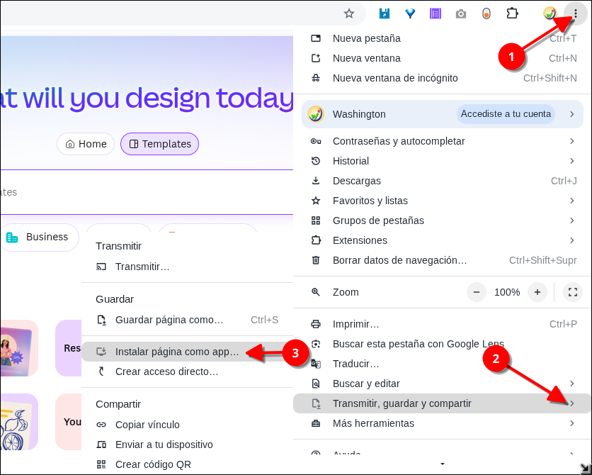

# Cómo instalar una página web como aplicación en Linux con Google Chrome



¿Sabías que puedes convertir prácticamente cualquier página web compatible en una aplicación independiente en Linux?

No necesitas instalar Wine, una máquina virtual ni buscar un paquete `.deb` o AppImage. **Google Chrome permite instalar determinadas páginas web como aplicaciones**, creando una ventana independiente y un acceso desde el menú de aplicaciones de Linux.

Por ejemplo, podemos instalar **Canva** como si fuera una aplicación de escritorio, aunque Canva no distribuya una aplicación oficial para Linux.

En este tutorial veremos cómo hacerlo paso a paso.

---

## ¿Qué vamos a conseguir?

Al finalizar tendremos una aplicación independiente para nuestra página web.

Por ejemplo:

```text
Canva
├── Ventana independiente
├── Icono propio
├── Acceso desde el menú de aplicaciones
├── Acceso directo
└── Sin necesidad de abrir una pestaña manualmente
```

La página seguirá siendo una aplicación web, pero Chrome se encargará de presentarla de una manera mucho más parecida a un programa de escritorio.

Esto es especialmente útil en distribuciones Linux donde determinado servicio no proporciona una aplicación nativa.

---

# 1. ¿Qué necesitamos?

Solamente necesitamos:

* Linux
* Google Chrome instalado
* Una conexión a Internet
* Una página web compatible con la instalación como aplicación

 

---

# 2. Abrir la página web

Primero abrimos **Google Chrome**.

En este ejemplo utilizaremos Canva:

[Canva](https://www.canva.com/?utm_source=chatgpt.com)

También podemos utilizar otros servicios web compatibles.

Una vez abierta la página, esperamos a que termine de cargar.

Por ejemplo:

```text
https://www.canva.com/
```

---

# 3. Abrir el menú de Chrome

Ahora hacemos clic en los **tres puntos verticales ⋮** que aparecen en la esquina superior derecha de Google Chrome.

En el menú buscamos:

**Transmitir, guardar y compartir**

Al colocar el cursor sobre esta opción aparecerá otro menú.

Seleccionamos:

**Instalar página como app**

La ruta completa es:

```text
⋮
   ↓
Transmitir, guardar y compartir
   ↓
Instalar página como app
```

> **Nota:** El nombre exacto de algunas opciones puede cambiar ligeramente dependiendo de la versión de Google Chrome y del idioma configurado.

---

# 4. Instalar la página como aplicación

Chrome mostrará la opción para instalar la página como aplicación.

Confirmamos la instalación.

Chrome creará una aplicación web independiente.

En nuestro ejemplo, si estamos instalando Canva, tendremos una aplicación llamada:

```text
Canva
```

A partir de este momento ya no necesitamos abrir una pestaña de Chrome y escribir manualmente la dirección de Canva cada vez que queramos utilizarla.

---

# 5. Abrir la aplicación

Después de instalarla podemos abrir la aplicación desde el menú de aplicaciones de nuestro entorno de escritorio Linux.

También podemos utilizar el buscador del sistema y escribir:

```text
Canva
```

La aplicación se abrirá en una **ventana independiente**.

Esto es diferente de simplemente tener Canva abierta en una pestaña del navegador.

Podemos tener, por ejemplo:

```text
Firefox
Chrome
Terminal
Canva
Administrador de archivos
```

como ventanas independientes.

---

# 6. ¿Dónde guarda Chrome estas aplicaciones?

Google Chrome proporciona una página especial para administrar las aplicaciones instaladas.

En la barra de direcciones escribimos:

```text
chrome://apps
```

y presionamos **Enter**.

Allí podremos ver las aplicaciones web que hemos instalado.

Por ejemplo:

```text
+-------------------+
|                   |
|      Canva        |
|                   |
+-------------------+
```

Desde esta pantalla podemos abrir la aplicación.

---

# 7. ¿Cómo desinstalar una aplicación?

Una de las ventajas de este método es que no tenemos que buscar archivos manualmente en nuestro sistema.

Abrimos:

```text
chrome://apps
```

Buscamos la aplicación que queremos eliminar.

Hacemos clic derecho sobre ella y utilizamos la opción disponible para **desinstalarla**.

De esta manera podemos quitar la aplicación cuando ya no la necesitemos.

---

# 8. ¿Es realmente una aplicación Linux?

Aquí hay una diferencia importante.

Cuando hacemos:

```text
Instalar página como app
```

**no estamos instalando un programa Linux nativo.**

Chrome está creando una aplicación web que utiliza el propio navegador para ejecutar el sitio.

Por eso es mejor entenderla como una:

**PWA — Progressive Web App**

o aplicación web instalada.

La página sigue funcionando mediante las tecnologías web utilizadas por el servicio, pero Chrome proporciona una experiencia más parecida a una aplicación independiente.

---

# 9. ¿Qué ventajas tiene?

Este método tiene varias ventajas.

### No necesitamos Wine

Si una empresa no proporciona una versión Linux de su programa, no necesariamente tenemos que utilizar Wine.

Podemos comprobar primero si existe una versión web que pueda instalarse como aplicación.

### No necesitamos una máquina virtual

No necesitamos instalar Windows dentro de VirtualBox, VMware u otro sistema de virtualización.

### No necesitamos buscar paquetes

No tenemos que buscar:

```text
programa.deb
programa.rpm
programa.AppImage
```

La aplicación web es administrada por Chrome.

### Podemos tener varias aplicaciones

Por ejemplo, podríamos instalar diferentes servicios web:

```text
Canva
Google Docs
Google Drive
YouTube Music
ChatGPT
Trello
Notion
```

siempre que Chrome permita instalarlos como aplicaciones.

---

# 10. Aplicaciones web frente a pestañas normales

La diferencia puede parecer pequeña, pero resulta bastante cómoda.

### Página web normal

```text
Chrome
┌──────────────────────────────────────────┐
│ Pestaña 1 │ Pestaña 2 │ Canva │ +       │
├──────────────────────────────────────────┤
│                                          │
│              CANVA                       │
│                                          │
└──────────────────────────────────────────┘
```

### Página instalada como aplicación

```text
Canva
┌──────────────────────────────────────────┐
│                                          │
│              CANVA                       │
│                                          │
└──────────────────────────────────────────┘
```

La segunda opción resulta especialmente cómoda cuando utilizamos determinado servicio con frecuencia.

---

# 11. Podemos crear un escritorio lleno de aplicaciones web

Una de las posibilidades interesantes de este sistema es utilizar Linux como una especie de **centro de aplicaciones web**.

Por ejemplo:

```text
Internet
   │
   ├── Canva
   ├── Google Drive
   ├── Gmail
   ├── Google Docs
   ├── YouTube
   ├── ChatGPT
   ├── GitHub
   └── Otros servicios
```

Cada servicio puede aparecer como una aplicación independiente.

Esto puede ser particularmente interesante para usuarios de Linux que utilizan servicios que solamente ofrecen aplicaciones oficiales para Windows o macOS.

---

# 12. ¿Funciona solamente en Linux?

No.

La posibilidad de instalar sitios web como aplicaciones forma parte de Google Chrome y también puede utilizarse en otros sistemas compatibles.

Lo interesante para los usuarios de Linux es que permite solucionar parcialmente una situación bastante habitual:

> "Este servicio tiene aplicación para Windows y macOS, pero no tiene aplicación Linux."

Antes de recurrir a Wine, podemos comprobar si el servicio tiene una versión web suficientemente completa y si Chrome permite instalarla como aplicación.

---

# 13. Ejemplo práctico: Canva en Linux

En mi caso utilicé Canva como ejemplo porque actualmente Canva ofrece aplicación de escritorio para algunos sistemas, pero no una aplicación Linux nativa.

En Linux podemos hacer:

```text
Google Chrome
     ↓
Canva.com
     ↓
⋮
     ↓
Transmitir, guardar y compartir
     ↓
Instalar página como app
     ↓
Canva
```

Después podemos comprobar la aplicación instalada desde:

```text
chrome://apps
```

Y tendremos Canva disponible como una aplicación independiente.

---

# 14. ¿Es mejor que instalar la aplicación de Windows con Wine?

No existe una respuesta universal, pero son dos soluciones diferentes.

### Aplicación web instalada

```text
Página web
     ↓
Google Chrome
     ↓
Aplicación web
```

### Aplicación Windows con Wine

```text
Programa Windows
       ↓
      Wine
       ↓
     Linux
```

Si el servicio web ofrece prácticamente todas las funciones que necesitamos, la aplicación web suele ser una solución mucho más sencilla.

Además, evitamos depender de una versión Windows del programa y de la compatibilidad de Wine.

---

# 15. Un consejo importante

No todas las páginas web pueden instalarse como aplicaciones.

Si al abrir el menú de Chrome no aparece:

```text
Instalar página como app
```

puede significar que esa página no está configurada para ofrecer esa posibilidad.

En ese caso podemos simplemente utilizarla como una página web normal.

También debemos recordar que una aplicación web depende de la página y del servicio que proporciona su desarrollador.

Si el sitio cambia, elimina alguna función o deja de funcionar, la aplicación web también se verá afectada.

---

# 16. Resumen

Convertir una página web en una aplicación en Linux mediante Google Chrome es muy sencillo:

```text
1. Abrir Google Chrome
        ↓
2. Entrar en la página web
        ↓
3. Pulsar ⋮
        ↓
4. Transmitir, guardar y compartir
        ↓
5. Instalar página como app
        ↓
6. Confirmar la instalación
        ↓
7. Buscar la aplicación en Linux
```

Y para administrar las aplicaciones instaladas podemos utilizar:

```text
chrome://apps
```

---

## Rererencias

- [Install and manage web apps in Google Chrome](https://support.google.com/chrome/answer/9658361)

- [Use web apps – Chrome Web Store Help](https://support.google.com/chrome_webstore/answer/3060053)

- [Canva – Official Website](https://www.canva.com/)

- [Canva – Desktop App](https://www.canva.com/download/)
