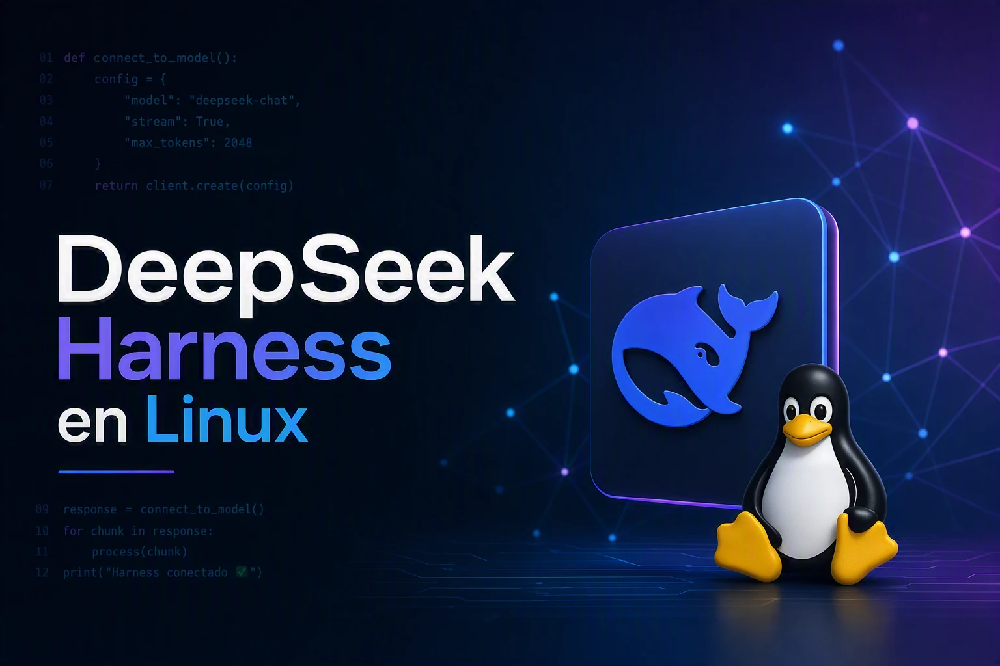

# Cómo instalar DeepSeek Harness en Linux y configurar sus modelos (APIs gratis y de pago)



> **Nota importante sobre el comando `dsh`**
>
> Si escribes `dsh --version` en la terminal y te aparece algo como *"Distributed Shell / Dancer's shell version 0.25.10"*, **no es DeepSeek Harness**. Existe un programa antiguo de Linux que también se llama `dsh` (de *Distributed Shell*) y que no tiene nada que ver. En Debian/Ubuntu, si haces `sudo apt install dsh`, instalarás ese otro programa antiguo, no el nuestro.
>
> DeepSeek Harness (dsh) **no se instala con `apt`**. Se instala clonando su repositorio y ejecutándolo con `pnpm`. La forma correcta de comprobar la versión del nuestro es:
>
> ```bash
> pnpm run dsh --version
> ```
>
> que mostrará algo como `0.1.5-rc.2`.

---

## Qué es DeepSeek Harness (dsh) y para qué sirve

**DeepSeek Harness** es una aplicación de inteligencia artificial que actúa como **agente de programación**. La palabra *harness* en inglés significa "arnés" o "arnés de sujeción" — la idea es que es una estructura que **sujeta y conecta** varias piezas:

```
   Los modelos de IA (DeepSeek, NVIDIA, TokenRouter, etc.)
              ↓
   DeepSeek Harness (los conecta y los controla)
              ↓
   Las herramientas (leer archivos, ejecutar comandos, etc.)
              ↓
   Tu ordenador (Linux)
```

**En palabras simples:** es un programa que se ejecuta en tu ordenador y te abre una página web en el navegador. En esa página escribes lo que quieres hacer (por ejemplo, "ordena mis fotos por fecha"), y la IA que tengas conectada lo hace por ti, pidiéndote permiso antes de tocar archivos o ejecutar comandos.

Lo interesante es que **puedes conectar varios proveedores de IA al mismo tiempo** y cambiar de uno a otro desde la propia interfaz, sin reiniciar nada:

```
DeepSeek Harness (dsh)
├── DeepSeek (nativo, con API key de pago)
│   └── deepseek-v4-flash / deepseek-v4-pro
│
├── TokenRouter (gratis)
│   └── z-ai/glm-5.3-free
│
└── NVIDIA (gratis)
    └── nvidia/nemotron-3-super-120b-a12b
```

---

## Palabras complicadas explicadas

Antes de empezar, vamos a explicar algunas palabras que van a aparecer y que quizá no conozcas:

- **Repositorio (repo):** es una carpeta de proyecto que está guardada en internet (en GitHub) y que puedes copiar a tu ordenador.
- **Clonar:** copiar un repositorio de internet a tu ordenador con el comando `git clone`.
- **Terminal / consola:** la ventana negra donde escribes comandos.
- **Comando:** una instrucción que escribes y pulsas Enter.
- **Dependencias:** los programas auxiliares que necesita un proyecto para funcionar. Se descargan con `pnpm install`.
- **Compilar / construir (build):** traducir el código fuente (que los humanos escriben) a algo que el ordenador pueda ejecutar. Se hace con `pnpm run build`.
- **API:** la "puerta" por la que un programa se comunica con otro. Una **API key** es la llave de esa puerta, un código secreto que te identifica.
- **Proveedor:** una empresa o servicio que te da acceso a modelos de IA (DeepSeek, NVIDIA, TokenRouter, OpenAI, etc.).
- **Modelo:** el "cerebro" de IA concreto que usas. Cada proveedor tiene varios.
- **Workspace (espacio de trabajo):** la carpeta de tu ordenador sobre la que el agente puede trabajar. Es como decirle "solo puedes tocar lo que está aquí dentro".
- **Token (en la URL):** una contraseña temporal que se añade a la dirección web para que solo tú puedas entrar.
- **Puerto:** un número que identifica a qué programa de tu ordenador quieres conectarte. El 3080 es el que usa dsh.
- **Backup (respaldo):** una copia de seguridad. Si algo se rompe, puedes volver a la copia.
- **`rc` (release candidate):** versión "candidata a definitiva". Está casi lista pero todavía puede cambiar.
- **`alpha` / `beta`:** versiones muy tempranas de un programa. Pueden tener fallos.
- **`~` (virgulilla):** significa "mi carpeta personal" (por ejemplo, `/home/wachin`). Así que `~/.dsh` es `/home/wachin/.dsh`.
- **`.bashrc`:** un archivo oculto que se lee cada vez que abres la terminal. Sirve para configurar cosas permanentes, como las claves de API.
- **Entorno / variable de entorno:** un valor que el sistema guarda y que los programas pueden leer. Por ejemplo, `DEEPSEEK_API_KEY`.
- **YAML:** un formato de archivo de configuración, parecido a una lista ordenada. Fácil de leer a simple vista.

---

## 1. Requisitos (Node.js, pnpm, curl) 

Necesitamos:

- **Node.js** (versión 22.19 o superior, o 24+). Si no lo tienes, instálalo desde el repositorio de NodeSource (instrucciones detalladas en [Cómo instalar node en Linux](https://facilitarelsoftwarelibre.blogspot.com/2026/08/como-instalar-nodejs-24-en-ubuntu-debian-etc.html)):

```bash
sudo apt update
sudo apt-get install -y curl
curl -fsSL https://deb.nodesource.com/setup_24.x | sudo -E bash -
sudo apt-get install -y nodejs
```

Comprueba la versión con:

```bash
node --version
```

> **Nota sobre permisos de npm:** si al instalar paquetes globales (`npm install -g ...`) aparece un error `EACCES: permission directed`, no modifiques los permisos de `/usr/lib`. En su lugar, configura las instalaciones globales en tu HOME:

```bash
mkdir -p ~/.local/npm
npm config set prefix ~/.local/npm
echo 'export PATH="$HOME/.local/npm/bin:$PATH"' >> ~/.bashrc
source ~/.bashrc
```

- **pnpm** (un gestor de dependencias). Si no lo tienes instálalo mediante npm:

```bash
sudo npm install -g pnpm
```

- **git**, para clonar el repositorio:

```bash
sudo apt install -y git
```

> **Ojo:** el paquete `dsh` que hay en `apt` **no es DeepSeek Harness**. Es un programa antiguo de Linux llamado *Distributed Shell*. Si lo instalas por error, no pasa nada, pero no sirve para lo que queremos. Para desinstalarlo si lo instalaste sin querer:
>
> ```bash
> sudo apt remove dsh libdshconfig1
> ```

---

## 2. Clonar e instalar DeepSeek Harness

```bash
git clone https://github.com/deepseek-ai/deepseek-harness.git
cd deepseek-harness
pnpm install
pnpm run build
```

`pnpm install` descarga todas las dependencias y `pnpm run build` compila el proyecto. Este paso tarda varios minutos la primera vez, pero **solo es necesario hacerlo una vez**.

### Si actualizas el repositorio más adelante

Cuando pase el tiempo y quieras actualizar, **no basta con `pnpm install && pnpm run build`**. Hay que hacer tres pasos, y uno de ellos es imprescindible para que no falle:

```bash
cd ~/Dev3/deepseek-harness
git pull                      # traer el código nuevo
pnpm install --frozen-lockfile
pnpm run clean                # ← ESTO ES LO QUE EVITA EL ERROR
pnpm run build
```

**¿Por qué es necesario `pnpm run clean`?**

Cuando compilas, se generan archivos de caché (`.tsbuildinfo` y carpetas `lib/`) que dicen "esto ya está compilado, no hace falta repetirlo". Al actualizar el código, esos archivos se quedan **desincronizados**: apuntan a versiones antiguas que ya no existen. El compilador entonces falla con un error tipo:

```
[MISSING_EXPORT] "DEFAULT_PREPARED_SESSION_CACHE_SIZE" is not exported by ...
```

Ese error significa: "el código nuevo espera una función que la parte compilada antigua no tiene". `pnpm run clean` borra esos archivos viejos y obliga a recompilar todo desde cero, de forma coherente.

Si después del `clean` sigue fallando, haz una limpieza total:

```bash
rm -rf node_modules pnpm-lock.yaml
pnpm install
pnpm run build
```

---

## 3. Abrir DeepSeek Harness (las veces que queramos, también después de reiniciar el ordenador)

Después de la instalación inicial, es necesario ubicarnos en el directorio donde clonamos el repositorio. Yo lo tengo en:

```bash
cd ~/Dev3/deepseek-harness
```

Luego, para lanzarlo:

```bash
pnpm dsh web
```

>**Posible problema con la terminal.-** Si acabas de compilar el proyecto (`pnpm run clean && pnpm run build`) en una terminal y luego ejecutas `pnpm dsh web` en esa misma terminal >pero no abre el navegador, **cierra esa terminal y abre otra nueva**. En la nueva terminal el comando funcionará correctamente.
>Esto ocurre porque la compilación puede alterar variables de entorno o el estado interno de la terminal. Al abrir una nueva, se recarga el `.bashrc` >limpio y todo funciona como es esperado.

**Este es el comando que hay que recordar.**

Al ejecutarlo, la terminal mostrará algo parecido a:

```
dsh web: http://127.0.0.1:3080/?token=lRn0K8364K86kkViiR4Sf_rP5OQp0NWNInNKxXx1Tnw
```

y el navegador se abrirá automáticamente en esa dirección.

### Detalles importantes

- La URL lleva un **token** de acceso (esa cadena larga de letras y números). Es una contraseña temporal.
- La primera vez se abre sola; si cierras la pestaña y quieres volver a entrar, copia la URL completa (con el token) desde la terminal.
- El servidor corre en la terminal: para cerrarlo, pulsa `Ctrl + C` en ella.
- **No hace falta volver a ejecutar `pnpm run build` después de reiniciar el ordenador.** Solo se necesita si actualizas el repositorio con `git pull`.

Si en algún momento cierras el servidor y quieres que no se abra el navegador (por ejemplo, en una sesión SSH), usa:

```bash
pnpm dsh web --no-open
```

### Comprobar la versión de dsh (la nuestra, no la de apt)

```bash
pnpm run dsh --version
```

Esto mostrará algo como `0.1.5-rc.2`.

> **No uses `dsh --version` a secas.** Si en algún momento instalaste el `dsh` de apt, ese comando te mostrará *"Distributed Shell / Dancer's shell"*, que no es nuestro programa. Para que el comando corto funcione como alias, puedes añadir esto al final de tu `~/.bashrc`:
>
> ```bash
> alias dsh="pnpm --dir ~/Dev3/deepseek-harness run dsh"
> ```
>
> Guardas, cierras la terminal, abres otra, y ya puedes escribir `dsh web` o `dsh --version` desde cualquier carpeta.

---

## 4. Primera vez: elegir el espacio de trabajo (workspace)

La primera vez que se abre la aplicación, hay que elegir el **workspace**, que es la carpeta del proyecto sobre la que el agente podrá trabajar.

En la pantalla inicial:

1. Pulsamos el botón **Choose workspace**.
2. Navegamos hasta la carpeta de nuestro proyecto.
3. Confirmamos.

El agente solo podrá leer y modificar archivos dentro de esa carpeta. Es una medida de seguridad: si le pides algo, no podrá salirse de ahí.

---

## 5. Configurar DeepSeek (proveedor nativo)

DeepSeek es el proveedor nativo del harness y **no requiere ninguna configuración especial**: basta con que la variable de entorno `DEEPSEEK_API_KEY` exista en la terminal desde la que lanzas `dsh web`.

Si aún no la tienes, la creas en `~/.bashrc`:

```bash
export DEEPSEEK_API_KEY="sk-XXXXXXXXXXXXXXXXXXXX"
```

(Este archivo está oculto en tu carpeta personal; en un administrador de archivos con **Ctrl + H** lo podrás ver. También puedes editarlo desde la terminal con `nano ~/.bashrc`.)

Guardas, cierras la terminal y abres otra.

**No publiques esta clave.** No la subas a GitHub, no la publiques en capturas de pantalla y no la envíes a otras personas. Si alguien la obtiene, puede gastar tu dinero.

Con eso, al abrir la interfaz web verás los modelos de DeepSeek disponibles en el selector:

- `deepseek-v4-flash`
- `deepseek-v4-pro`
- `deepseek-v4-flash-vision-exp` (experimental, con visión)

### Alternativa: guardar la clave desde la interfaz web

También se puede hacer sin tocar `.bashrc`: abrimos **Settings → Models**, buscamos la tarjeta **DeepSeek**, pegamos la clave en el campo de API key y guardamos. La clave queda almacenada en `~/.dsh/.credentials.yaml` y la interfaz nunca vuelve a mostrarla (solo una versión censurada).

---

## 6. Configurar TokenRouter (gratis, OpenAI-compatible)

TokenRouter ofrece modelos gratuitos mediante una API compatible con OpenAI. Su tutorial completo está en:

[AGENTS/20260828 Creando una API gratis en TR](../20260828%20Creando%20una%20API%20gratis%20en%20TR/API%20gratis%20en%20TokenRouter.md)

Resumen de los datos:

```
Base URL: https://api.tokenrouter.com/v1
Modelo:   z-ai/glm-5.3-free
```

En la interfaz web:

1. Vamos a **Settings → Models**.
2. Pulsamos **Add a custom provider**.
3. Rellenamos:

| Campo | Valor |
|---|---|
| Provider ID | `tokenrouter` |
| Display name | TokenRouter |
| Base URL | `https://api.tokenrouter.com/v1` |
| API protocol | OpenAI-compatible |
| API key | tu clave `sk-...` de TokenRouter |
| Models | `z-ai/glm-5.3-free` |

4. Pulsamos el botón **Fetch available models** si queremos que la propia interfaz consulte el endpoint y nos ofrezca la lista de modelos disponibles (TokenRouter soporta el endpoint `GET /models`, así que funciona).
5. Guardamos.

---

## 7. Configurar NVIDIA (gratis, OpenAI-compatible)

NVIDIA Build ofrece también modelos gratuitos mediante una API compatible con OpenAI. Su tutorial completo está en:

[AGENTS/20260828.2 Cómo usar la API gratuita de NVIDIA en Qwen Code CLI para Linux](../20260828.2%20Cómo%20usar%20la%20API%20gratuita%20de%20NVIDIA%20en%20Qwen%20Code%20CLI%20para%20Linux/Free%20NVIDIA%20API%20en%20qwen.md)

Resumen de los datos:

```
Base URL: https://integrate.api.nvidia.com/v1
Modelo:   nvidia/nemotron-3-super-120b-a12b
```

En la interfaz web:

1. Vamos a **Settings → Models**.
2. Pulsamos **Add a custom provider**.
3. Rellenamos:

| Campo | Valor |
|---|---|
| Provider ID | `nvidia` |
| Display name | NVIDIA |
| Base URL | `https://integrate.api.nvidia.com/v1` |
| API protocol | OpenAI-compatible |
| API key | tu clave `nvapi-...` de NVIDIA |
| Models | `nvidia/nemotron-3-super-120b-a12b` |
4. Al igual que con TokenRouter, **Fetch available models** funciona aquí y devuelve una lista enorme de modelos (puedes buscar `deepseek`, `nemotron`, `qwen`, `glm`, etc.).
5. Guardamos.

---

## 8. Elegir modelo y empezar a usar el agente

Una vez configurados los proveedores, todos los modelos aparecen en el **selector de modelos** de la interfaz web (normalmente abajo, cerca de donde se escribe el mensaje).

Seleccionamos el que queramos y ya podemos escribir la primera tarea. Por ejemplo, una prueba segura sin modificar nada:

```
Lista los archivos del directorio actual y dime sus nombres.
No modifiques, crees ni elimines ningún archivo.
```

Si el agente pide permiso para ejecutar herramientas (leer archivos, ejecutar comandos), la interfaz mostrará un cuadro de aprobación donde eliges si permitirlo una vez, siempre en esta sesión, o denegarlo.

El flujo completo queda:

```
API (DeepSeek / TokenRouter / NVIDIA)
          ↓
   Modelo seleccionado
          ↓
   DeepSeek Harness (web)
          ↓
   Herramientas (Shell, archivos, ...)
          ↓
        Linux
```

---

## 9. Cambiar de modelo o de proveedor

No hay que reconfigurar nada. Simplemente:

1. Abrimos el selector de modelos en la interfaz.
2. Elegimos otro modelo (aunque sea de otro proveedor distinto).

Los cambios de proveedor aplican en la siguiente petición, sin reiniciar el servidor.

Si borras un proveedor que estaba siendo usado como modelo por defecto, el compositor mostrará **Select model** y bloqueará la entrada hasta que elijas otro.

---

## 10. Dónde se guardan tus datos (y por qué hay que hacer backup)

DeepSeek Harness guarda su configuración en:

```
~/.dsh/
```

Eso es una carpeta oculta dentro de tu carpeta personal (`/home/wachin/.dsh`). Dentro hay tres cosas importantes:

| Archivo / carpeta | Contenido |
|---|---|
| `settings.yaml` | Preferencias (idioma, onboarding, compatibilidad de proveedores) |
| `.credentials.yaml` | Claves API guardadas desde la interfaz |
| `sessions/` | Las sesiones de trabajo (todo el historial de conversaciones y acciones) |

### Qué es cada cosa, explicado

- **`settings.yaml`** es como el "panel de preferencias" de dsh. Aquí viven cosas como en qué idioma quieres la interfaz, si ya viste el asistente de bienvenida, y ajustes finos de compatibilidad con proveedores. Si lo borras, dsh vuelve a su estado inicial (no pierdes conversaciones, solo preferencias).

- **`.credentials.yaml`** es la "caja fuerte" donde se guardan las claves API que has escrito desde la interfaz web (**Settings → Models**). El punto delante del nombre significa que es un archivo oculto. Contiene tus claves en texto plano, así que **no lo compartas ni lo subas a ningún sitio**.

- **`sessions/`** es la carpeta más valiosa. Ahí dentro está **todo tu historial de trabajo**: cada conversación con el agente, cada comando que se ejecutó, cada archivo que se modificó, todo. Si pierdes esta carpeta, pierdes el historial de todas tus sesiones. Las sesiones se conservan entre reinicios: si apagas el ordenador y vuelves a lanzar `pnpm dsh web`, la conversación anterior seguirá allí (aparece en la lista de sesiones de la barra lateral).

### ¿Por qué hay que hacer un backup antes de actualizar?

Porque el proyecto DeepSeek Harness está en **fase de desarrollo temprano** (lo que ellos llaman *developer preview*), y su propio README avisa con mayúsculas:

> *"DeepSeek Harness is currently in developer preview and is iterating rapidly. **THERE WILL BE COMPATIBILITY-BREAKING CHANGES**."*

Eso significa, en palabras simples: **las actualizaciones pueden cambiar el formato en que se guardan las sesiones en el disco**. Un archivo que la versión antigua escribía de una manera, la versión nueva puede esperar que esté de otra. Si actualizas y el formato cambió, la versión nueva puede leer mal tus sesiones antiguas o incluso estropearlas.

Por eso, antes de actualizar, hay que hacer una copia de seguridad de `~/.dsh`. Concretamente:

```bash
cp -r ~/.dsh ~/.dsh-backup
```

**Explicación del comando:**

- `cp` = copy (copiar)
- `-r` = recursive (recursivo: copia también todo lo que hay dentro de la carpeta)
- `~/.dsh` = la carpeta original
- `~/.dsh-backup` = la carpeta nueva donde se guarda la copia

Eso crea una copia completa en `/home/wachin/.dsh-backup`. Si algo sale mal después de actualizar, puedes volver atrás borrando la carpeta nueva y renombrando la copia:

```bash
rm -rf ~/.dsh
mv ~/.dsh-backup ~/.dsh
```

### Cuándo hacer el backup

- **Antes** de hacer `git pull && pnpm run build`, no después. La versión nueva toca la carpeta de sesiones en cuanto la abre por primera vez. Una copia hecha *después* ya sería una copia del formato nuevo, que no te serviría para volver atrás.
- Si vas a saltar entre versiones `rc` (release candidate), hazlo siempre. Son las que más cambios de formato traen.

---

## 11. Solución de problemas

### El comando `dsh --version` muestra "Distributed Shell"

No es un error del tutorial: es que en tu sistema hay instalado el `dsh` de apt (otro programa distinto). Para usar el nuestro, dentro de la carpeta del repo:

```bash
pnpm run dsh --version
```

Y si quieres un atajo permanente, añade el alias al `~/.bashrc` como se explicó en la sección 3.

### El comando `pnpm dsh web` no hace nada o falla

Comprueba que estás dentro de la carpeta del repositorio:

```bash
cd ~/Dev3/deepseek-harness
```

Si actualizaste el repositorio (`git pull`), hay que recompilar:

```bash
pnpm run clean
pnpm run build
```

### `pnpm dsh web` no abre el navegador tras actualizar (pero sí en otra terminal)

Si acabas de compilar el proyecto (`pnpm run clean && pnpm run build`) en una terminal y luego ejecutas `pnpm dsh web` en esa misma terminal pero no abre el navegador, **cierra esa terminal y abre otra nueva**. En la nueva terminal el comando funcionará correctamente.

Esto ocurre porque la compilación puede alterar variables de entorno o el estado interno de la terminal. Al abrir una nueva, se recarga el `.bashrc` limpio y todo funciona como es esperado.

### Error `MISSING_EXPORT` al recompilar tras `git pull`

Es el error más típico al actualizar. Aparece así:

```
[MISSING_EXPORT] "DEFAULT_PREPARED_SESSION_CACHE_SIZE" is not exported by ...
```

Significa que los archivos de compilación antiguos (caché `.tsbuildinfo` y carpetas `lib/`) están desincronizados con el código nuevo. La solución es limpiar y recompilar desde cero:

```bash
pnpm run clean
pnpm install --frozen-lockfile
pnpm run build
```

Si sigue fallando, limpieza total:

```bash
rm -rf node_modules pnpm-lock.yaml
pnpm install
pnpm run build
```

### Aviso "Update available" de pnpm al actualizar

Al actualizar el repositorio (`git pull`) y ejecutar `pnpm install`, pnpm puede mostrar:

```
Update available! 11.7.0 → 11.25.0.
```

**No es necesario actualizar pnpm.** El proyecto fija su versión en `package.json` (`"packageManager": "pnpm@11.7.0"`) y pnpm usa automáticamente esa versión dentro del repositorio, así que el aviso se puede ignorar. El comando que sugiere (`pnpm add -g pnpm`) además fallará si pnpm se instaló con npm, porque el directorio global de pnpm no está en el PATH. Si aun así quieres actualizar pnpm, hazlo por el mismo canal con el que lo instalaste:

```bash
npm install -g pnpm@latest
```

### Error `MISSING_CREDENTIAL`

El proveedor está configurado pero no encuentra la clave. Guarda la clave desde **Settings → Models** o asegúrate de que la variable de entorno correspondiente existe en la terminal donde lanzaste `dsh web`.

### Error `UNKNOWN_MODEL`

El modelo seleccionado ya no está en la configuración del proveedor. Selecciona otro o añádelo en **Settings → Models**.

### "Fetch available models" devuelve 401

La API key es incorrecta o ha caducado. Genera otra en la consola del proveedor (TokenRouter o NVIDIA, en los enlaces de arriba).

### El proveedor rechaza todas las peticiones aunque la clave y la URL son correctas

Es un problema de compatibilidad de peticiones (no todos los gateways aceptan el formato exacto de OpenAI). En `$DSH_HOME/settings.yaml` (es decir, `~/.dsh/settings.yaml`) se puede ajustar la sección `llm-pi-ai` con:

```yaml
llm-pi-ai:
  providers:
    tokenrouter:
      compat:
        supportsDeveloperRole: false
        maxTokensField: max_tokens
```

La lista completa de opciones de compatibilidad está en la [documentación oficial de dsh-llm-pi-ai](https://github.com/deepseek-ai/deepseek-harness/blob/main/packages/llm/llm-pi-ai/README.md).

### Cerrar el servidor

`Ctrl + C` en la terminal donde corre. El puerto por defecto es `3080`.

---

## 12. Resultado final

Al terminar tendrás:

```
DeepSeek Harness 0.1.5-rc.2 (web local en http://127.0.0.1:3080)
│
├── DeepSeek (nativo, ~/.bashrc o interfaz)
│   └── deepseek-v4-flash, deepseek-v4-pro
│
├── TokenRouter (custom provider, gratis)
│   └── z-ai/glm-5.3-free
│
└── NVIDIA (custom provider, gratis)
    └── nvidia/nemotron-3-super-120b-a12b
```

Y el comando para abrirlo cada día, también después de reiniciar el ordenador:

```bash
cd ~/Dev3/deepseek-harness && pnpm dsh web
```

## RESUMEN

```
1. git clone + pnpm install + pnpm run build   (una sola vez)
        ↓
2. pnpm dsh web                                (cada vez que queramos abrirlo)
        ↓
3. Elegir workspace la primera vez
        ↓
4. Settings → Models → tarjeta DeepSeek
   (o DEEPSEEK_API_KEY en ~/.bashrc)
        ↓
5. Add a custom provider → TokenRouter / NVIDIA
        ↓
6. Seleccionar modelo y escribir la primera tarea
        ↓
7. Cambiar de modelo con el selector, sin reiniciar
```

### Para actualizar en el futuro

```
1. cp -r ~/.dsh ~/.dsh-backup     ← BACKUP PRIMERO (por si acaso)
        ↓
2. cd ~/Dev3/deepseek-harness
        ↓
3. git pull
        ↓
4. pnpm install --frozen-lockfile
        ↓
5. pnpm run clean                 ← evita el error MISSING_EXPORT
        ↓
6. pnpm run build
        ↓
7. pnpm dsh web                   ← y a trabajar
```

De esta manera puedes ejecutar DeepSeek Harness en Linux con varios proveedores de modelos —los gratuitos de TokenRouter y NVIDIA junto a la API oficial de DeepSeek— y conservar todas tus sesiones de trabajo entre reinicios del ordenador, con la tranquilidad de tener un respaldo por si una actualización cambia el formato de los archivos.
