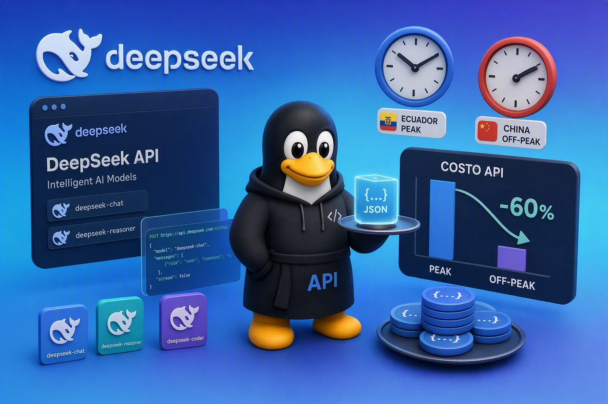

# Guía completa de DeepSeek API desde cero

## 1. Primero, entendamos las palabras básicas (no te asustes, no son difíciles)

Antes de empezar, hay que entender algunos términos. Yo tampoco los entendía, pero con el tiempo los aprendí:

| Palabra en inglés | En español | Explicación con palabras sencillas |
|---|---|---|
| **API** | Interfaz de programación | Imagina un **mesero**. Tu programa le dice al mesero lo que quieres, el mesero va a la cocina (servidor), trae la comida (datos o respuesta) y te la entrega. |
| **Input** | Entrada | **Lo que tú le envías a la IA**. Por ejemplo, el texto que escribes, un archivo que subes. |
| **Output** | Salida | **Lo que la IA te responde**. Por ejemplo, el texto que genera, el código que escribe, la respuesta que te da. |
| **Token** | Ficha o unidad de texto | La IA no cobra por "letra" ni por "palabra", cobra por **Token**. Un Token puede ser una palabra, un número o un signo de puntuación. **Mientras más texto envías, más Tokens usas y más pagas**. |
| **Cache Hit** | Acierto de caché | **"La IA recuerda que ya le enviaste lo mismo antes"**. Si repites el mismo texto, la IA no lo vuelve a calcular, lo saca de su "memoria". Por eso es **muchísimo más barato**. |
| **Cache Miss** | Fallo de caché | **"La IA ve esto por primera vez"**. Tiene que calcularlo todo desde cero, por eso es **más caro**. |
| **Peak** | Hora pico / hora punta | **"La hora más ocupada"**. Hay mucha gente usando el servicio, por eso cobran **el doble**. |
| **Off-Peak** | Hora valle / hora tranquila | **"La hora menos ocupada"**. Hay poca gente usando el servicio, por eso cobran **la mitad**. |
| **USD** | Dólares estadounidenses | La moneda con la que te cobran. |
| **Base URL** | Dirección base | La dirección de internet a la que tu programa se conecta para hablar con la IA. |
| **API Key** | Clave de API | Es como tu **contraseña secreta**. Con ella el servicio sabe que eres tú y te cobra a ti. **Nunca la compartas con nadie**. |

**¿Por qué hay que entender esto?** Porque DeepSeek cobra según la cantidad de **Input** y **Output** en **Tokens**, y además en **horario Peak** cobra el doble. Si entiendes esto, puedes ahorrar mucho dinero.

---

## 2. Enlaces oficiales de DeepSeek (imprescindibles para usuarios de Ecuador)

Estos son todos los enlaces que usarás en la plataforma de DeepSeek. Los he organizado para ti:

| Para qué sirve | Enlace | Explicación |
|---|---|---|
| **Plataforma principal** | https://platform.deepseek.com | Registrarse, iniciar sesión, administrar la cuenta |
| **Recargar saldo** | https://platform.deepseek.com/top_up | Poner dinero en tu cuenta (ver más abajo el problema de pago en Ecuador) |
| **Historial de pagos** | https://platform.deepseek.com/transactions | Ver cuánto dinero has gastado |
| **Generar API Key** | https://platform.deepseek.com/api_keys | Aquí creas tu "llave" secreta. **No se la muestres a nadie** |
| **Ver uso** | https://platform.deepseek.com/usage | Ver cuánto saldo te queda y cuántos Tokens has usado |

### ⚠El pago

- Soy de Ecuador y he testeado pagar con Google Play y me funcionó una vez pero después no me funcionó, y después intenté con **PayPal** y si me funcionó. 
- Existen métodos de pago chinos (WeChat Pay, Alipay).

**Nota**: Existen servicios de terceros que te permiten comprar saldo de DeepSeek con una tarjeta de crédito normal. Por ejemplo, **AiCredits**. Tú les pagas a ellos, y ellos te dan una API Key. Solo tienes que cambiar la `base_url` en tu código para que funcione. 

---

### Nuevos precios para Flash (desde el 10 de septiembre 2026)

DeepSeek ha bajado el precio de la serie Flash. Los precios oficiales están en yuanes, pero para tu referencia, aquí están los valores aproximados en dólares por millón de tokens para el horario de menor demanda (off-peak):

*   **Input (Cache Hit)**: ~$0.003 USD
*   **Input (Cache Miss)**: ~$0.15 USD
*   **Output**: ~$0.60 USD

Durante el horario de mayor demanda (peak), estos precios se duplican. El horario peak es de **lunes a viernes, de 9:00 a 12:00 y de 14:00 a 18:00, hora de Beijing**.

### El fin de V4 Pro y la redirección a Flash (14 de septiembre)

A partir del **14 de septiembre**, si intentas usar el modelo **V4 Pro**, DeepSeek redirigirá automáticamente tus solicitudes al modelo **V4.1 Flash**. Esto significa que:
1.  **El servicio V4 Pro desaparecerá**: Ya no podrás usar el modelo antiguo.
2.  **La facturación cambiará**: Tus solicitudes a Pro se cobrarán con la tarifa de Flash, que es más económica.

---

## Primero: la diferencia de hora para aprovechar el horario off-peak

**Aprovecha el horario off-peak**: Dado que vives en Ecuador, la diferencia horaria con Beijing es de 13 horas. El horario peak de China (9:00-12:00 y 14:00-18:00) corresponde a la **noche y madrugada en Ecuador**. Si puedes programar tus tareas para que corran en horario off-peak de China, pagarás la mitad del precio.

China (Beijing) está **13 horas adelante** de Ecuador.

- Cuando en Ecuador son las **8:00 P.M.**, en China ya es el día siguiente a las **9:00 A.M.**
- Por eso el "horario caro" de China cae de **noche y madrugada** en Ecuador.

---

## Palabras que quizás no conozcas

| Palabra en inglés | Qué significa |
|---|---|
| **Peak** | "Pico" o "hora punta". Es cuando hay **más gente usando el servicio**, por eso cobran **el doble (más caro)**. |
| **Off-peak** | Lo contrario de peak: **hora valle** o "hora tranquila". Hay **menos gente**, por eso cobran **la mitad (más barato)**. |
| **Input** | Lo que **tú envías** a la API (tu pregunta, tu texto). |
| **Output** | Lo que **la API te responde** (la respuesta que te da). |
| **Cache hit** | "Acierto de caché". Cuando ya habías enviado **lo mismo antes** y el sistema lo recuerda → te cobran **muchísimo menos**. |
| **Cache miss** | "Fallo de caché". Cuando es **texto nuevo** que el sistema no tenía guardado → te cobran **más** que en cache hit. |
| **Tokens** | Son como **"trocitos de texto"**. No es exactamente una palabra, pero sirve para medir cuánto texto usas. Se cobra **por millón de tokens**. |
| **API** | Es el "puente" que usa tu programa para **hablar con los servidores de DeepSeek**. |
| **USD** | Dólares estadounidenses (la moneda con la que te cobran). |

---

## Tabla de horarios en Ecuador (hora local)

| Hora en Ecuador | Hora en China (Beijing) | ¿Peak o Off-peak? | ¿Te conviene? |
|---|---|---|---|
| **12:00 A.M. – 8:00 A.M.** | 1:00 P.M. – 9:00 P.M. | **PEAK** (caro) | ❌ No conviene |
| **8:00 A.M. – 11:00 A.M.** | 9:00 P.M. – 12:00 A.M. | **OFF-PEAK** (barato) | ✅ Sí conviene |
| **11:00 A.M. – 2:00 P.M.** | 12:00 A.M. – 3:00 A.M. | **OFF-PEAK** (barato) | ✅ Sí conviene |
| **2:00 P.M. – 5:00 P.M.** | 3:00 A.M. – 6:00 A.M. | **OFF-PEAK** (barato) | ✅ Sí conviene |
| **5:00 P.M. – 8:00 P.M.** | 6:00 A.M. – 9:00 A.M. | **OFF-PEAK** (barato) | ✅ Sí conviene |
| **8:00 P.M. – 12:00 A.M.** | 9:00 A.M. – 1:00 P.M. | **PEAK** (caro) | ❌ No conviene |

---

## Resumen fácil de recordar

- **CARO (peak) en Ecuador:** desde las **8:00 P.M. hasta las 8:00 A.M.** (toda la noche y madrugada).
- **BARATO (off-peak) en Ecuador:** desde las **8:00 A.M. hasta las 8:00 P.M.** (todo el día).

> ⚠️ **Ojo:** El horario peak de China solo aplica **de lunes a viernes**. Los **sábados y domingos** en China **todo el día es off-peak (barato)**. Como China va 13 horas adelante, esto significa que en Ecuador **desde el viernes por la noche hasta el domingo por la noche** probablemente todo sea barato. Te recomiendo confirmarlo en tu panel de uso.

---

## Consejo práctico

Si puedes **programar tus tareas pesadas** (las que usan mucho texto o muchas respuestas) para que corran **durante el día en Ecuador** (8:00 A.M. a 8:00 P.M.), **pagarás la mitad** que si las corres de noche.

---

## Ejemplo: cuánto pagas según la hora

Vamos a suponer que haces **una tarea** que gasta:

- **1 millón de tokens de input** (lo que tú envías)
- **1 millón de tokens de output** (lo que la API te responde)

Y supongamos que **todo tu input es "cache miss"** (texto nuevo, el caso más caro) para que el ejemplo sea claro.

### 💵 Precios (en dólares, por millón de tokens)

| Concepto | Off-peak (barato) | Peak (caro = doble) |
|---|---|---|
| Input (cache miss) | $0.15 | $0.30 |
| Output | $0.60 | $1.20 |

---

## Cuenta de esa tarea

| Concepto | Off-peak | Peak |
|---|---|---|
| Input (1 millón) | $0.15 | $0.30 |
| Output (1 millón) | $0.60 | $1.20 |
| **TOTAL por tarea** | **$0.75** | **$1.50** |

👉 **La misma tarea te cuesta el DOBLE si la haces en horario peak.**

---

## Ejemplo de un mes completo

Supongamos que haces **esta tarea 1 vez al día, los 30 días del mes**:

| Escenario | Costo por tarea | Veces al mes | **Total del mes** |
|---|---|---|---|
| 😀 Todo en **off-peak** (barato) | $0.75 | 30 | **$22.50** |
| 😢 Todo en **peak** (caro) | $1.50 | 30 | **$45.00** |
| 😐 Mitad y mitad | — | — | **$33.75** |

### 💰 Ahorro si lo haces siempre en horario barato:
**$45.00 − $22.50 = $22.50 de ahorro al mes** (¡la mitad!)

---

## 🕗 ¿Cómo aplicarlo a tu día en Ecuador?

| Si trabajas en este horario... | ¿Barato o caro? |
|---|---|
| **8:00 A.M. a 8:00 P.M.** | ✅ BARATO (ahorras la mitad) |
| **8:00 P.M. a 8:00 A.M.** | ❌ CARO (pagas el doble) |

**Truco fácil:** Si tu computadora puede hacer las tareas **sola y programadas**, ponlas a correr **en la mañana o en la tarde** (hora Ecuador), no en la noche.

---

## Bonus: si usas "cache hit" ahorras aún más

Si repites mucho el **mismo texto de entrada**, el sistema lo recuerda y te cobra muchísimo menos:

| Concepto | Precio off-peak |
|---|---|
| Input **cache hit** (repetido) | **$0.003** (¡casi nada!) |
| Input **cache miss** (nuevo) | $0.15 |

👉 La diferencia es tal bez **50 veces más barato** si repites texto. Por eso, si puedes **reutilizar el mismo texto de entrada**, ahorras muchísimo.

---
