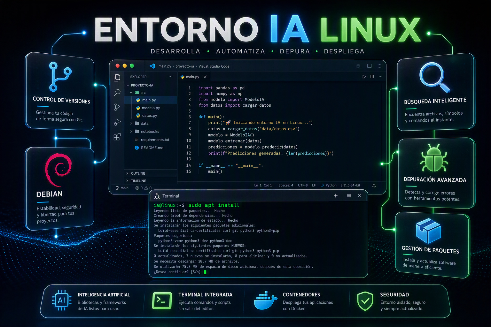

# Guía Completa: Paquetes para que un Agente IA Trabaje en Linux (Debian 13)



Guía definitiva para preparar un entorno Linux donde un agente de código de inteligencia artificial pueda investigar, analizar, compilar y documentar proyectos de software en Linux

---

## 1. Actualiza los índices

```bash
sudo apt update
```

## 2. Comando de Instalación Completa (Copia y Pega)

Para instalar **todas** las herramientas de una sola vez:

```bash
sudo apt update && sudo apt install -y \
  git \
  git-lfs \
  git-flow \
  gitk \
  tig \
  gh \
  python3 \
  python3-pip \
  python3-venv \
  python3-dev \
  build-essential \
  ripgrep \
  fd-find \
  jq \
  tree \
  bat \
  silversearcher-ag \
  universal-ctags \
  findutils \
  coreutils \
  grep \
  sed \
  gawk \
  diffutils \
  parallel \
  unzip \
  zip \
  tar \
  xz-utils \
  zstd \
  p7zip-full \
  rsync \
  file \
  binutils \
  elfutils \
  strace \
  ltrace \
  patchelf \
  dpkg-dev \
  debhelper \
  devscripts \
  fakeroot \
  lintian \
  desktop-file-utils \
  dpkg-repack \
  squashfs-tools \
  squashfuse \
  fuse3 \
  fuse \
  curl \
  wget \
  httpie \
  socat \
  ncat \
  net-tools \
  iproute2 \
  less \
  vim \
  nano \
  htop \
  btop \
  tmux \
  screen \
  pandoc \
  cppcheck
```

de estos algunos necesitan configuración, revise:


## 3. Configuración Post-Instalación

### Configurar `fd` en Debian

**En una frase:** `fd` es una alternativa moderna al comando `find`: hace lo mismo, pero se escribe mucho menos y es bastante más rápido.

En Debian y Ubuntu el paquete se llama **`fd-find`** y el programa se instala como **`fdfind`**, no como `fd`, porque el nombre `fd` ya estaba ocupado por otro paquete. Por eso aquí se crea un enlace simbólico: para poder escribir `fd`, igual que en cualquier otra distribución.

```bash
mkdir -p ~/.local/bin
ln -sf "$(command -v fdfind)" ~/.local/bin/fd
echo 'export PATH="$HOME/.local/bin:$PATH"' >> ~/.bashrc
source ~/.bashrc
```

Línea por línea:

- **`mkdir -p ~/.local/bin`** — crea la carpeta donde van tus propios ejecutables. `-p` significa "no falles si ya existe, y crea las carpetas intermedias que falten".
- **`ln -sf "$(command -v fdfind)" ~/.local/bin/fd`** — `command -v fdfind` devuelve la ruta completa donde está instalado (`/usr/bin/fdfind`); `ln -s` crea un enlace simbólico llamado `fd` que apunta ahí; `-f` lo sobrescribe si ya existía.
- **`echo 'export PATH="$HOME/.local/bin:$PATH"' >> ~/.bashrc`** — añade esa carpeta al final de tu `~/.bashrc` para que el sistema busque programas ahí. `>>` **añade** al final del archivo; con un solo `>` lo borrarías entero.
- **`source ~/.bashrc`** — vuelve a leer el archivo en la terminal actual, para no tener que cerrarla y abrir otra.

Comprobar que quedó bien, y ejemplos de uso:

```bash
fd --version            # debe responder sin errores
fd config               # archivos y carpetas que contienen 'config' en el nombre
fd -e md                # solo archivos .md
fd -t f                 # solo archivos
fd -t d                 # solo carpetas
fd -H config            # incluir archivos ocultos (por defecto los ignora)
```

Dos detalles que lo hacen distinto de `find`: **respeta el `.gitignore`** (no te lista `node_modules` ni la carpeta `dist/`, así que las búsquedas dentro de un proyecto devuelven solo lo que importa) y su sintaxis es la del `grep`: el patrón va primero y las opciones después.

### Configurar GitHub CLI

**En una frase:** `gh` es la herramienta oficial de GitHub para la terminal: te deja hacer desde ahí lo que normalmente harías en el navegador (repositorios, issues, pull requests, releases, ejecuciones de CI) y además **autentica git**, para que no tengas que escribir tu contraseña al hacer `push`.

```bash
gh auth status
# Si no has iniciado sesión:
gh auth login
```

- **`gh auth status`** — solo informa: con qué cuenta y en qué servidor estás, y qué permisos tiene el token. Es el primer comando que conviene ejecutar cuando algo falla al subir código.
- **`gh auth login`** — proceso guiado. Te pregunta si es GitHub.com o un servidor empresarial, si prefieres HTTPS o SSH, y si quieres autenticarte **por el navegador** o **pegando un token**. Además configura el ayudante de credenciales de git, así que después `git push` funciona sin pedirte contraseña.

Otros comandos que acabarás usando:

```bash
gh repo clone usuario/repositorio    # clonar sin copiar la URL a mano
gh pr create                         # abrir un pull request
gh issue list                        # ver los issues abiertos
gh run watch                         # seguir en vivo una ejecución de CI
```

#### Configurar Git con tu correo, ejemplo Proton

Esto **no** es autenticación: es el nombre y el correo que quedan escritos **dentro de cada commit**, es decir, quién hizo el cambio. Si no lo configuras, git lo deduce del equipo y los commits no aparecerán vinculados a tu cuenta.

```bash
git config --global user.email "linuxfrontier@proton.me"
git config --global user.name "Tu Nombre"
```

Detalle importante: GitHub relaciona un commit con tu cuenta **por el correo**, así que conviene que sea el mismo con el que te registraste (o el correo `@users.noreply.github.com` que GitHub te ofrece para no publicar el tuyo). `--global` lo aplica a todos tus repositorios; dentro de uno concreto puedes usar `--local` para poner otro distinto.

---
A continuación los comandos mismos separados por secciones:


## 4. Herramientas Principales del Sistema

Estas son las herramientas base que todo agente necesita:

```bash
sudo apt install -y \
  git \
  git-lfs \
  gh \
  python3 \
  python3-pip \
  python3-venv \
  python3-dev \
  build-essential \
  curl \
  wget \
  less
```

| Paquete | Comando | Descripción |
|---------|---------|-------------|
| `git` | `git` | Control de versiones, esencial para trabajar con repositorios |
| `git-lfs` | `git lfs` | Git Large File Storage, para repositorios con archivos grandes |
| `gh` | `gh` | GitHub CLI, para interactuar con GitHub directamente desde terminal |
| `python3` | `python3` | Intérprete de Python, base para muchas herramientas |
| `python3-pip` | `pip3` | Gestor de paquetes Python |
| `python3-venv` | `python3 -m venv` | Entornos virtuales de Python |
| `python3-dev` | - | Archivos de desarrollo de Python (headers) |
| `build-essential` | `gcc`, `make`, etc. | Compiladores y herramientas de build esenciales |
| `curl` | `curl` | Cliente HTTP para APIs y descargas |
| `wget` | `wget` | Descarga de archivos |
| `less` | `less` | Visualizador de archivos |

---

## 5. Búsqueda y Análisis de Código

Herramientas para que el agente pueda buscar, analizar y entender código rápidamente:

```bash
sudo apt install -y \
  ripgrep \
  fd-find \
  jq \
  tree \
  bat \
  silversearcher-ag \
  ctags \
  universal-ctags
```

| Paquete | Comando | Descripción |
|---------|---------|-------------|
| `ripgrep` | `rg` | Búsqueda recursiva ultra-rápida, respeta `.gitignore` |
| `fd-find` | `fdfind` | Búsqueda de archivos por nombre (más rápido que `find`) |
| `jq` | `jq` | Procesador de JSON en línea de comandos |
| `tree` | `tree` | Visualización de estructura de directorios |
| `bat` | `bat` | `cat` mejorado con resaltado de sintaxis |
| `silversearcher-ag` | `ag` | Búsqueda rápida de código fuente |
| `ctags` / `universal-ctags` | `ctags` | Generación de índices de código |

> En Debian, `fd-find` se instala como `fdfind`; el ajuste para poder llamarlo `fd` está
explicado paso a paso en la sección 3.

---

## 6. Herramientas GNU Esenciales

El conjunto básico de herramientas Unix que todo agente debe conocer:

```bash
sudo apt install -y \
  findutils \
  coreutils \
  grep \
  sed \
  gawk \
  diffutils \
  xargs \
  parallel
```

| Paquete | Comando principal | Descripción |
|---------|-------------------|-------------|
| `findutils` | `find`, `xargs` | Búsqueda de archivos y procesamiento |
| `coreutils` | `ls`, `cp`, `mv`, `cat`, `sort`, `uniq`, `wc`, etc. | Herramientas básicas del sistema |
| `grep` | `grep` | Búsqueda de patrones en texto |
| `sed` | `sed` | Edición de texto en línea de comandos |
| `gawk` | `awk` | Procesamiento de texto y columnas |
| `diffutils` | `diff`, `comm` | Comparación de archivos |
| `parallel` | `parallel` | Ejecución paralela de comandos |

---

## 7. Compresión y Archivos

Para trabajar con cualquier formato de archivo:

```bash
sudo apt install -y \
  unzip \
  zip \
  tar \
  xz-utils \
  zstd \
  p7zip-full \
  rsync \
  file
```

| Paquete | Comando | Descripción |
|---------|---------|-------------|
| `unzip` / `zip` | `unzip`, `zip` | Formato ZIP |
| `tar` | `tar` | Archivos tar/gz/bz2/xz |
| `xz-utils` | `xz`, `unxz` | Compresión XZ |
| `zstd` | `zstd`, `unzstd` | Compresión Zstandard (muy rápido) |
| `p7zip-full` | `7z` | Soporte para 7z y muchos formatos |
| `rsync` | `rsync` | Sincronización eficiente de archivos |
| `file` | `file` | Identificación de tipo de archivo |

---

## 8. Herramientas de Inspección de Ejecutables

Para analizar binarios, bibliotecas y paquetes:

```bash
sudo apt install -y \
  binutils \
  elfutils \
  strace \
  ltrace \
  patchelf \
  objdump
```

| Paquete | Comandos | Descripción |
|---------|----------|-------------|
| `binutils` | `readelf`, `objdump`, `strings`, `nm`, `strip`, `ar` | Herramientas de análisis de binarios ELF |
| `elfutils` | `eu-readelf`, `eu-objdump` | Utilidades ELF alternativas |
| `strace` | `strace` | Seguimiento de llamadas al sistema |
| `ltrace` | `ltrace` | Seguimiento de llamadas a bibliotecas |
| `patchelf` | `patchelf` | Modificación de ELF (rpath, interpreter) |

### Ejemplos de uso para el agente:

```bash
# Identificar un archivo
file programa

# Analizar dependencias ELF
readelf -d programa

# Ver secciones del binario
objdump -p programa

# Extraer strings legibles
strings programa

# Ver símbolos
nm programa

# Modificar rpath
patchelf --set-rpath /mi/ruta programa
```

---

## 9. Herramientas para Paquetes Debian (.deb)

Para investigar y crear paquetes Debian:

```bash
sudo apt install -y \
  dpkg-dev \
  debhelper \
  devscripts \
  fakeroot \
  lintian \
  desktop-file-utils \
  dpkg-repack
```

| Paquete | Comando | Descripción |
|---------|---------|-------------|
| `dpkg-dev` | `dpkg-deb`, `dpkg-buildpackage`, `dpkg-source` | Herramientas de desarrollo de paquetes |
| `debhelper` | `dh` | Macros y helpers para empaquetado Debian |
| `devscripts` | `debuild`, `dch`, `debchange` | Scripts para mantenedores Debian |
| `fakeroot` | `fakeroot` | Simular usuario root para empaquetado |
| `lintian` | `lintian` | Verificador de calidad de paquetes .deb |
| `desktop-file-utils` | `desktop-file-validate` | Validación de archivos .desktop |
| `dpkg-repack` | `dpkg-repack` | Reconstruir un .deb desde un paquete instalado |

---

## 10. Herramientas para AppImage

Para trabajar con formato AppImage:

```bash
sudo apt install -y \
  squashfs-tools \
  squashfuse \
  fuse3 \
  fuse
```

| Paquete | Comando | Descripción |
|---------|---------|-------------|
| `squashfs-tools` | `unsquashfs`, `mksquashfs` | Extraer/crear sistemas de archivos squashfs |
| `squashfuse` | - | Montar squashfs sin root |
| `fuse3` / `fuse` | - | Filesystem in Userspace |

> **Nota:** No instalar `appimagetool` ni `linuxdeploy` todavía. Primero hay que investigar qué usa cada proyecto.

---

## 11. Herramientas de Red y Debugging

Para debugging de red y peticiones HTTP:

```bash
sudo apt install -y \
  net-tools \
  iproute2 \
  socat \
  ncat \
  httpie \
  tmux \
  screen
```

| Paquete | Comando | Descripción |
|---------|---------|-------------|
| `net-tools` | `netstat`, `ifconfig` | Herramientas de red clásicas |
| `iproute2` | `ip`, `ss` | Herramientas de red modernas |
| `socat` | `socat` | Multiplexor de sockets bidireccional |
| `ncat` | `ncat` | Cliente/servidor TCP/UDP |
| `httpie` | `http` | Cliente HTTP más amigable que curl |
| `tmux` | `tmux` | Multiplexor de terminal |
| `screen` | `screen` | Sesioness de terminal |

---

## 12. Herramientas de Texto y Documentación

Para generar y documentar:

```bash
sudo apt install -y \
  pandoc \
  texlive-base \
  groff \
  vim \
  nano \
  htop \
  btop
```

| Paquete | Comando | Descripción |
|---------|---------|-------------|
| `pandoc` | `pandoc` | Conversor universal de documentos |
| `texlive-base` | `pdflatex` | LaTeX para generación de PDF |
| `groff` | `groff` | Sistema de formateado de texto |
| `vim` / `nano` | `vim`, `nano` | Editores de texto |
| `htop` / `btop` | `htop`, `btop` | Monitoreo de procesos |

---

## 13. Herramientas Git Avanzadas

Para un mejor control de versiones:

```bash
sudo apt install -y \
  git \
  git-lfs \
  git-flow \
  gitk \
  tig
```

| Paquete | Comando | Descripción |
|---------|---------|-------------|
| `git-flow` | `git flow` | Flujo de trabajo Git (feature, release, hotfix) |
| `gitk` | `gitk` | Visualizador gráfico del historial |
| `tig` | `tig` | Visualizador del historial de git en terminal |

---

## 14. Herramientas de Análisis de Código

Para análisis estático y detección de patrones:

```bash
sudo apt install -y \
  cppcheck \
  splint \
  nmcli
```

| Paquete | Comando | Descripción |
|---------|---------|-------------|
| `cppcheck` | `cppcheck` | Análisis estático de C/C++ |
| `splint` | `splint` | Verificador estático de C |

---

### Verificar todo con un solo bloque

```bash
echo "=== Git ===" && git --version
echo "=== Git LFS ===" && git lfs version
echo "=== GitHub CLI ===" && gh --version | head -1
echo "=== Python ===" && python3 --version
echo "=== Pip ===" && pip3 --version
echo "=== Ripgrep ===" && rg --version | head -1
echo "=== fd ===" && fd --version
echo "=== jq ===" && jq --version
echo "=== Tree ===" && tree --version
echo "=== file ===" && file --version | head -1
echo "=== readelf ===" && readelf --version | head -1
echo "=== patchelf ===" && patchelf --version
echo "=== lintian ===" && lintian --version
echo "=== bat ===" && bat --version
echo "=== parallel ===" && parallel --version | head -1
echo "=== GitHub auth ===" && gh auth status 2>&1
```

---

## ¿A qué agentes de IA beneficia este entorno?

**En una frase:** a todos los que trabajan ejecutando comandos en tu terminal, porque todos buscan más o menos las mismas herramientas y, cuando no las encuentran, pierden tiempo o te preguntan.

Un agente de código (Copilot, Claude Code, Cursor, Aider, Cline, Gemini CLI, Qwen Code…) **no "ve" tu disco**: explora el proyecto lanzando comandos. Cuando la herramienta que espera no está instalada, le ocurren dos cosas: o se detiene a preguntarte si puede instalarla, o cae en una alternativa peor —recorrer carpetas a mano, abrir archivos de uno en uno—, y eso se nota en la calidad de la respuesta y en el tiempo que tarda.

Caso real: usando **Copilot en Visual Studio Code**, el agente se detuvo a decir que no encontraba una herramienta para buscar. Después de instalar la lista completa de esta guía, no volvió a preguntarlo nunca más.

Estas son las que más buscan, y para qué las usan:

| Herramienta | Para qué la busca el agente |
|-------------|-----------------------------|
| `rg` (ripgrep) | Buscar texto en todo el proyecto. Es **la que más se echa de menos**: `grep` funciona, pero `rg` respeta el `.gitignore` y es mucho más rápido |
| `fd` | Encontrar archivos por nombre sin recorrer `node_modules` ni `dist/` |
| `gh` | Abrir pull requests, leer issues y ver el estado del CI sin salir de la terminal |
| `git`, `git-lfs` | Clonar, ramificar, commitear y subir; con `git-lfs` para repositorios con archivos grandes |
| `jq` | Leer y filtrar JSON: respuestas de APIs, `package.json`, archivos de configuración |
| `bat` | Ver un archivo con números de línea y resaltado, que es como mejor lo interpreta |
| `tree` | Ver la estructura del proyecto de un vistazo |
| `python3`, `pip`, `venv` | Ejecutar scripts, probar código y usar herramientas escritas en Python |
| `build-essential`, `pkg-config` | Compilar cuando un proyecto lo pide (extensiones, dependencias nativas) |
| `file`, `binutils`, `elfutils` | Inspeccionar binarios: qué es un archivo, de qué depende, qué símbolos exporta |
| `strace`, `ltrace` | Averiguar por qué un programa falla: qué llamadas hace al sistema |
| `tar`, `xz`, `zstd`, `7z` | Abrir cualquier comprimido que aparezca en un tutorial |
| `pandoc` | Convertir documentación entre formatos |
| `tmux`, `htop`, `curl`, `wget` | Procesos largos, ver recursos del equipo y descargar |

Clasificadas por cuánto se nota que falten:

- **Imprescindibles** (su ausencia se nota enseguida): `rg`, `fd`, `gh`, `git`, `jq`, `curl`.
- **Muy útiles**: `bat`, `tree`, `python3` + `pip` + `venv`, `file`, `build-essential`.
- **Para casos concretos**: `strace`, `ltrace`, `binutils`, `elfutils`, `patchelf`, `dpkg-dev`, `debhelper`, `lintian`, `squashfs-tools`.

Y no hay que instalar nada distinto por cada agente: todos usan el **mismo shell** del sistema, así que esta lista sirve igual para el que llegue mañana.

### Comprobar que no falta ninguna

Cuando un agente diga que "no encuentra una herramienta", este bloque te dice en un segundo cuál es:

```bash
for t in rg fd gh jq bat tree file gcc make python3 pip3 curl wget strace git; do
  if command -v "$t" >/dev/null 2>&1; then
    echo "ok     $t"
  else
    echo "FALTA  $t"
  fi
done
```

---

## Resumen de Categorías

| Categoría | Paquetes | Propósito |
|-----------|----------|-----------|
| **Git y GitHub** | `git`, `git-lfs`, `git-flow`, `gh`, `tig` | Control de versiones y GitHub |
| **Python** | `python3`, `pip3`, `python3-venv`, `python3-dev` | Entorno Python |
| **Búsqueda de código** | `ripgrep`, `fd-find`, `bat`, `ag` | Encontrar código rápido |
| **Compilación** | `build-essential`, `gcc`, `make`, `pkg-config` | Compilar software |
| **Análisis de binarios** | `binutils`, `elfutils`, `strace`, `patchelf` | Analizar ejecutables |
| **Paquetes Debian** | `dpkg-dev`, `debhelper`, `lintian`, `fakeroot` | Crear/verificar .deb |
| **AppImage** | `squashfs-tools`, `squashfuse`, `fuse3` | Trabajar con AppImage |
| **Compresión** | `tar`, `zip`, `7z`, `zstd`, `xz` | Cualquier formato |
| **Texto y docs** | `pandoc`, `vim`, `nano` | Editar y documentar |
| **Sistema** | `htop`, `tmux`, `curl`, `wget` | Monitoreo y red |

---

> **Nota:** Esta guía está diseñada para que un agente de código pueda trabajar de forma autónoma en Linux, investigando repositorios, analizando código, inspeccionando binarios y documentando hallazgos sin necesidad de instalar dependencias de proyectos específicos.
