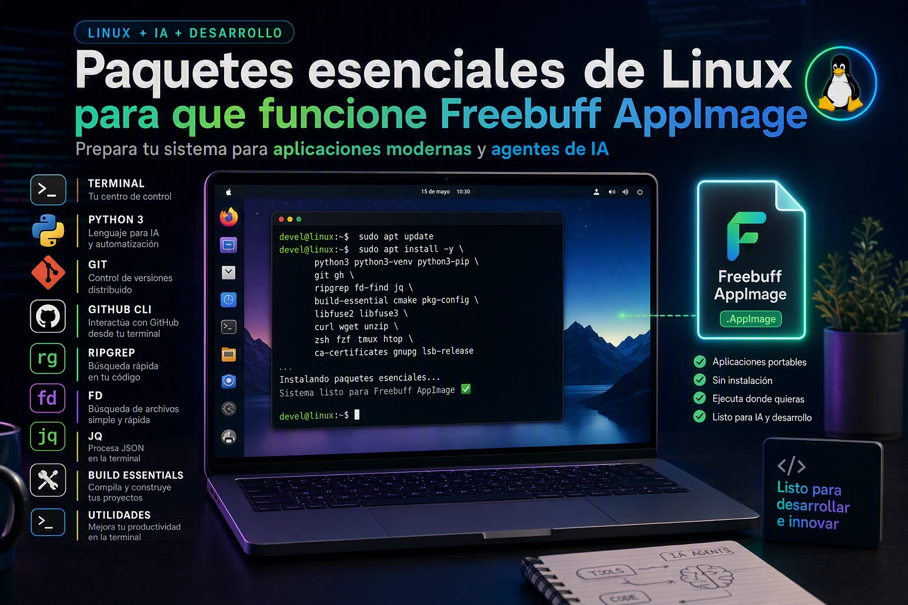

# Freebuff AppImage paquetes esenciales de Linux para que funcione 



Para que puedas usar FreeBuff en AppImage en Linux:

[https://freebuff.com/](https://freebuff.com/)

conviene tener instalado un buen conjunto de herramientas de desarrollo. Esto no solo mejora la experiencia con Freebuff, sino que te deja el sistema listo para cualquier proyecto de código.

## Primero: libfuse2 (obligatorio para AppImage)

Si descargás Freebuff como AppImage, necesitás `libfuse2` para que ejecute. Sin esto, el AppImage directamente no arranca:

```bash
sudo apt update && sudo apt install -y libfuse2
```

> **Nota:** En distribuciones basadas en Debian/Ubuntu más recientes, FUSE 3 viene por defecto pero los AppImages necesitan FUSE 2. Por eso hay que instalarlo explícitamente.

> **Nota 2**: Para la versión CLI hice un tutorial [aquí](https://facilitarelsoftwarelibre.blogspot.com/2026/08/como-instalar-freebuff-en-mx-linux-debian-y-derivados.html).

## Paquetes esenciales

Estos son los que realmente necesitás. Copiá y pegá:

```bash
sudo apt update && sudo apt install -y \
  git \
  git-lfs \
  gh \
  python3 \
  python3-pip \
  python3-venv \
  python3-dev \
  build-essential \
  ripgrep \
  fd-find \
  jq \
  tree \
  bat \
  curl \
  wget \
  vim \
  nano \
  htop \
  btop \
  tmux \
  less \
  unzip \
  zip \
  tar \
  xz-utils \
  zstd \
  diffutils \
  parallel \
  rsync \
  file
```

### ¿Para qué sirve cada grupo?

#### Git y GitHub

| Paquete | Para qué |
| --- | --- |
| `git`, `git-lfs` | Control de versiones y archivos grandes |
| `gh` | CLI de GitHub — crear PRs, issues, gestionar repos desde terminal |

#### Python y compilación

| Paquete | Para qué |
| --- | --- |
| `python3`, `python3-pip`, `python3-venv` | Ejecutar e instalar paquetes Python |
| `python3-dev`, `build-essential` | Compilar extensiones nativas (necesario para muchos paquetes pip) |

#### Búsqueda y análisis de código

| Paquete | Para qué |
| --- | --- |
| `ripgrep` | Búsqueda de código ultrarrápida — Freebuff lo usa internamente |
| `fd-find` | Alternativa más intuitiva a `find` |
| `jq` | Procesar JSON desde la terminal |
| `bat` | `cat` con resaltado de sintaxis |
| `tree` | Visualizar la estructura de directorios |

#### Red

| Paquete | Para qué |
| --- | --- |
| `curl`, `wget` | Descargas y peticiones HTTP |

#### Terminal y edición

| Paquete | Para qué |
| --- | --- |
| `vim`, `nano` | Edición rápida de archivos |
| `tmux` | Sesiones de terminal persistentes |
| `htop`, `btop` | Monitoreo de recursos del sistema |
| `less` | Leer archivos largos sin saturar la terminal |

#### Compresión

| Paquete | Para qué |
| --- | --- |
| `unzip`, `zip` | Formato ZIP |
| `tar`, `xz-utils`, `zstd` | TAR, XZ y Zstandard |

#### Utilidades generales

| Paquete | Para qué |
| --- | --- |
| `diffutils` | Comparar archivos |
| `parallel` | Ejecutar tareas en paralelo desde CLI |
| `rsync` | Sincronizar archivos eficientemente |
| `file` | Identificar el tipo de un archivo |

## Paquetes opcionales

Dependiendo de tu flujo de trabajo, estos también pueden servir:

```bash
sudo apt install -y \
  git-flow \
  gitk \
  tig \
  silversearcher-ag \
  universal-ctags \
  httpie \
  screen \
  pandoc \
  cppcheck
```

- **git-flow, gitk, tig** — para quienes siguen flujo git-flow o quieren visualizar historial.
- **silversearcher-ag** — otra opción de búsqueda de código (redundante con ripgrep, pero gusta a algunos).
- **universal-ctags** — navegación por definiciones de código.
- **httpie** — requests HTTP más legibles que curl.
- **screen** — alternativa a tmux (usá uno u otro).
- **pandoc** — conversión entre formatos de documento.
- **cppcheck** — solo si programás en C/C++.

## Paquetes que probablemente no necesitás

A menos que hagas algo muy específico, podés omitir:

- **Empaquetado Debian:** `dpkg-dev`, `debhelper`, `devscripts`, `fakeroot`, `lintian`
- **SquashFS/FUSE:** `squashfs-tools`, `squashfuse`, `fuse3`
- **Análisis binario:** `binutils`, `elfutils`, `strace`, `ltrace`, `patchelf`
- **Red avanzada:** `socat`, `ncat`, `net-tools`

No los instales por si acaso — ocultan espacio y complejidad que no necesitás.

## Resumen

La instalación mínima para una experiencia completa con Freebuff en Linux es:

```bash
sudo apt update && sudo apt install -y libfuse2 git git-lfs gh \
  python3 python3-pip python3-venv python3-dev build-essential \
  ripgrep fd-find jq tree bat curl wget vim nano htop btop tmux \
  less unzip zip tar xz-utils zstd diffutils parallel rsync file
```

Esto te deja el sistema listo para desarrollo con Freebuff. El resto lo instalás bajo demanda cuando lo necesites.
