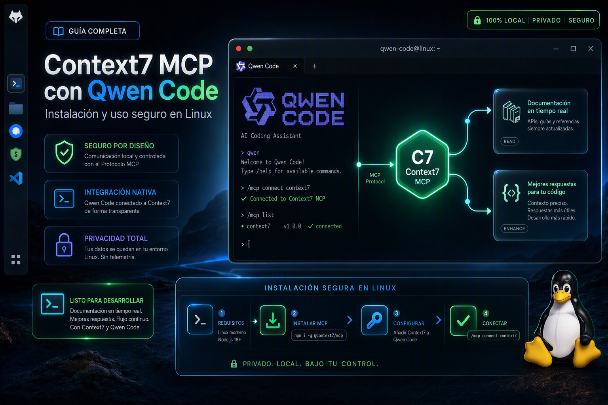

# Cómo instalar Context7 MCP en Linux para usarlo con Qwen Code



Si utilizas un agente de inteligencia artificial para programar, probablemente ya has visto el término **MCP** (Model Context Protocol). Al principio puede parecer otro concepto más relacionado con IA, pero en realidad es bastante sencillo:

> **MCP permite conectar un agente de IA con herramientas y servicios externos que el agente puede utilizar durante una conversación.**

Por ejemplo, un agente puede tener sus propias herramientas para leer archivos, ejecutar comandos o trabajar con Git. Con MCP podemos añadirle otras capacidades.

En este tutorial vamos a instalar **Context7** en Linux y conectarlo con **Qwen Code CLI**.

El objetivo de Context7 es muy concreto: proporcionar al agente **documentación actualizada de bibliotecas y frameworks de programación**, en lugar de obligarlo a depender exclusivamente de lo que recuerda el modelo.

---

## ¿Qué es MCP?

MCP significa **Model Context Protocol**.

Podemos imaginarlo como una especie de "enchufe estándar" para agentes de IA.

Sin MCP:

```
                    Agente de IA
                         │
                         ├── archivos
                         ├── terminal
                         ├── Git
                         └── búsqueda
```

Con MCP:

```
                    Agente de IA
                         │
             ┌───────────┴───────────┐
             │                       │
       Herramientas propias       Servidores MCP
                                     │
                          ┌──────────┼──────────┐
                          │          │          │
                       Context7    GitHub    Base de datos
```

Qwen Code puede conectarse a servidores MCP externos y utilizarlos como herramientas. La documentación oficial de Qwen Code explica que estos servidores pueden proporcionar acceso a herramientas, bases de datos, APIs y otros servicios. ([Qwen][1])

### MCP no es una IA

Es importante entender esto.

**Context7 no es otro modelo de inteligencia artificial que sustituya a Qwen.**

En nuestro caso:

```
Qwen Code
    │
    ├── modelo de IA
    │
    └── MCP
          │
          └── Context7
                 │
                 └── documentación
```

Qwen sigue siendo el agente que razona y trabaja en el proyecto.

Context7 simplemente le proporciona información documental cuando la necesita.

---

# ¿Qué hace Context7?

Context7 está especializado en documentación de programación.

Por ejemplo, podemos preguntarle a Qwen:

> Utiliza Context7 para buscar la documentación actual de PyQt6 y explícame cómo funciona QGraphicsView.

El agente puede primero buscar qué biblioteca corresponde a PyQt6:

```
resolve-library-id
```

y después consultar la documentación:

```
query-docs
```

Esas son precisamente las dos herramientas que proporciona actualmente el servidor MCP de Context7. ([GitHub][2])

Esto resulta especialmente útil cuando trabajamos con bibliotecas que cambian con el tiempo.

---

# Una advertencia importante antes de instalar MCP

Aquí es donde quiero hacer una pausa.

**No recomiendo instalar servidores MCP a ciegas.**

Un MCP puede tener herramientas que permitan:

* leer archivos;
* escribir archivos;
* ejecutar comandos;
* acceder a bases de datos;
* utilizar APIs;
* modificar repositorios;
* acceder a servicios externos.

Por tanto, instalar un MCP es parecido a instalar una extensión, plugin o programa adicional: **hay que saber qué estamos instalando y qué permisos tendrá**.

Y esta precaución no es exagerada.

## Un ejemplo real: el incidente de GitHub

En mayo de 2026, GitHub informó de un incidente en el que un dispositivo de uno de sus empleados fue comprometido mediante una **extensión de VS Code maliciosa publicada por un tercero**. GitHub indicó que detectó y contuvo el incidente y que su investigación inicial apuntaba a la extracción de repositorios internos de GitHub. ([The GitHub Blog][3])

Este tipo de incidentes demuestra algo importante:

> **Que una herramienta esté diseñada para ayudar a programar no significa que debamos instalarla sin comprobar su procedencia y capacidades.**

Por eso, en este tutorial no solamente vamos a instalar Context7. También vamos a comprobar **qué herramientas expone realmente**.

---

# Context7: servidor remoto o servidor local

Hay dos formas principales de utilizar Context7.

## Servidor remoto

El agente se conecta a:

```
https://mcp.context7.com/mcp
```

No ejecutamos el servidor MCP en nuestro ordenador.

### Servidor local

También podemos ejecutar el servidor mediante Node.js, por ejemplo utilizando `@upstash/context7-mcp`.

La documentación oficial de Context7 muestra ambas posibilidades para Qwen Code. ([GitHub][4])

Para este tutorial utilizaremos **el servidor remoto HTTP**, porque es la opción más sencilla y no necesitamos instalar un nuevo programa MCP localmente.

---

# Requisitos

Necesitamos:

* Linux
* Qwen Code CLI
* una versión reciente de Qwen Code con soporte MCP
* conexión a Internet

Qwen Code permite instalar servidores MCP mediante el comando:

```bash
qwen mcp add
```

y soporta el transporte HTTP para servidores remotos. ([GitHub][5])

---

# Paso 1: comprobar que Qwen Code tiene MCP

En una terminal ejecutamos:

```bash
qwen mcp
```

Si ejecutamos:

```bash
qwen mcp add
```

sin argumentos, Qwen mostrará la sintaxis disponible.

En versiones actuales veremos algo similar a:

```
qwen mcp add [options] <name> <commandOrUrl>
```

Esto nos indica que debemos proporcionar:

1. un nombre para el servidor;
2. la dirección o comando del servidor.

---

# Paso 2: instalar Context7

Utilizaremos el servidor oficial de Context7:

```
https://mcp.context7.com/mcp
```

El propio registro de Context7 publica este endpoint como su servidor MCP remoto. ([GitHub][6])

Ejecutamos:

```bash
qwen mcp add --transport http context7 https://mcp.context7.com/mcp
```

Si todo funciona correctamente, Qwen mostrará:

```
MCP server "context7" added to user settings. (http)
```

## ¿Qué significa `user`?

Qwen Code tiene distintos ámbitos de configuración.

El ámbito **user** significa que el servidor queda disponible para tus proyectos de Qwen en esa cuenta de usuario.

Qwen documenta `~/.qwen/settings.json` como la configuración de usuario. También existe una configuración por proyecto en `.qwen/settings.json`. ([Qwen][1])

---

# Paso 3: comprobar la conexión

Ahora ejecutamos:

```bash
qwen mcp list
```

Deberíamos obtener algo parecido a:

```
Configured MCP servers:

✓ context7: https://mcp.context7.com/mcp (http) - Connected
```

La palabra importante aquí es:

```
Connected
```

Esto significa que Qwen consiguió conectarse al servidor.

---

# Paso 4: comprobarlo desde Qwen Code

Iniciamos Qwen:

```bash
qwen
```

Dentro de Qwen escribimos:

```
/mcp
```

Aparecerá el administrador de servidores MCP.

Deberíamos ver:

```
User MCPs

❯ context7 · ✓ connected
```

Podemos seleccionar `context7` y pulsar **Enter**.

---

# Paso 5: comprobar qué herramientas tiene Context7

En nuestro caso Qwen mostró:

```
Status: connected
Source: User Settings
Command: https://mcp.context7.com/mcp (http)
Tools: 2 tools
```

Y al seleccionar **View tools** apareció:

```
Tools for context7
(2 tools)

mcp__context7__query-docs
read-only, open-world, idempotent

mcp_context7_resolve-library-id
read-only, open-world, idempotent
```

Este fue un paso **muy importante desde el punto de vista de seguridad**.

No nos limitamos a asumir que Context7 era seguro porque alguien lo dijo en Internet.

**Comprobamos qué herramientas estaba ofreciendo realmente a Qwen.**

---

# ¿Qué significan esas dos herramientas?

## `resolve-library-id`

Sirve para identificar una biblioteca y encontrar su identificador correspondiente en Context7.

Por ejemplo:

```
PyQt6
```

puede resolverse a una biblioteca disponible en Context7.

La implementación oficial describe esta herramienta como un mecanismo para resolver el nombre de una biblioteca hacia un identificador compatible con Context7. ([GitHub][2])

---

## `query-docs`

Es la herramienta que permite consultar la documentación de la biblioteca encontrada.

Por ejemplo:

```
QGraphicsView coordinate mapping
```

El servidor devuelve documentación y ejemplos relevantes.

La implementación oficial de Context7 describe `query-docs` precisamente como la herramienta para recuperar documentación y ejemplos de código actualizados. ([GitHub][2])

---

# Algo que tranquiliza bastante: son herramientas de solo lectura

En nuestra prueba, Qwen las identificó como:

```
read-only
```

Esto es importante.

No encontramos herramientas como:

```
shell
exec
run_command
write_file
delete_file
```

Context7 no necesitaba acceso al terminal de nuestro Linux.

Tampoco necesitaba permisos para modificar el proyecto.

Su función era básicamente:

```
pregunta
   ↓
Context7
   ↓
documentación
   ↓
Qwen
```

---

# Paso 6: hacer una prueba real

Una vez conectado Context7, podemos probarlo con algo sencillo:

```
Utiliza Context7 para buscar la documentación actual de PyQt6 y explícame cómo funciona QGraphicsView. No modifiques ningún archivo del proyecto.
```

En nuestra prueba ocurrió exactamente lo que esperábamos.

Qwen llamó primero:

```
resolve-library-id
```

Después encontró la documentación de PyQt6 de Riverbank Computing y llamó:

```
query-docs
```

Finalmente utilizó esa información para explicar `QGraphicsView`.

---

# Qwen pide autorización antes de utilizar el MCP

Hay otra característica de seguridad interesante.

La primera vez que Qwen intentó utilizar:

```
resolve-library-id
```

mostró:

```
Allow execution of MCP tool "resolve-library-id" from server "context7"?

1. Yes, allow once
2. Switch to Default Mode and allow once
3. No
```

Después hizo lo mismo con:

```
query-docs
```

Esto permite al usuario **ver qué herramienta quiere ejecutar el agente antes de permitirla**.

Además, Qwen puede ofrecer diferentes niveles de autorización, incluyendo permitir una herramienta solamente una vez o permitirla posteriormente para el proyecto o usuario.

---

# ¿Es Context7 seguro?

Aquí conviene ser precisos.

No existe una forma seria de decir:

> "Este software tiene garantía absoluta de estar libre de virus."

Eso no existe.

Lo que sí podemos hacer es **reducir el riesgo mediante comprobaciones**.

En este caso encontramos varias señales favorables:

## 1. Procedencia

Utilizamos el servidor oficial:

```
https://mcp.context7.com/mcp
```

La documentación y el repositorio oficial de Context7 publican ese endpoint. ([GitHub][6])

## 2. Código público

El proyecto oficial de Context7 está publicado públicamente en GitHub bajo la organización Upstash. ([GitHub][7])

## 3. Herramientas limitadas

Nuestro propio Qwen mostró solamente:

```
2 tools
```

y ambas eran:

```
read-only
```

## 4. No instalamos un ejecutable local

En este tutorial utilizamos:

```bash
qwen mcp add --transport http context7 https://mcp.context7.com/mcp
```

Por tanto, Qwen se conecta al servidor remoto mediante HTTP.

No ejecutamos:

```bash
npx @upstash/context7-mcp
```

en nuestra máquina.

La documentación oficial también ofrece una modalidad local mediante `npx`, pero es una alternativa diferente. ([GitHub][4])

---

# ¿Entonces Context7 puede leer mis archivos?

**No mediante las dos herramientas que comprobamos.**

Esto es algo que conviene explicar claramente.

Tu agente Qwen puede tener sus propias herramientas para:

```
leer archivos
buscar archivos
ejecutar Bash
utilizar Git
```

Pero esas capacidades pertenecen a **Qwen Code**.

Context7 añadió solamente:

```
resolve-library-id
query-docs
```

No debemos confundir las capacidades del agente con las capacidades del MCP.

---

# Una precaución MUY importante

Aunque `query-docs` sea de solo lectura, **no debemos enviar información confidencial a un servicio externo**.

La implementación oficial de Context7 advierte expresamente que las consultas enviadas a `resolve-library-id` y `query-docs` no deben contener API keys, contraseñas, credenciales, datos personales ni código propietario. ([GitHub][2])

Por ejemplo, esto está bien:

```
¿Cómo funciona QGraphicsView en PyQt6?
```

Pero no deberíamos hacer:

```
Busca en esta API key:
sk-xxxxxxxx
```

ni:

```
Analiza este código propietario y envíalo a Context7.
```

La regla práctica es:

> **Utiliza Context7 para consultar documentación, no para enviar secretos ni código privado.**

---

# ¿Necesito una API Key de Context7?

Actualmente Context7 recomienda obtener una API Key gratuita para disponer de límites de uso superiores, pero el servidor remoto puede utilizarse con el acceso básico. ([GitHub][7])

Por eso, para empezar podemos probarlo sin añadir otra credencial.

Si posteriormente necesitas mayor capacidad, puedes utilizar una API Key de Context7.

---

# ¿Funciona solamente con Qwen Code?

**No.**

MCP es un protocolo, no una función exclusiva de Qwen.

El mismo servidor Context7 puede utilizarse desde diferentes clientes/agentes compatibles con MCP.

La página oficial de Context7 actualmente muestra configuraciones para múltiples agentes, incluyendo Claude Code, Cursor, Codex, OpenCode y otros. ([Context7][8])

Por tanto, conceptualmente:

```
                  Context7
                     │
          ┌──────────┼──────────┐
          │          │          │
       Qwen Code   Cursor    otros MCP
```

Cada agente tiene su propia forma de configurar el servidor.

**En este tutorial hemos utilizado Qwen Code porque es el agente que estamos configurando.**

---

# ¿Dónde queda instalado?

En nuestro caso utilizamos el ámbito de usuario:

```bash
qwen mcp add --transport http context7 https://mcp.context7.com/mcp
```

Qwen registra el servidor en la configuración del usuario.

La documentación de Qwen indica que los servidores MCP de usuario se almacenan en:

```
~/.qwen/settings.json
```

mientras que un servidor específico de un proyecto puede configurarse en:

```
.qwen/settings.json
```

dentro del proyecto. ([Qwen][1])

---

# Cómo eliminar Context7

Si posteriormente quieres quitarlo, no necesitas desinstalar Qwen ni borrar archivos manualmente.

Puedes utilizar:

```bash
qwen mcp remove context7
```

Y después comprobar:

```bash
qwen mcp list
```

También puedes comprobarlo desde:

```
/mcp
```

---

# ¿Qué aporta realmente a un agente de programación?

Sin Context7:

```
Usuario
   ↓
Qwen
   ↓
"Según lo que conozco de PyQt6..."
   ↓
respuesta
```

Con Context7:

```
Usuario
   ↓
Qwen
   ↓
Context7
   ↓
documentación actual
   ↓
Qwen
   ↓
respuesta basada en documentación
```

Esto puede ser especialmente útil cuando trabajamos con APIs que cambian frecuentemente.

Por ejemplo:

```
PyQt6
Qt
React
Next.js
FastAPI
Django
NumPy
Pandas
etc.
```

---

# Conclusión

MCP puede parecer complicado al principio, pero el concepto fundamental es bastante sencillo:

> **MCP permite conectar un agente de IA con herramientas externas de una manera estandarizada.**

En este caso hemos conectado:

```
Linux
  │
  └── Qwen Code
        │
        ├── herramientas propias
        │     ├── Bash
        │     ├── Git
        │     ├── archivos
        │     └── Ripgrep
        │
        └── MCP
              │
              └── Context7
                    ├── resolve-library-id
                    └── query-docs
```

Y antes de confiar en él hicimos algo que recomiendo a cualquier usuario:

**no confiar ciegamente en un MCP solamente porque sea popular.**

Comprobamos su procedencia, utilizamos el endpoint oficial, verificamos que Qwen pudiera conectarse y, sobre todo, abrimos `/mcp` para comprobar **qué herramientas estaba exponiendo realmente**.

En nuestro caso solamente aparecieron dos herramientas y ambas fueron identificadas por Qwen como **`read-only`**.

Eso no constituye una garantía absoluta de seguridad —ningún software externo puede ofrecerla—, pero sí proporciona una base mucho más razonable para decidir si queremos utilizarlo.

Y después hicimos una prueba real con PyQt6: Qwen utilizó `resolve-library-id`, encontró la documentación correspondiente y posteriormente utilizó `query-docs` para consultar `QGraphicsView`. ([GitHub][2])

**Ese es el enfoque que recomiendo con cualquier MCP nuevo: primero comprobar qué es, de dónde viene y qué herramientas expone; después darle permisos mínimos; y solamente entonces utilizarlo en nuestros proyectos.**

**Nota:** Qwen Code soporta MCP mediante `qwen mcp`, incluyendo servidores HTTP remotos, y Context7 publica oficialmente el endpoint `https://mcp.context7.com/mcp` y documentación específica para Qwen Code. ([Qwen][1])


[1]: https://qwenlm.github.io/qwen-code-docs/en/users/features/mcp/? "Connect Qwen Code to tools via MCP | Qwen Code Docs"
[2]: https://github.com/upstash/context7/blob/master/packages/mcp/src/index.ts? "context7/packages/mcp/src/index.ts at master · upstash/context7 · GitHub"
[3]: https://github.blog/security/investigating-unauthorized-access-to-githubs-internal-repositories/? "Investigation update: GitHub Enterprise Server signing key rotation - The GitHub Blog"
[4]: https://github.com/upstash/context7/blob/master/docs/resources/all-clients.mdx? "context7/docs/resources/all-clients.mdx at master · upstash/context7 · GitHub"
[5]: https://github.com/QwenLM/qwen-code/blob/main/docs/developers/tools/mcp-server.md? "qwen-code/docs/developers/tools/mcp-server.md at main · QwenLM/qwen-code · GitHub"
[6]: https://github.com/mcp/io.github.upstash/context7? "MCP Registry | Context7 · GitHub"
[7]: https://github.com/upstash/context7?pubDate=20260216& "GitHub - upstash/context7: Context7 Platform -- Up-to-date code documentation for LLMs and AI code editors · GitHub"
[8]: https://context7.com/install? "Install Context7 — One command for every coding agent | Context7"
