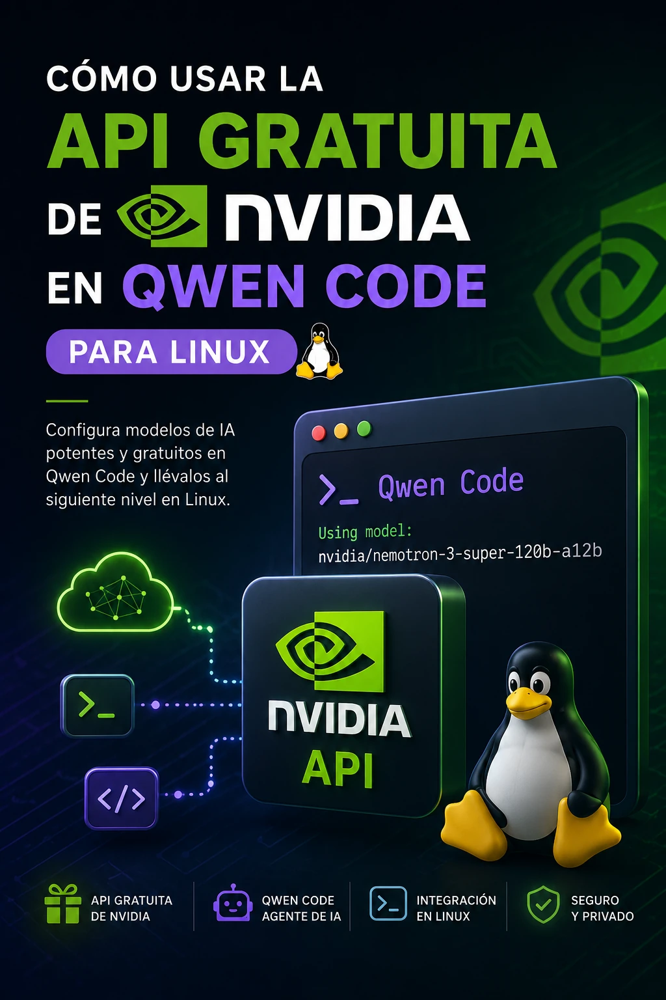

# Cómo usar la API gratuita de NVIDIA en Qwen Code para Linux



En este tutorial vamos a configurar una API de NVIDIA para utilizar modelos de inteligencia artificial desde **Qwen Code** en Linux.

La ventaja es que podemos tener varios proveedores configurados simultáneamente. Por ejemplo:

```
Qwen Code
├── NVIDIA API
│   └── Nemotron
│
└── TokenRouter
    └── Qwen
```

Después podremos cambiar de modelo mediante `/model`, sin tener que volver a configurar todo.

---

## 1. Crear una cuenta en NVIDIA

Primero debemos tener una cuenta de NVIDIA.

Entramos en:

[https://build.nvidia.com/](https://build.nvidia.com/)

da clic en:

`Login`


aparecerá una ventana **pon tu correo** y da clic en "**Next**":


aparecerá una ventana donde hay que llenar todos los datos que piden, seguir las instrucciones:


debe de quedar ejemplo así:


da clic en:

`Crear cuenta `

NVIDIA dispone allí de un catálogo de modelos NIM que pueden utilizarse mediante API. La documentación oficial explica que estos modelos están disponibles mediante endpoints de inferencia y que las APIs de los LLM siguen el formato compatible con OpenAI.

En el catálogo también podemos encontrar modelos marcados como **Free Endpoint**.

[https://build.nvidia.com/models](https://build.nvidia.com/models)

---

# 2. Crear la API Key

Después de iniciar sesión en NVIDIA Build, entramos en la sección de API Keys:

[https://build.nvidia.com/settings/api-keys](https://build.nvidia.com/settings/api-keys)

Creamos una nueva API Key.

La clave tendrá un aspecto parecido a:

```
nva...
```

## Importante

**No publiques esta clave.**

No la introduzcas en GitHub, no la publiques en capturas de pantalla y no la envíes a otras personas.

Qwen Code se encargará de guardar/referenciar la clave mediante una variable de configuración.

---

# 3. Comprobar desde Linux que la API funciona

Antes de configurar Qwen Code es recomendable comprobar que la API funciona directamente desde la terminal.

Podemos utilizar `curl`.

Por seguridad, guardaremos temporalmente la clave en una variable de entorno:

```bash
export NVIDIA_API_KEY="TU_API_KEY"
```

No escribas literalmente `TU_API_KEY`; sustitúyelo por tu clave real.

Por ejemplo:

```bash
export NVIDIA_API_KEY="nvaxxxxxxxxxxxxxxxx"
```

ponla en tu archivo

.bashrc

este archivo está oculto en tu HOME, en un administrador de archivos con Ctrl + H lo podrás ver y debes de editarlo con algún editor de texto y guardar,  y cierra esta instancia de la terminal donde estés trabajando y abre otra.

---

# 4. Ver qué modelos ofrece la API

La API de NVIDIA utiliza un endpoint compatible con OpenAI.

La documentación oficial establece:

```
https://integrate.api.nvidia.com
```

y para los LLM:

```
POST /v1/chat/completions
```

Pero podemos consultar también los modelos mediante la API.

Si no tienes `jq` instálalo:

```bash
sudo apt install jq
```

Ejecuta:

```bash
curl -s https://integrate.api.nvidia.com/v1/models \
  -H "Authorization: Bearer $NVIDIA_API_KEY" \
  | jq -r '.data[].id'
```

Nota: En este comando "$NVIDIA_API_KEY" tomará tu API KEY para que funcione (no se mostrará)

y verás una larga lista con todos los nombres disponibles

---

# 5. Importante: modelos disponibles no significa necesariamente modelos gratuitos

Este punto es importante.

El endpoint `/v1/models` nos permite consultar los modelos que la API expone, pero **no debemos asumir que todos ellos son gratuitos**.

NVIDIA distingue en su catálogo los modelos que tienen **Free Endpoint**. La página del catálogo permite utilizar precisamente ese filtro.

Por tanto, para buscar modelos gratuitos debemos consultar:

[NVIDIA Build — modelos con Free Endpoint](https://build.nvidia.com/models?label=text)

La disponibilidad y el catálogo pueden cambiar, por lo que es mejor consultar el catálogo actual que utilizar una lista antigua de Internet.

---

# 6. Buscar específicamente modelos NVIDIA

También podemos utilizar la API para filtrar visualmente los modelos cuyo nombre contiene `nvidia` o `nemotron`.

Por ejemplo:

```bash
curl -s https://integrate.api.nvidia.com/v1/models \
  -H "Authorization: Bearer $NVIDIA_API_KEY" \
  | jq -r '.data[].id' \
  | grep -Ei 'nvidia|nemotron'
```

Esto podría mostrar modelos como:

```
nvidia/nemotron-3-super-120b-a12b
nvidia/nemotron-3-nano-30b-a3b
...
```

El catálogo actual de NVIDIA incluye, entre otros, modelos Nemotron y también modelos de Qwen, OpenAI, DeepSeek, MiniMax, GLM y otros proveedores.

---

# 7. Elegir un modelo para Qwen Code

Para este tutorial utilizaremos:

```
nvidia/nemotron-3-super-120b-a12b
```

NVIDIA lo identifica actualmente como un modelo disponible en su API de LLM.

Es importante distinguir dos cosas:

## Base URL

Es la dirección del servidor:

```
https://integrate.api.nvidia.com/v1
```

## Model ID

Es el nombre del modelo:

```
nvidia/nemotron-3-super-120b-a12b
```

**No son lo mismo.**

---

# 8. Configurar NVIDIA en Qwen Code

Abrimos Qwen Code:

```bash
qwen
```

Dentro de Qwen Code ejecutamos:

```
/auth
```

Aparecerá:

```
Connect a Provider

    Alibaba ModelStudio
    Official recommended setup: Coding Plan, Token Plan, or Standard API Key

    Third-party Providers
    Choose a built-in provider and connect with an API key

    Custom Provider
    Manually connect a local server, proxy, or unsupported provider
```

Seleccionamos:

```
Custom Provider
```

---

# 9. Step 1/6 — Protocol

Qwen Code mostrará:

```
Custom Provider . Step 1/6 . Protocol

    OpenAI-compatible
    Standard OpenAI API format (most common)

    Anthropic-compatible
    Anthropic Messages API format

    Gemini-compatible
    Google Gemini API format
```

Seleccionamos:

```
OpenAI-compatible
```

¿Por qué?

Porque el endpoint de LLM de NVIDIA utiliza una API compatible con el formato de OpenAI. NVIDIA documenta explícitamente este formato para sus LLM NIM.

Pulsamos:

```
Enter
```

---

# 10. Step 2/6 — Base URL

Ahora aparece:

```
Custom Provider . Step 2/6 . Base URL

Enter the API endpoint for this protocol
>
```

Aquí debemos poner:

```
https://integrate.api.nvidia.com/v1
```

## Atención

Aquí **NO** ponemos:

```
nvidia/nemotron-3-super-120b-a12b
```

Ese es el ID del modelo y se introducirá posteriormente.

La Base URL correcta es:

```
https://integrate.api.nvidia.com/v1
```

La documentación oficial de NVIDIA establece `https://integrate.api.nvidia.com` como URL del servicio y `/v1/chat/completions` como endpoint de chat.

Pulsamos:

```
Enter
```

---

# 11. Step 3/6 — API Key

Qwen Code solicitará la API Key.

Aquí debemos pegar:

```
nva...
```

es decir, la API Key que acabamos de crear en NVIDIA Build.

**Nunca publiques esta clave.**

Después pulsamos:

```
Enter
```

---

# 12. Step 4/6 — Model IDs

Ahora aparece:

```
Custom Provider . Step 4/6

Enter model IDs separated by commas
>
```

Aquí sí ponemos el ID del modelo:

```
nvidia/nemotron-3-super-120b-a12b
```

Este es el lugar correcto para introducir el modelo.

Si queremos configurar varios modelos NVIDIA al mismo tiempo, Qwen Code permite introducir varios IDs separados por comas, por ejemplo:

```
modelo1,modelo2,modelo3
```

Pero para la primera configuración recomiendo poner **un solo modelo**.

---

# 13. Step 5/6 — Advanced Config

Ahora aparece:

```
Custom Provider . Step 5/6 . Advanced Config

Optional: configure advanced generation settings.

    Enable thinking
    Allows the model to perform extended reasoning before responding.

    Enable modality
    Enables multimodal input capabilities (image, video, etc.).

    Context window: > auto
    Max input tokens (leave empty to auto-detect from model name).
```

Para este modelo, en nuestra prueba práctica encontramos que activar:

```
Enable thinking
```

hizo que Qwen Code enviara:

```json
"enable_thinking": true
```

y NVIDIA respondió:

```
400 Validation: Unsupported parameter(s): enable_thinking
```

Por eso, para esta configuración, debemos dejarlo **desactivado**.

La configuración recomendada es:

```
☐ Enable thinking
☐ Enable modality

Context window: auto
Max input tokens: vacío
```

Simplemente dejamos las opciones sin seleccionar y pulsamos:

```
Enter
```

---

# 14. Step 6/6 — Review

Qwen Code mostrará una pantalla de revisión parecida a:

```json
{
  "env": {
    "QWEN_CUSTOM_API_KEY_OPENAI_HTTPS_INTEGRATE_API_NVIDIA_COM_V1_...": "nva..."
  },
  "modelProviders": {
    "openai": [
      {
        "id": "nvidia/nemotron-3-super-120b-a12b",
        "name": "nvidia/nemotron-3-super-120b-a12b",
        "baseUrl": "https://integrate.api.nvidia.com/v1"
      }
    ]
  }
}
```

Es normal que Qwen Code utilice un nombre largo para la variable que contiene la API Key.

No significa que esté exponiendo la clave.

Si todo es correcto, pulsamos:

```
Enter
```

para guardar.

Qwen Code mostrará:

```
Successfully configured Custom Provider.
Use /model to switch models.
```

---

# 15. Comprobar los modelos configurados

Ahora ejecutamos:

```
/model
```

Deberíamos ver algo parecido a:

```
Select Model

1. [openai] nvidia/nemotron-3-super-120b-a12b

2. [openai] qwen/qwen3.8-max-free
```

Esto demuestra que podemos conservar **los dos proveedores**.

En nuestro caso teníamos:

```
1. NVIDIA
   nvidia/nemotron-3-super-120b-a12b

2. TokenRouter
   qwen/qwen3.8-max-free
```

No es necesario eliminar la configuración anterior.

---

# 16. Seleccionar NVIDIA

Seleccionamos:

```
1. [openai] nvidia/nemotron-3-super-120b-a12b
```

Qwen Code mostrará información similar a:

```
Modality: text-only
Context Window: 200,000 tokens
Base URL: https://integrate.api.nvidia.com/v1
API Key: QWEN_CUSTOM_API_KEY_OPENAI_HTTPS_INTEGRATE_API_NVIDIA_COM_V1_...
```

Pulsamos:

```
Enter
```

---

# 17. Comprobar que NVIDIA es el modelo activo

Qwen Code deberá mostrar algo parecido a:

```
authType: openai
Using model: nvidia/nemotron-3-super-120b-a12b
Base URL: https://integrate.api.nvidia.com/v1
API key: nva...gF4l
```

Y en la parte inferior:

```
wachin : nvidia/nemotron-3-super-120b-a12b
```

Esto confirma que Qwen Code está utilizando NVIDIA.

---

# 18. Primera prueba desde Qwen Code

Podemos hacer una prueba segura sin modificar ningún archivo.

Por ejemplo:

```
Lista los archivos del directorio actual y dime sus nombres.
No modifiques, crees ni elimines ningún archivo.
```

En nuestra prueba, Nemotron utilizó automáticamente la herramienta Shell:

```
✓ Shell ls -1a
```

Esto es importante porque demuestra que no solamente estamos utilizando NVIDIA como un chatbot.

El flujo es:

```
NVIDIA API
     ↓
Nemotron
     ↓
Qwen Code
     ↓
Shell
     ↓
Linux
```

---

# 19. Utilizar NVIDIA con MCP Context7

Si ya tenemos Context7 configurado en Qwen Code, también podemos utilizarlo con Nemotron.

Por ejemplo:

```
Usa Context7 MCP para consultar la documentación oficial de PyQt6 sobre QTreeWidget.

No utilices solamente tu conocimiento interno.

Después dime qué métodos principales tiene QTreeWidget y de qué documentación obtuviste la información.

No modifiques ningún archivo.
```

Qwen Code puede solicitar autorización para ejecutar la herramienta MCP.

Por ejemplo:

```
Allow execution of MCP tool "resolve-library-id"
from server "context7"?
```

Podemos seleccionar:

```
Yes, allow once
```

El agente puede entonces utilizar:

```
resolve-library-id
```

y:

```
query-docs
```

para consultar la documentación.

En nuestras pruebas, Nemotron utilizó Context7 para consultar la documentación oficial de PyQt6 de Riverbank Computing.

El flujo completo queda:

```
                 NVIDIA API
                     │
                     ▼
          Nemotron 3 Super
                     │
                     ▼
                 Qwen Code
                /         \
               /           \
           Shell           MCP
             │              │
             ▼              ▼
           Linux         Context7
                             │
                             ▼
                     Documentación PyQt6
```

---

# 20. Cambiar nuevamente a otro proveedor

No tenemos que volver a configurar nada.

Simplemente ejecutamos:

```
/model
```

Y seleccionamos el modelo que queramos.

Por ejemplo:

```
1. [openai] nvidia/nemotron-3-super-120b-a12b

2. [openai] qwen/qwen3.8-max-free
```

Así podemos alternar entre NVIDIA y TokenRouter.

---

# 21. Comprobar modelos NVIDIA desde la terminal

Si queremos investigar qué modelos están disponibles para nuestra API Key, podemos ejecutar:

```bash
curl -s https://integrate.api.nvidia.com/v1/models \
  -H "Authorization: Bearer $NVIDIA_API_KEY" \
  | jq -r '.data[].id'
```

Para buscar solamente modelos relacionados con Nemotron:

```bash
curl -s https://integrate.api.nvidia.com/v1/models \
  -H "Authorization: Bearer $NVIDIA_API_KEY" \
  | jq -r '.data[].id' \
  | grep -i nemotron
```

Para buscar modelos de Qwen:

```bash
curl -s https://integrate.api.nvidia.com/v1/models \
  -H "Authorization: Bearer $NVIDIA_API_KEY" \
  | jq -r '.data[].id' \
  | grep -i qwen
```

Para buscar modelos de DeepSeek:

```bash
curl -s https://integrate.api.nvidia.com/v1/models \
  -H "Authorization: Bearer $NVIDIA_API_KEY" \
  | jq -r '.data[].id' \
  | grep -i deepseek
```

## Pero recuerda

Estos comandos sirven para descubrir modelos expuestos por el endpoint. Para determinar cuáles tienen **Free Endpoint**, hay que comprobar el catálogo de NVIDIA y su indicador de disponibilidad gratuita. NVIDIA mantiene ese catálogo separado y lo actualiza.

---

# 22. Comprobar directamente un modelo

También podemos probar un modelo sin Qwen Code.

Por ejemplo:

```bash
curl -s https://integrate.api.nvidia.com/v1/chat/completions \
  -H "Authorization: Bearer $NVIDIA_API_KEY" \
  -H "Content-Type: application/json" \
  -d '{
    "model": "nvidia/nemotron-3-super-120b-a12b",
    "messages": [
      {
        "role": "user",
        "content": "Responde en español. Confirma que la API de NVIDIA está funcionando."
      }
    ],
    "max_tokens": 200
  }'
```

Si obtenemos:

```json
"object": "chat.completion"
```

y:

```json
"model": "nvidia/nemotron-3-super-120b-a12b"
```

la llamada ha funcionado.

---

# 23. Un detalle importante sobre el parámetro `enable_thinking`

No debemos asumir que todos los modelos de NVIDIA aceptan exactamente los mismos parámetros.

En nuestra prueba, al activar en Qwen Code:

```
Enable thinking
```

se generó:

```json
"extra_body": {
    "enable_thinking": true
}
```

y el modelo respondió:

```
400 Validation: Unsupported parameter(s): enable_thinking
```

Por eso dejamos:

```
Enable thinking
☐
```

desactivado.

Esto demuestra una regla importante al configurar proveedores personalizados:

> Que una opción aparezca en Qwen Code no significa que todos los modelos del proveedor sean compatibles con ella.

Hay que comprobar las capacidades y parámetros admitidos por el modelo concreto.

---

# 24. Resultado final

Al terminar tendremos Qwen Code configurado de esta manera:

```
Qwen Code 0.22.2
│
├── NVIDIA
│   ├── Base URL:
│   │   https://integrate.api.nvidia.com/v1
│   │
│   └── Model:
│       nvidia/nemotron-3-super-120b-a12b
│
└── TokenRouter
    └── qwen/qwen3.8-max-free
```

Y podremos cambiar entre ellos utilizando:

```
/model
```

La API de NVIDIA utiliza el formato OpenAI-compatible, por lo que Qwen Code puede conectarse mediante **Custom Provider → OpenAI-compatible**. NVIDIA documenta oficialmente este tipo de acceso mediante sus APIs NIM.

## Conclusión

La configuración no requiere instalar un SDK especial de NVIDIA en Linux.

El proceso esencial es:

```
1. Crear cuenta NVIDIA
        ↓
2. Entrar en NVIDIA Build
        ↓
3. Crear API Key
        ↓
4. Custom Provider en Qwen Code
        ↓
5. OpenAI-compatible
        ↓
6. https://integrate.api.nvidia.com/v1
        ↓
7. API Key de NVIDIA
        ↓
8. ID del modelo
        ↓
9. Advanced Config sin activar opciones
        ↓
10. Guardar
        ↓
11. /model
        ↓
12. Seleccionar NVIDIA
```

De esta manera podemos utilizar un modelo del catálogo de NVIDIA directamente desde un **agente de IA en Linux**, y además conservar otros proveedores configurados en Qwen Code.
