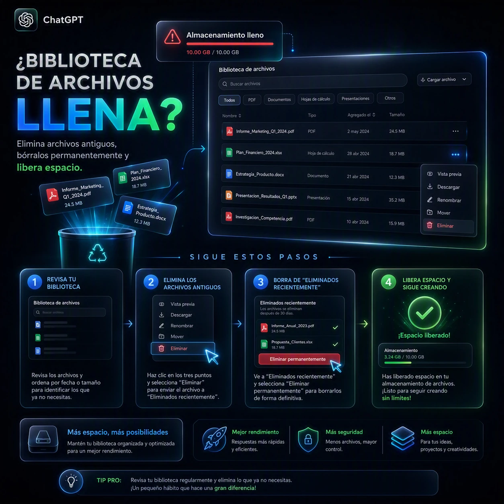

# Cómo borrar los archivos de la biblioteca de ChatGPT cuando se llena

Me sucedió que llegó un momento en el que ya no podía añadir ningún archivo a un chat de ChatGPT para hacer preguntas. La solución fue **eliminar los archivos de la biblioteca**.

### 1. Eliminar los archivos de la biblioteca

Primero, hay que entrar en la biblioteca de archivos de ChatGPT:

[https://chatgpt.com/library?tab=files](https://chatgpt.com/library?tab=files)

Selecciona los archivos que ya no necesites y **elimínalos**.

### 2. Eliminar los archivos permanentemente

Después, hay que ir a la sección de archivos recientemente eliminados:

[https://chatgpt.com/library?deleted=true&show_all_file_types=true](https://chatgpt.com/library?deleted=true&show_all_file_types=true)

Allí aparecerán los archivos que acabas de eliminar.

**Es importante borrarlos también desde esta sección**, porque de lo contrario permanecerán en la papelera y no se eliminarán permanentemente.

Una vez eliminados de esta segunda sección, los archivos quedarán **borrados permanentemente** y se liberará el espacio que estaban ocupando en la biblioteca.
