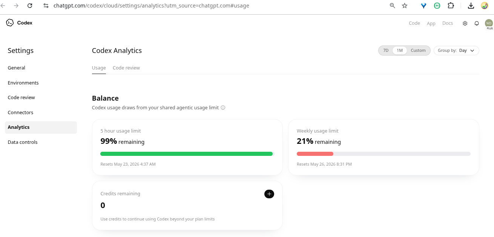

# Cómo revisar el consumo de Codex CLI en ChatGPT Plus

Autor: Washington Indacochea Delgado

## ¿Qué significa el mensaje?

A veces Codex CLI muestra un aviso como este:

```text
Heads up, you have less than 25% of your weekly limit left. Run /status for a breakdown.
```

Esto significa que la cuota semanal de Codex está por agotarse.

No significa que se haya acabado ChatGPT Plus completo.

## Cómo revisar el estado desde la terminal

Dentro de Codex CLI puedes ejecutar:

```bash
/status
```

Ese comando muestra:

- límite de 5 horas
- límite semanal
- porcentaje restante
- fecha de reinicio

## Cómo revisar el estado desde la web

También puedes abrir el panel web de Codex:

https://chatgpt.com/codex/settings/usage

Allí verás algo similar a esta captura:



## Explicación de los límites

### 1. Límite de 5 horas

Este límite se reinicia varias veces al día.

Si aparece:

```text
99% remaining
```

significa que casi no has usado la cuota de las últimas 5 horas.

---

### 2. Límite semanal

Este es el más importante.

Si aparece:

```text
21% remaining
```

significa que solo queda el 21% de la cuota semanal.

Cuando llegue a 0%, Codex dejará de funcionar hasta el próximo reinicio semanal.

---

### 3. Credits remaining

Si aparece:

```text
0
```

significa que no hay créditos extra comprados para continuar usando Codex después de agotar el límite semanal.

## ¿Por qué se consume tan rápido?

El límite semanal se consume más rápido cuando:

- se usan agentes automáticos
- se hacen múltiples rondas
- se analizan repositorios grandes
- se portan proyectos completos
- se usa mucho `gpt-5.5`
- se ejecutan pruebas constantemente

Por ejemplo, un script automático de 10 rondas puede consumir muchísimo contexto.

## Cómo ahorrar cuota de Codex

Una buena estrategia es combinar varias herramientas:

### Usar Codex solo para tareas difíciles

Por ejemplo:

- debugging complejo
- arquitectura
- refactors delicados
- ports complicados

### Usar otras IA para tareas repetitivas

Por ejemplo:

- Hermes
- Zhipu AI
- OpenCode
- Aider
- Cline

Así puedes ahorrar bastante cuota semanal.

## Recomendaciones

- dividir tareas grandes en partes pequeñas
- abrir sesiones nuevas frecuentemente
- evitar prompts como “analiza todo el proyecto”
- usar prompts específicos
- limpiar contexto largo
- usar otras IA para tareas simples

## Ejemplo de prompt eficiente

Mejor:

```text
Porta únicamente src/player.cpp a PyQt6
```

Peor:

```text
Continúa portando todo el proyecto completo
```

## Conclusión

Aunque tengas ChatGPT Plus, Codex CLI tiene límites separados para programación intensiva.

El panel de Analytics ayuda a entender cuánto queda disponible y cuándo se reiniciarán los límites.
