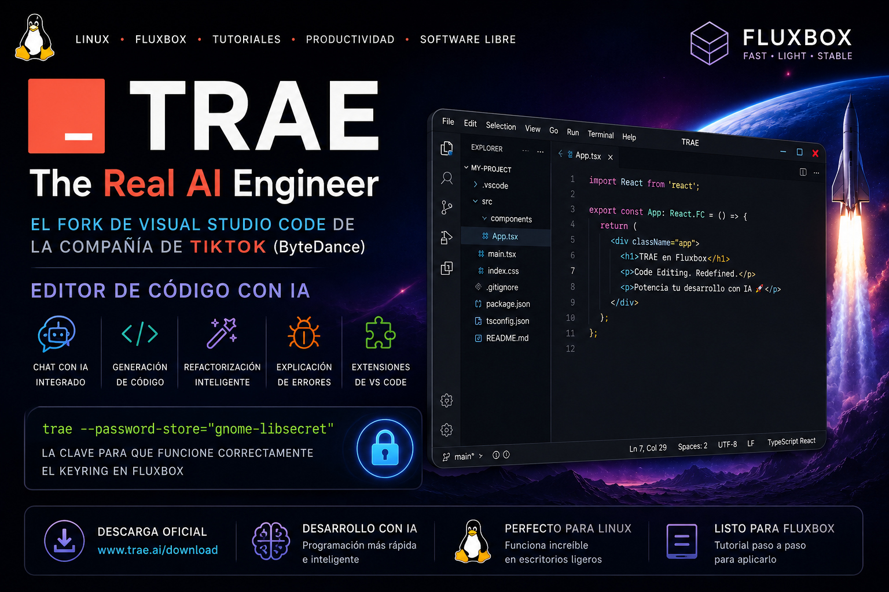

# TRAE en Fluxbox: cómo aplicar el fix del keyring en MX Linux



[TRAE AI IDE](https://www.trae.ai/) es un editor de código con inteligencia artificial desarrollado por la compañía china ByteDance, conocida mundialmente por crear TikTok.

TRAE significa **“The Real AI Engineer”** y es un fork moderno de Visual Studio Code enfocado en desarrollo asistido por IA. Está basado en Code OSS / VS Code y añade herramientas avanzadas como:

* Chat con IA integrado
* Generación automática de código
* Refactorización inteligente
* Explicación de errores
* Edición asistida por agentes IA
* Integración con modelos como Claude y DeepSeek
* Soporte para extensiones compatibles con VS Code

El proyecto busca competir con herramientas como:

* [Cursor](https://www.cursor.com/)
* [Windsurf](https://windsurf.com/)
* [Visual Studio Code](https://code.visualstudio.com/)

Sitio oficial de descarga:

**Descargar TRAE para Linux**  
[https://www.trae.ai/download#solo-download](https://www.trae.ai/download#solo-download)

TRAE puede utilizarse para:

* Desarrollo Python
* Desarrollo C++
* Desarrollo web
* Aplicaciones con IA
* Proyectos Open Source
* Automatización de tareas
* Desarrollo multiplataforma
* Programación asistida por IA en Linux

Según documentación pública y medios tecnológicos, TRAE está construido sobre Electron y VS Code OSS. ([Trae][1])

---

# 🔧 PROBLEMA EN FLUXBOX

Al igual que Cursor, Kiro, Windsurf y otros forks de VS Code, TRAE puede presentar problemas con el almacenamiento de credenciales (keyring) cuando se utiliza en escritorios ligeros como Fluxbox.

La solución es forzar el uso de GNOME Keyring mediante:

```bash
--password-store="gnome-libsecret"
```

---

# 🔧 SOLUCIÓN DEFINITIVA

Primero instala los paquetes necesarios:

```bash
sudo apt install libsecret-1-0 libsecret-tools gedit
```

---

# MÉTODO 1: Modificar el launcher (.desktop)

## 1. Copiar el lanzador

```bash
cp /usr/share/applications/trae.desktop ~/.local/share/applications/
```

---

## 2. Editarlo

```bash
gedit ~/.local/share/applications/trae.desktop
```

---

## 3. Cambiar la línea principal `Exec=`

Busca:

```ini
Exec=/usr/share/trae/trae %F
```

Cámbiala por:

```ini
Exec=/usr/share/trae/trae --password-store="gnome-libsecret" %F
```

---

## 4. Cambiar también la acción “New Empty Window”

Busca:

```ini
[Desktop Action new-empty-window]
```

Y cambia:

```ini
Exec=/usr/share/trae/trae --new-window %F
```

por:

```ini
Exec=/usr/share/trae/trae --password-store="gnome-libsecret" --new-window %F
```

guarda y cierra

---

# Resultado final del archivo

```ini
[Desktop Entry]
Name=Trae
Comment=Code Editing. Redefined.
GenericName=Text Editor
Exec=/usr/share/trae/trae --password-store="gnome-libsecret" %F
Icon=trae
Type=Application
StartupNotify=false
StartupWMClass=Trae
Categories=TextEditor;Development;IDE;
MimeType=application/x-trae-workspace;
Actions=new-empty-window;
Keywords=trae;

[Desktop Action new-empty-window]
Name=New Empty Window
Name[cs]=Nové prázdné okno
Name[de]=Neues leeres Fenster
Name[es]=Nueva ventana vacía
Name[fr]=Nouvelle fenêtre vide
Name[it]=Nuova finestra vuota
Name[ja]=新しい空のウィンドウ
Name[ko]=새 빈 창
Name[ru]=Новое пустое окно
Name[zh_CN]=新建空窗口
Name[zh_TW]=開新空視窗
Exec=/usr/share/trae/trae --password-store="gnome-libsecret" --new-window %F
Icon=trae
```

---

# MÉTODO 2: Alias en terminal

Edita tu `.bashrc`:

```bash
gedit ~/.bashrc
```

Añade al final:

```bash
alias trae='/usr/share/trae/trae --password-store="gnome-libsecret"'
```

Aplica cambios:

```bash
source ~/.bashrc
```

Ahora podrás abrir TRAE simplemente escribiendo:

```bash
trae
```

---

# MÉTODO 3: Menú de Fluxbox

Edita:

```bash
gedit ~/.fluxbox/menu
```

Añade esta línea:

```bash
[exec] (TRAE Corregido) {/usr/share/trae/trae --password-store="gnome-libsecret"} </usr/share/pixmaps/trae.png>
```

Recarga Fluxbox:

```bash
fluxbox-remote reconfig
```

o desde el menú:

```text
Click derecho → Restart
```

---

# 🔍 ¿Por qué ocurre este problema?

Fluxbox es un entorno extremadamente ligero y normalmente no inicia automáticamente:

* GNOME Keyring
* KWallet

Los editores modernos basados en Electron y VS Code necesitan un sistema seguro para guardar:

* Tokens
* Sesiones
* APIs
* Credenciales
* Login de servicios IA

Por eso herramientas como:

* [Cursor](https://www.cursor.com/)
* [Windsurf](https://windsurf.com/)
* [TRAE](https://www.trae.ai/)
* [Visual Studio Code](https://code.visualstudio.com/)

pueden mostrar errores relacionados con el keyring en Fluxbox.

El parámetro:

```bash
--password-store="gnome-libsecret"
```

normalmente resuelve completamente el problema.

---

# ⚠️ Nota sobre privacidad y telemetría

Algunos desarrolladores han expresado preocupaciones sobre la telemetría y recolección de datos en TRAE. Existen reportes públicos indicando que ciertas conexiones de red continúan incluso con opciones de telemetría desactivadas. ([Windows Central][2])

Como ocurre con muchas herramientas modernas de IA, especialmente aquellas conectadas a servicios cloud, es recomendable:

* Revisar la configuración de privacidad
* Evitar abrir proyectos sensibles
* Utilizar firewalls o monitoreo de red si se desea mayor control
* Leer las políticas de privacidad del proveedor

---

# ✅ Conclusión

TRAE es uno de los nuevos editores de código con IA más interesantes que han aparecido recientemente y demuestra cómo las compañías tecnológicas están llevando los agentes IA directamente al IDE.

En MX Linux 23 con Fluxbox, el fix más efectivo sigue siendo:

```bash
--password-store="gnome-libsecret"
```

permitiendo que TRAE funcione correctamente con el keyring incluso en escritorios ligeros.

Dios les bendiga 🙏

[1]: https://www.trae.ai/ "TRAE - Collaborate with Intelligence"
[2]: https://www.windowscentral.com/software-apps/tiktoks-owner-forked-microsofts-visual-studio-code-and-there-are-concerns "ByteDance clarifies concerns over Trae, its fork of Microsoft's Visual Studio Code"
