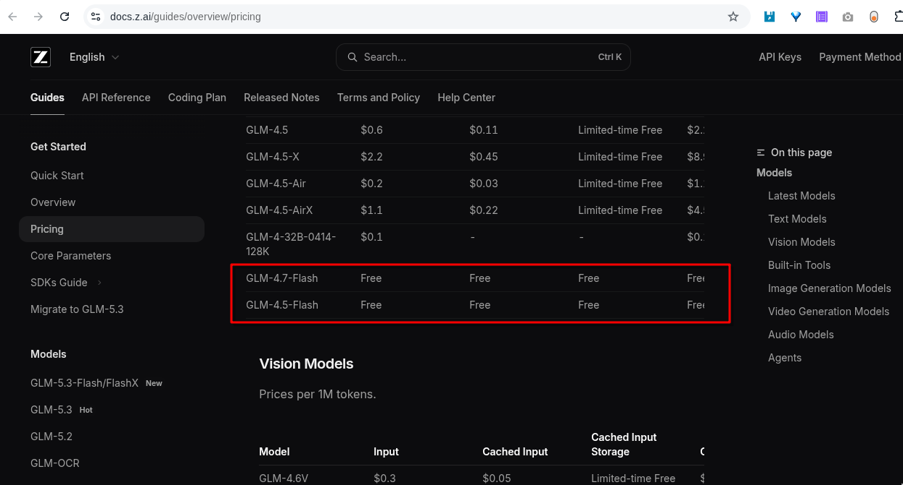

# Como crear una api en zhipu z ai

Ellos tienen unos modelos gratis:

[https://docs.z.ai/guides/overview/pricing](https://docs.z.ai/guides/overview/pricing)

Para crear una clave de API en **Zhipu AI (Z.AI)**, debes registrarte en su plataforma oficial y generar el token de acceso desde la sección de administración de claves.[Z.ai (+1) - Inicio rápido - Descripción general - Z.AI docs. Resultados relacionados](https://docs.z.ai/guides/overview/quick-start)

Pasos para crear y obtener tu API Key

-   **Registrarse o iniciar sesión:**
    -   Entra a la [Plataforma Z.AI](https://z.ai/model-api) o al sitio oficial de [Zhipu AI](https://docs.z.ai/guides/overview/quick-start).
    -   Crea una cuenta o inicia sesión con tu correo electrónico, Google o GitHub.[Z.ai (+2) - Z.ai API Platform — Start building with GLM-5.3. Resultados relacionados](https://z.ai/model-api)

-   **Ir a la gestión de claves:**
    -   Haz clic en tu perfil o busca en el menú de configuración la sección de **API Keys** o administración de claves.[精挑翻译 (+1) - Z.ai - SelectTranslate. Resultados relacionados](https://selecttranslate.com/es/docs/service/zhipu)

-   **Crear la clave API:**
    -   Haz clic en el botón para **Crear una nueva API Key** (o _Create API Key_).
    -   Asigna un nombre único para identificar tu clave.
    -   Guarda o copia el token generado inmediatamente en un lugar seguro, ya que no se volverá a mostrar completo.[Z.ai (+3) - Inicio rápido - Descripción general - Z.AI docs. Resultados relacionados](https://docs.z.ai/guides/overview/quick-start)
