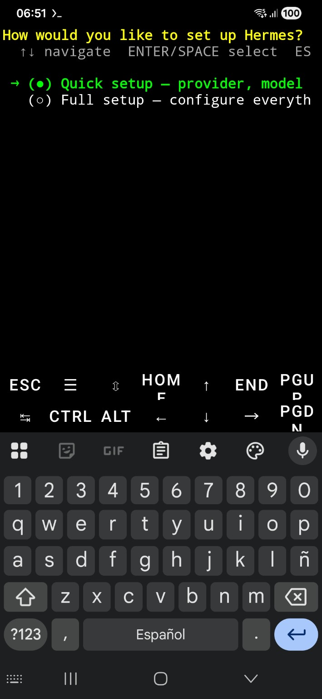
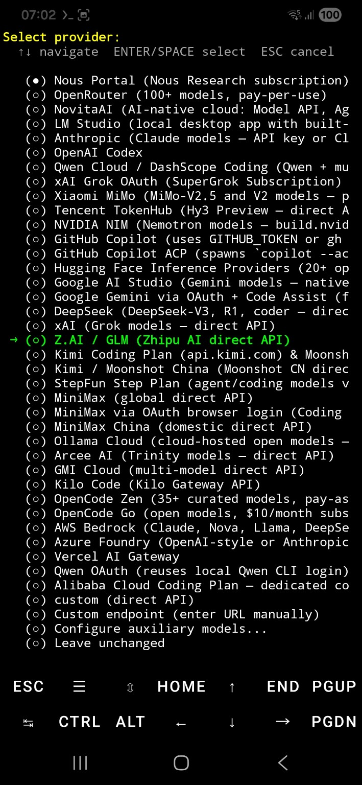
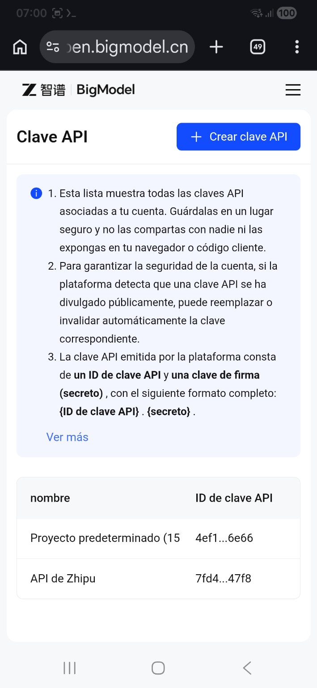
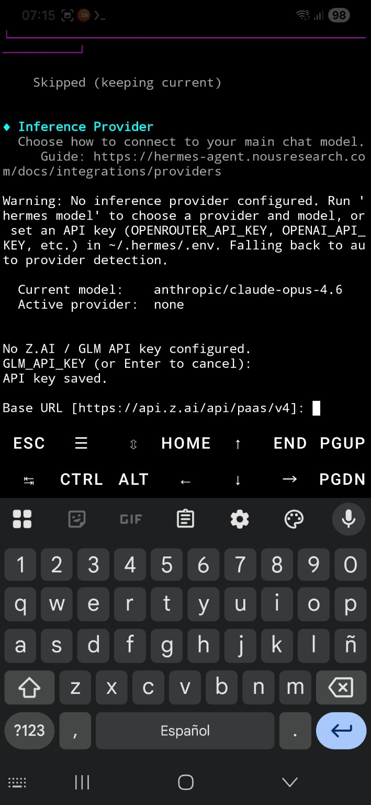
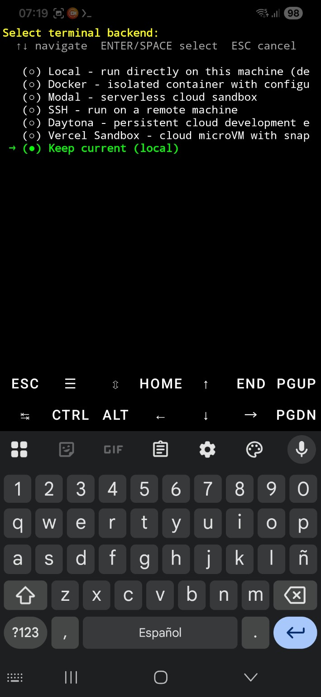
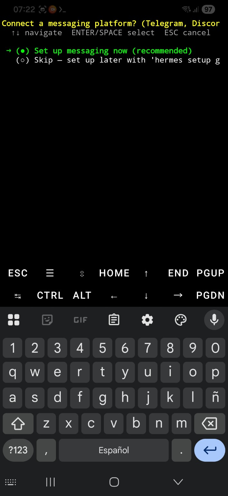
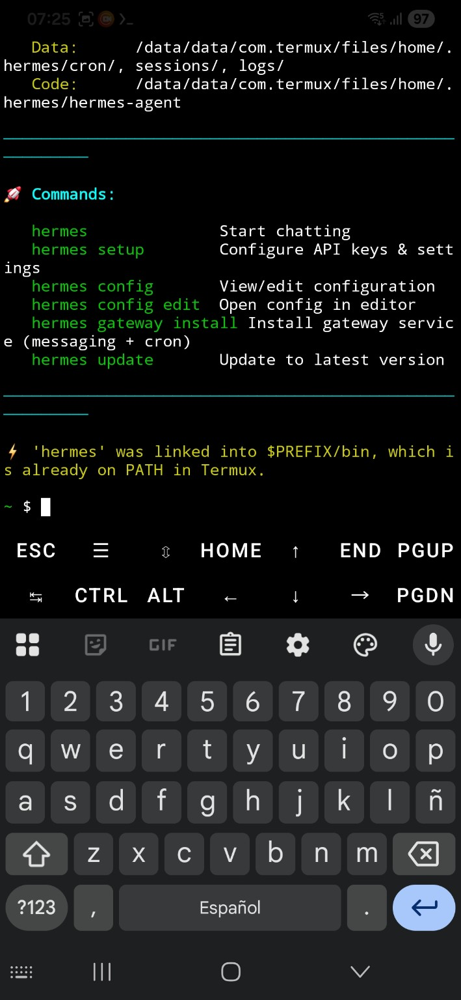
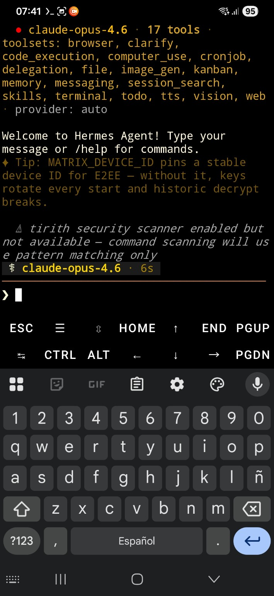
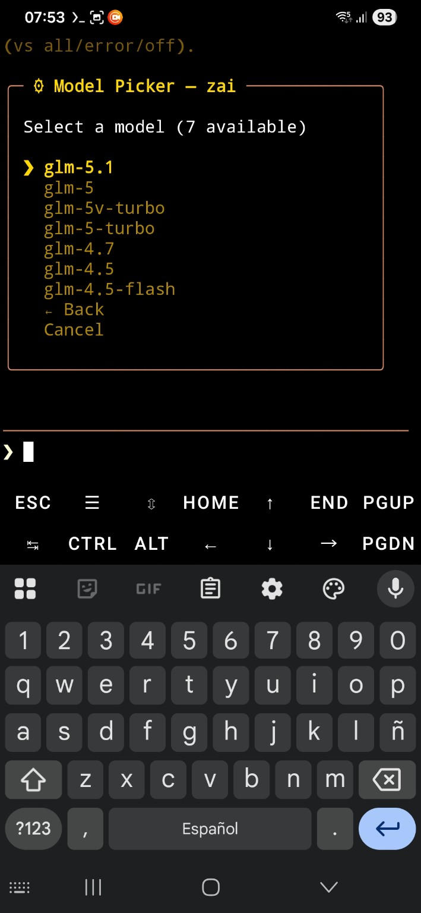
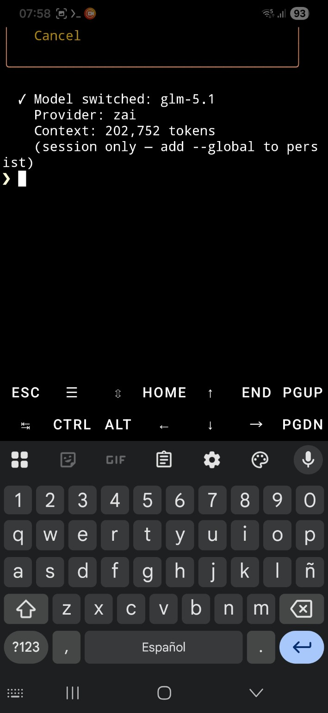

# Instalación de Hermes Agent en Termux usando Zhipu AI (GLM)

Tutorial realizado en Android + Termux usando Hermes Agent y Zhipu AI GLM.

---

## 1. Instalar Hermes en Termux

Ejecutar:

```bash
pkg update -y && pkg upgrade -y
pkg install -y curl
curl -fsSL https://raw.githubusercontent.com/NousResearch/hermes-agent/main/scripts/install.sh | bash
```

---

## 2. Pantalla inicial de configuración

Seleccionar:

- `Quick setup — provider, model`



---

## 3. Elegir proveedor Zhipu AI

Seleccionar:

- `Z.AI / GLM (Zhipu AI direct API)`



---

## 4. Obtener API Key en Zhipu AI

Sitio:

- https://open.bigmodel.cn/apikey/platform

La API debe tener formato:

```text
id.secreto
```

NO solamente el ID.



---

## 5. Base URL

Cuando Hermes pregunte:

```text
Base URL [https://api.z.ai/api/paas/v4]
```

Simplemente presionar ENTER.



---

## 6. Backend de terminal

Seleccionar:

- `Keep current (local)`



---

## 7. Mensajería

Seleccionar:

- `Skip — set up later`



---

## 8. Instalación terminada

Hermes quedará instalado correctamente.

Comando principal:

```bash
hermes
```



---

## 9. Ejecutar Hermes dentro de un repositorio Git

Entrar en un proyecto:

```bash
cd ~/mi_proyecto
hermes
```

Hermes detectará automáticamente el repositorio.



---

## 10. Cambiar modelo

Dentro de Hermes:

```text
/model
```

Seleccionar:

- `glm-5.1`



---

## 11. Confirmación del modelo

Hermes mostrará algo como:

```text
Model switched: glm-5.1
Provider: zai
Context: 202,752 tokens
```



---

## 12. Qué significa la cantidad de tokens

La línea:

```text
Context: 202,752 tokens
```

significa la cantidad máxima de contexto que el modelo puede recordar dentro de una conversación.

Eso permite:

- analizar proyectos grandes
- leer muchos archivos
- mantener conversaciones largas
- trabajar mejor con código fuente

---

## 13. Comandos útiles

Abrir Hermes:

```bash
hermes
```

Cambiar configuración:

```bash
hermes setup
```

Cambiar modelo:

```text
/model
```

Actualizar Hermes:

```bash
hermes update
```

---

## 14. Ejemplos de uso

Analizar un proyecto:

```text
Analyze this repository and explain the architecture
```

Ayuda con PyQt6:

```text
Continue porting this C++ project to PyQt6
```

Crear README:

```text
Generate a README for this repository
```

---

Fin del tutorial.
