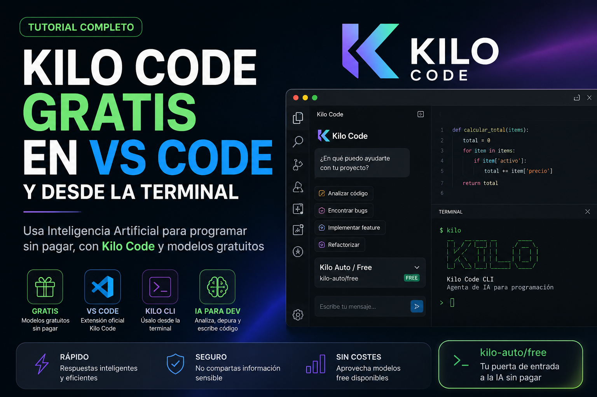

# Cómo usar Kilo Code gratis en Visual Studio Code y desde la terminal (Qwen Code Free y otras)



Kilo Code es un agente de Inteligencia Artificial para programación que podemos utilizar directamente desde **Visual Studio Code**, otros IDE y también desde la **terminal mediante Kilo CLI**.

Una de sus características más interesantes es que Kilo Code permite trabajar con diferentes proveedores y modelos de Inteligencia Artificial. Además, actualmente dispone de modelos que pueden utilizarse gratuitamente, por lo que es una alternativa muy interesante para desarrolladores que buscan utilizar agentes de IA sin tener que pagar constantemente por tokens.

En este tutorial veremos cómo utilizar **Kilo Code gratis**, primero desde Visual Studio Code y posteriormente desde la terminal.

## ¿Kilo Code es gratis?

Hay que distinguir entre dos cosas:

* El software Kilo Code es gratuito y de código abierto.
* La inferencia de los modelos de IA puede ser gratuita o de pago dependiendo del modelo y proveedor seleccionado.

Kilo ofrece actualmente una opción especialmente interesante denominada:

```
kilo-auto/free
```

También aparece en la interfaz como:

```
Kilo Auto / Free
```

Esta modalidad selecciona automáticamente modelos gratuitos disponibles.

Por lo tanto, no debemos confundir el hecho de que nuestra cuenta tenga **$0 de saldo** con que no podamos utilizar Kilo Code.

Si utilizamos `kilo-auto/free` o seleccionamos individualmente uno de los modelos marcados como gratuitos, las solicitudes correspondientes tienen un costo de **$0 en Kilo**.

## Instalar Kilo Code en Visual Studio Code

Abrimos Visual Studio Code y entramos en:

```
Extensions
```

Buscamos:

```
Kilo Code
```

e instalamos la extensión oficial.

Después de instalarla aparecerá el icono de Kilo Code en la barra lateral de Visual Studio Code.

Página oficial:

[https://kilo.ai](https://kilo.ai)

## Iniciar sesión

Al abrir Kilo Code por primera vez podemos iniciar sesión o crear gratuitamente una cuenta.

Una vez iniciada la sesión tendremos acceso al chat y al selector de modelos.

No es necesario comprar créditos para utilizar los modelos gratuitos.

## Utilizar Kilo Auto / Free

Esta es probablemente la forma más sencilla de comenzar.

Debajo de la ventana del chat encontraremos el selector del modelo.

Seleccionamos:

```
Kilo Auto / Free
```

Su identificador interno es:

```
kilo-auto/free
```

Ahora podemos comenzar a pedirle tareas relacionadas con nuestro proyecto.

Por ejemplo:

```
Analyze this project and explain its architecture.
```

o:

```
Find possible bugs in this project and explain how to fix them.
```

También podemos pedirle directamente que modifique nuestro código:

```
Analyze this PyQt6 project, find the cause of the error and implement the fix.
```

Kilo puede leer archivos del proyecto, analizar código, modificar archivos y ejecutar diferentes acciones necesarias para completar una tarea.

## ¿Qué modelo utiliza Kilo Auto / Free?

Esta parte es importante.

`kilo-auto/free` **no es realmente un único modelo de Inteligencia Artificial**.

Es un sistema de enrutamiento.

Kilo selecciona automáticamente alguno de los modelos gratuitos que estén disponibles en ese momento.

Esto tiene una ventaja importante: si los proveedores cambian sus modelos gratuitos, Kilo puede actualizar la selección sin que nosotros tengamos que cambiar nuestra configuración.

Por ello:

```
kilo-auto/free
```

es una muy buena opción para quienes quieren utilizar Kilo Code sin estar pendientes constantemente de qué modelo está disponible gratuitamente.

## Elegir manualmente un modelo gratuito

También podemos escoger nosotros mismos el modelo.

Abrimos el selector de modelos y escribimos:

```
free
```

Kilo mostrará los modelos que en ese momento están marcados como gratuitos.

Esto puede resultar útil si queremos comparar varios modelos.

Por ejemplo, podemos probar un mismo problema de programación con dos modelos diferentes y comprobar cuál comprende mejor nuestro proyecto.

La disponibilidad de estos modelos puede cambiar con el tiempo, por lo que es mejor consultar siempre el selector de Kilo en lugar de depender de una lista fija publicada meses atrás.

## Importante: límites de los modelos gratuitos

"Gratis" no significa necesariamente capacidad infinita sin ninguna restricción.

Kilo documenta actualmente un límite para los modelos gratuitos de aproximadamente:

```
200 solicitudes por hora por IP
```

Además, algunos proveedores externos pueden aplicar sus propios límites.

Si un determinado modelo gratuito alcanza temporalmente su límite, podemos probar otro modelo gratuito o continuar utilizando:

```
kilo-auto/free
```

## Cuidado con información privada

Existe otra consideración importante.

Kilo advierte que `Auto Free` puede enviar las solicitudes a proveedores gratuitos externos que registren prompts y respuestas y que eventualmente los utilicen para mejorar sus servicios.

Por este motivo, es recomendable **no enviar contraseñas, API Keys, datos personales, información confidencial ni secretos del proyecto** cuando utilizamos Auto Free.

Las API Keys nunca deberían formar parte de nuestros prompts ni estar escritas directamente dentro del código fuente.

---

# Utilizar Kilo Code desde la terminal

Una de las funciones más interesantes de Kilo Code es que no estamos obligados a utilizar Visual Studio Code.

También existe:

```
Kilo CLI
```

Esto convierte a Kilo en un agente de programación que podemos utilizar directamente desde una terminal.

Es especialmente útil para usuarios de Linux y para quienes acostumbramos trabajar con herramientas de línea de comandos.

## Instalar Kilo CLI

Debemos tener instalado Node.js y npm.

Podemos comprobarlo mediante:

```bash
node --version
npm --version
```

Posteriormente instalamos Kilo CLI:

```bash
npm install -g @kilocode/cli
```

**Nota**: en la pagina web esta esta instrucciones y otras maneras [https://kilo.ai/](https://kilo.ai/)

Comprobamos la instalación:

```bash
kilo --version
```

También podemos consultar las opciones disponibles:

```bash
kilo --help
```

## Actualizar Kilo CLI

Kilo incluye su propio comando de actualización:

```bash
kilo upgrade
```

Si lo instalamos mediante npm también podemos utilizar:

```bash
npm update -g @kilocode/cli
```

## Ejecutar Kilo dentro de nuestro proyecto

Supongamos que tenemos un proyecto:

```
~/Dev/mi-programa
```

Entramos en él:

```bash
cd ~/Dev/mi-programa
```

y ejecutamos:

```bash
kilo
```

Aparecerá la interfaz de Kilo directamente dentro de nuestra terminal.

De esta manera el agente puede trabajar con el proyecto situado en el directorio actual.

## Configuración inicial

Dentro de Kilo CLI podemos utilizar:

```
/connect
```

para configurar proveedores y credenciales cuando necesitemos conectar nuestras propias API Keys.

Sin embargo, si nuestro objetivo es trabajar gratuitamente con los modelos proporcionados por Kilo, podemos utilizar los modelos gratuitos disponibles.

## Ver los modelos

Dentro de Kilo CLI escribimos:

```
/models
```

Podemos buscar:

```
free
```

y seleccionar alguno de los modelos gratuitos.

También podemos utilizar:

```
kilo-auto/free
```

para dejar que Kilo seleccione automáticamente un modelo gratuito.

Esto significa que podemos tener una experiencia semejante a la extensión de Visual Studio Code, pero directamente desde nuestra terminal.

---

# ¿Qué podemos hacer con Kilo CLI?

Podemos utilizarlo para tareas como:

### Analizar un proyecto

```
Analyze this entire project and explain its architecture. Do not modify anything yet.
```

### Buscar errores

```
Analyze this project for bugs and show me the problems you find before modifying the files.
```

### Implementar una característica

```
Implement this feature while respecting the existing architecture and coding style.
```

### Refactorizar

```
Analyze this project and refactor the duplicated code without changing its current behavior.
```

### Investigar un error

Podemos copiar el mensaje de error y pedir:

```
Find the root cause of this error in the project, explain it, and implement the safest fix.
```

Esto resulta especialmente útil porque Kilo puede investigar directamente los archivos del proyecto en lugar de tener que copiar manualmente todo nuestro código a un chatbot.

---

# Los diferentes agentes de Kilo

Kilo no se limita únicamente a escribir código.

Dispone de diferentes modos o agentes especializados, entre ellos:

* **Code**: escribir y modificar código.
* **Architect**: estudiar la arquitectura y planificar cambios.
* **Ask**: hacer preguntas sobre el proyecto.
* **Debug**: investigar errores.
* **Orchestrator**: coordinar tareas más complejas.

Esto permite utilizar diferentes estrategias dependiendo del trabajo.

Por ejemplo, para una modificación grande puede ser conveniente comenzar con Architect para estudiar el proyecto y después utilizar Code para implementar los cambios.

---

# Cómo utilizar Kilo gratis sin gastar créditos accidentalmente

Si nuestro objetivo es mantener el costo en cero, conviene revisar tres lugares.

## 1. Modelo principal

Seleccionar:

```
kilo-auto/free
```

o algún modelo que aparezca explícitamente marcado como gratuito.

## 2. Modelo para tareas en segundo plano

Kilo también utiliza un modelo pequeño para ciertas tareas internas, como generar títulos o resumir contexto.

En Visual Studio Code podemos entrar en:

```
Settings → Models
```

y configurar el modelo pequeño utilizando un modelo gratuito.

En Kilo CLI esta configuración puede establecerse en:

```
~/.config/kilo/config.json
```

mediante la opción:

```json
{
  "small_model": "MODELO-GRATUITO"
}
```

Debemos sustituir `MODELO-GRATUITO` por el identificador de un modelo gratuito que aparezca actualmente disponible.

## 3. Autocompletado

El autocompletado del editor es independiente de las conversaciones normales con el agente.

Kilo explica que puede configurarse mediante BYOK —Bring Your Own Key— utilizando, por ejemplo, proveedores que ofrezcan algún nivel gratuito.

Por tanto, si queremos mantener absolutamente todo a costo cero, debemos revisar también la configuración del autocompletado.

---

# Utilizar nuestras propias API Keys

Kilo también permite conectar nuestras propias API Keys.

Esta característica se conoce como:

```
BYOK
```

o:

```
Bring Your Own Key
```

Esto resulta muy interesante porque podemos combinar en una misma herramienta diferentes servicios.

Por ejemplo, podemos tener:

```
Kilo Auto / Free
        +
modelos gratuitos individuales
        +
nuestras propias API Keys
        +
modelos ejecutados localmente
```

y cambiar de uno a otro dependiendo de la tarea.

---

# También podemos utilizar modelos locales

Kilo puede trabajar con soluciones locales como:

```
Ollama
```

o:

```
LM Studio
```

En este caso el modelo se ejecuta en nuestro propio ordenador.

No pagamos por tokens, pero necesitamos suficiente RAM, VRAM y potencia de procesamiento.

Esta opción puede resultar especialmente interesante para quienes disponen de un ordenador potente y quieren independencia de servicios externos.

---

# ¿Y Qwen3.8-27B?

Qwen 3.8 27B Is FREE & Unlimited in VS Code!  
[https://youtu.be/Mz808YZL_RI?si=AQ7_OWM9O3BoI1NJ](https://youtu.be/Mz808YZL_RI?si=AQ7_OWM9O3BoI1NJ)  

Recientemente Alibaba/Qwen publicó:

```
Qwen3.8-27B
```

Es un modelo abierto de 27 mil millones de parámetros y está publicado bajo licencia Apache 2.0.

Entre sus características encontramos:

```
27B parámetros
262.144 tokens de contexto nativo
Contexto extensible hasta 1 millón de tokens
Razonamiento
Programación
Uso como agente
Comprensión de imágenes y vídeo
```

Por tratarse de un modelo abierto también puede ejecutarse localmente si nuestro hardware dispone de recursos suficientes, utilizando herramientas compatibles y versiones cuantizadas.

Sin embargo, debemos hacer una distinción importante:

**que los pesos de Qwen3.8-27B sean abiertos y descargables no significa automáticamente que cualquier servidor que lo ejecute nos proporcione inferencia gratuita e ilimitada.**

El costo y los límites dependen del proveedor que ejecute el modelo.

Por ello debemos comprobar siempre qué proveedor está detrás de una supuesta API "gratis e ilimitada".

---

# Una estrategia para programar con IA sin pagar

Una configuración práctica puede ser:

```
                    Kilo Code
                        │
        ┌───────────────┼────────────────┐
        │               │                │
 Kilo Auto Free    Modelos Free        BYOK
        │               │                │
        └───────────────┼────────────────┘
                        │
                  Modelos locales
                 Ollama / LM Studio
```

Podemos comenzar siempre con:

```
kilo-auto/free
```

Si un problema resulta difícil, probar individualmente otros modelos gratuitos.

Si uno de ellos alcanza su límite, cambiar temporalmente a otro.

Y si tenemos una API Key gratuita de otro proveedor, añadirla mediante BYOK.

Así Kilo Code se convierte en una especie de **centro de control para utilizar diferentes Inteligencias Artificiales de programación desde una misma interfaz**.

---

# Kilo Code en Visual Studio Code o Kilo CLI: ¿cuál utilizar?

No tenemos que elegir solamente uno.

Podemos utilizar ambos.

**Visual Studio Code + Kilo Code** resulta muy cómodo cuando estamos editando código y queremos ver inmediatamente los cambios.

**Kilo CLI** resulta excelente cuando ya estamos trabajando en una terminal, administramos repositorios Git o queremos que un agente trabaje directamente sobre un proyecto sin abrir un IDE.

Para quienes utilizamos Linux habitualmente, disponer de ambas posibilidades es especialmente útil.

---

# Conclusión

Kilo Code es una alternativa muy interesante dentro de los agentes de programación con Inteligencia Artificial porque no nos obliga a utilizar un único modelo o proveedor.

Podemos trabajar desde Visual Studio Code o directamente desde la terminal con Kilo CLI y seleccionar entre modelos gratuitos, modelos de pago, nuestras propias API Keys o incluso modelos ejecutados localmente.

Para comenzar sin gastar dinero, una de las configuraciones más sencillas actualmente es:

```
kilo-auto/free
```

Y desde Kilo CLI podemos consultar periódicamente:

```
/models
```

y buscar:

```
free
```

para descubrir qué otros modelos gratuitos están disponibles.

La disponibilidad de modelos gratuitos cambia con el tiempo, así que conviene comprobar periódicamente el catálogo de Kilo.

De esta forma podemos aprovechar distintos modelos de Inteligencia Artificial para desarrollar, depurar y mantener nuestros proyectos sin depender exclusivamente de una única plataforma.
