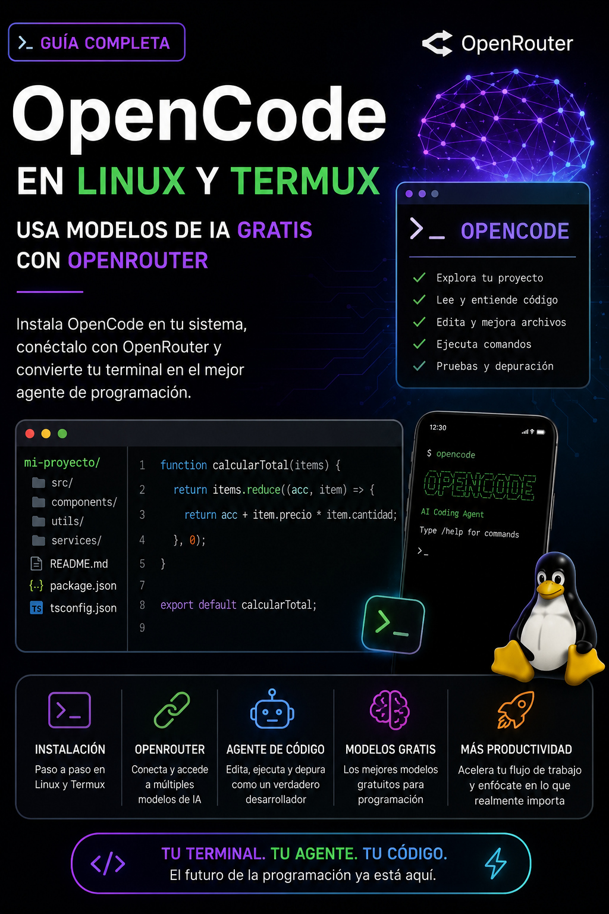

# Cómo instalar OpenCode en Linux y Termux y usar modelos de IA gratis (para tareas pequeñas o medianas) con OpenRouter



OpenCode es un agente de programación de código abierto que funciona desde la terminal y permite utilizar modelos de inteligencia artificial para trabajar directamente sobre proyectos de software.

A diferencia de un chatbot convencional, un agente de programación puede explorar un proyecto, localizar archivos, analizar código, realizar modificaciones y utilizar herramientas de desarrollo. OpenCode soporta más de 75 proveedores de modelos de IA y también permite utilizar modelos locales.

En este tutorial veremos:

- Cómo instalar OpenCode en Linux.
- Cómo instalar OpenCode en Android mediante Termux.
- Cómo crear una API Key de OpenRouter.
- Cómo conectar OpenRouter con OpenCode.
- Cómo utilizar modelos gratuitos.
- Qué modelos gratuitos son interesantes para programación.
- Cómo trabajar con proyectos grandes sin desperdiciar la ventana de contexto.

---

# 1. Instalar OpenCode en Linux

En una distribución Linux convencional, la instalación es bastante sencilla.

El método oficial es:

```bash
curl -fsSL https://opencode.ai/install | bash
```

OpenRouter también documenta este mismo método para utilizar OpenCode con sus modelos.

Una vez terminada la instalación, se puede comprobar la versión:

```bash
opencode --version
```

Para ejecutar OpenCode:

```bash
opencode
```

## Instalación alternativa mediante npm

Si Node.js y npm ya están instalados, también puede utilizarse:

```bash
npm install -g opencode-ai
```

Este es igualmente uno de los métodos de instalación documentados para OpenCode.

---

# 2. Instalar OpenCode en Android mediante Termux

La situación es diferente en Android.

Termux proporciona un entorno Linux sobre Android, pero Android utiliza Bionic como biblioteca C del sistema y existen otras diferencias respecto de una distribución GNU/Linux convencional.

Por este motivo existe el proyecto comunitario **opencode-termux**, que construye OpenCode específicamente para Android/Termux sobre arquitectura ARM64 (`aarch64`). El proyecto recompila componentes necesarios para que OpenCode pueda ejecutarse nativamente en este entorno.

Proyecto:

**guysoft/opencode-termux**

[https://github.com/guysoft/opencode-termux](https://github.com/guysoft/opencode-termux)

## Comprobar la arquitectura

En Termux:

```bash
uname -m
```

Para utilizar estos paquetes debe aparecer:

```
aarch64
```

## Actualizar Termux

```bash
pkg update && pkg upgrade
```

Instalar las herramientas necesarias:

```bash
pkg install curl ripgrep
```

## Descargar OpenCode para Termux

Es recomendable consultar primero las releases del proyecto:

[https://github.com/guysoft/opencode-termux/releases](https://github.com/guysoft/opencode-termux/releases)

Por ejemplo, una versión comprobada es OpenCode 1.17.9 para Android/Termux aarch64, publicada como release `v0.2.1`.

Puede descargarse así:

```bash
cd ~
curl -LO https://github.com/guysoft/opencode-termux/releases/download/v0.2.1/opencode_1.17.9_aarch64.deb
```

Comprobar el archivo:

```bash
ls -lh opencode_1.17.9_aarch64.deb
```

A continuación instalarlo:

```bash
dpkg -i opencode_1.17.9_aarch64.deb
```

Y asegurarse de que `ripgrep` esté instalado:

```bash
pkg install ripgrep
```

Finalmente:

```bash
opencode --version
```

Para iniciarlo:

```bash
opencode
```

El proyecto `opencode-termux` también ofrece otros formatos de instalación, incluyendo un ejecutable independiente y paquetes para Pacman.

> **Nota:** OpenCode evoluciona rápidamente. Antes de instalarlo en Termux conviene consultar la página de Releases y utilizar la versión más reciente compatible, en lugar de asumir que el número de versión mostrado en este tutorial continúa siendo el último.

---

# 3. ¿Qué es OpenRouter?

OpenCode necesita un modelo de inteligencia artificial para realizar su trabajo.

Puede conectarse directamente con numerosos proveedores, pero una alternativa especialmente interesante es **OpenRouter**.

OpenRouter funciona como una puerta de acceso a muchos modelos de diferentes desarrolladores utilizando una única API.

Esto permite cambiar de modelo sin tener que configurar un proveedor diferente cada vez.

OpenCode incluye soporte integrado para OpenRouter.

Sitio:

[https://openrouter.ai/](https://openrouter.ai/)

---

# 4. Crear una API Key de OpenRouter

Crear una cuenta o iniciar sesión en OpenRouter y acceder a la sección de API Keys.

[https://openrouter.ai/settings/keys](https://openrouter.ai/settings/keys)

Crear una nueva API Key.

Normalmente tendrá un aspecto parecido a:

```
sk-or-v1-...
```

La API Key debe tratarse como una contraseña.

**Nunca debe publicarse en GitHub, incluirse en capturas de pantalla ni compartirse con otras personas.**

# 4.1 Guardar la API  en .bashrc

En Linux puedes dejar la clave de OpenRouter disponible como una variable de entorno en ~/.bashrc. para Linux/macOS:

export OPENROUTER_API_KEY="sk-or-v1-TU_API_KEY"

puedes intentar cargar la configuración con:

```bash
source ~/.bashrc
```

pero sino carga debes cerrar la terminal donde estés usando opencode (y cerrar opencode claro, con /exit) y vovlerla a abrir y volver a abrir opencode

---

# 5. Conectar OpenRouter con OpenCode

Primero hay que entrar en la carpeta del proyecto que se desea trabajar.

Por ejemplo:

```bash
cd ~/Proyectos/mi-programa
```

En Termux podría ser:

```bash
cd /sdcard/Proyectos/mi-programa
```

Ejecutar:

```bash
opencode
```

Dentro de OpenCode escribir:

```
/connect
```

Buscar:

```
OpenRouter
```

Seleccionarlo.

OpenCode solicitará la API Key.

Se pega la clave creada anteriormente y se confirma.

Este procedimiento es el recomendado tanto por la documentación de OpenCode como por la documentación de integración de OpenRouter.

---

# 6. Seleccionar un modelo

Dentro de OpenCode ejecutar:

```
/models
```

Aparecerá una gran cantidad de modelos.

Es importante comprender que:

**Que un modelo aparezca en OpenRouter no significa que sea gratuito.**

Pueden aparecer modelos comerciales y gratuitos en la misma lista.

OpenRouter mantiene una colección específica de modelos gratuitos:

https://openrouter.ai/collections/free-models

Los modelos gratuitos suelen identificarse mediante:

```
(free)
```

o mediante el identificador:

```
:free
```

La disponibilidad de estos modelos puede cambiar con el tiempo. OpenRouter advierte que no puede garantizar permanentemente qué opciones gratuitas estarán disponibles.

---

# 7. Modelos gratuitos interesantes para programación

No existe necesariamente un único modelo que sea el mejor para todas las tareas.

Un modelo puede ser mejor escribiendo código mientras que otro puede ser más apropiado para analizar repositorios grandes, utilizar herramientas o mantener conversaciones extensas.

A agosto de 2026, estas son algunas opciones especialmente interesantes disponibles gratuitamente a través de OpenRouter.

## North Mini Code (free)

Una de las opciones más interesantes para utilizar específicamente con OpenCode es:

```
North Mini Code (free)
```

No se trata simplemente de un modelo conversacional general.

Cohere lo diseñó para:

- generación de código;
- ingeniería de software agentiva;
- utilización de terminal;
- llamadas a herramientas;
- razonamiento intercalado con acciones.

OpenRouter señala específicamente que fue entrenado para generalizar entre entornos de agentes como **OpenCode y SWE-Agent**.

Dispone de:

```
256K tokens de contexto
hasta 64K tokens de salida
```

y la variante gratuita aparece actualmente a:

```
$0/M input
$0/M output
```

Por ello es una excelente primera opción para tareas cotidianas de programación con OpenCode.

---

# 8. NVIDIA Nemotron 3 Ultra (free)

Otra alternativa muy potente es:

```
Nemotron 3 Ultra (free)
```

Es un modelo de razonamiento y orquestación de NVIDIA con arquitectura Mixture-of-Experts.

OpenRouter destaca su rendimiento en benchmarks relacionados con agentes y programación, incluyendo TerminalBench y SWE-Bench Verified.

Actualmente la variante gratuita mostrada por OpenRouter dispone de aproximadamente:

```
262K tokens de contexto
```

Es especialmente interesante para:

- comprender repositorios grandes;
- razonamiento complejo;
- arquitectura de software;
- tareas que involucran varios archivos;
- planificación;
- depuración compleja.

---

# 9. NVIDIA Nemotron 3 Super (free)

Para proyectos que requieren una ventana de contexto todavía mayor resulta particularmente interesante:

```
Nemotron 3 Super (free)
```

OpenRouter muestra actualmente una ventana de:

```
1.000.000 tokens
```

Es decir:

```
1M de contexto
```

OpenRouter lo describe como apropiado para coherencia agentiva prolongada, razonamiento entre documentos y planificación de múltiples pasos.

Para analizar repositorios excepcionalmente grandes, esta característica puede ser muy valiosa.

---

# 10. Laguna XS 2.1 (free)

Otra alternativa específicamente orientada al desarrollo de software es:

```
Laguna XS 2.1 (free)
```

OpenRouter lo clasifica dentro de programación y lo describe como un modelo para ingeniería de software y **agentic coding**, con herramientas y razonamiento.

Actualmente ofrece:

```
256K tokens de contexto
hasta 32K tokens de salida
```

Puede utilizarse como alternativa cuando otro modelo gratuito alcance sus límites.

Hay que tener en cuenta una consideración de privacidad: OpenRouter indica que, cuando Laguna XS 2.1 se utiliza gratuitamente, las entradas y salidas pueden emplearse para mejorar o entrenar los modelos.

Esto debe considerarse antes de utilizarlo con código privado o confidencial.

---

# 11. Una configuración práctica

En lugar de depender de un único modelo, puede resultar conveniente guardar varios como favoritos.

Por ejemplo:

| Modelo | Contexto aproximado | Uso recomendado |
|---|---:|---|
| North Mini Code Free | 256K | Programación agentiva y terminal |
| Nemotron 3 Ultra Free | 262K | Razonamiento y proyectos grandes |
| Nemotron 3 Super Free | 1M | Contexto extremadamente grande |
| Laguna XS 2.1 Free | 256K | Ingeniería de software y alternativa |

La lista cambia con frecuencia, por lo que conviene consultar periódicamente:

[https://openrouter.ai/collections/free-models](https://openrouter.ai/collections/free-models)

---

# 12. Utilizar OpenCode como agente de programación

La mejor manera de utilizar OpenCode es ejecutarlo desde la raíz del proyecto.

Por ejemplo:

```bash
cd ~/Proyectos/mi-programa
opencode
```

En lugar de comenzar pidiéndole que modifique todo el proyecto, puede ser conveniente solicitar primero una inspección.

Por ejemplo:

```
Inspect the project structure and explain its architecture.
Do not modify any files yet.
```

Después puede solicitarse una tarea concreta:

```
Find the cause of this bug.
Explain the cause before modifying anything.
```

Y posteriormente:

```
Implement the fix.
Preserve the existing architecture and coding style.
Run the relevant tests after making the changes.
```

De esta forma OpenCode puede investigar el repositorio y actuar progresivamente.

---

# 13. Cómo trabajar con proyectos grandes

Los modelos tienen una **ventana de contexto** limitada.

Si una sesión acumula demasiado código, conversaciones y resultados de herramientas, OpenCode puede llegar a mostrar mensajes similares a:

```
Session too large to compact -
context exceeds model limit even
after stripping media
```

Esto no necesariamente significa que se haya agotado la cuota de la API.

Son conceptos diferentes:

**Cuota de API:** cuánto uso permite el proveedor.

**Ventana de contexto:** cuánta información puede procesar el modelo dentro de una petición o sesión.

Por este motivo, un modelo con una ventana de contexto mayor puede ser especialmente útil para repositorios grandes.

Sin embargo, disponer de 256K o incluso 1M de contexto no significa que sea buena idea introducir todo el repositorio indiscriminadamente.

Es preferible solicitar:

```
Inspect the repository structure first.
Identify the files relevant to this task.
Read only the necessary files and then propose a solution.
```

en lugar de:

```
Read every file in this repository.
```

Esto reduce el consumo, evita llenar innecesariamente el contexto y facilita sesiones más largas.

---

# 14. Importante: los modelos gratuitos tienen límites pequeños para desarrollo intensivo, los modelos gratuitos no sustituyen una API de uso intensivo

Los modelos identificados como `(free)` o `:free` en OpenRouter son una excelente manera de probar OpenCode sin pagar, aprender a utilizar agentes de programación y realizar tareas pequeñas o medianas. Sin embargo, **no debe entenderse que proporcionan uso ilimitado ni que permiten mantener un agente desarrollando un proyecto grande durante muchas horas de forma gratuita**.

OpenRouter limita actualmente su plan gratuito a aproximadamente:

```
50 solicitudes al día
20 solicitudes por minuto
```

Este límite se aplica a los modelos gratuitos y puede agotarse mucho antes de lo esperado cuando se utiliza un **agente de programación**.

Esto ocurre porque una sola instrucción del usuario no equivale necesariamente a una sola llamada a la API.

Por ejemplo, si se le pide a OpenCode:

```
Analiza este proyecto, implementa esta característica,
añade las pruebas, ejecútalas, corrige los errores
y actualiza la documentación.
```

para el usuario eso parece una sola petición.

Pero OpenCode puede necesitar realizar internamente una secuencia semejante a:

```
Usuario
  │
  ▼
OpenCode
  │
  ├── consultar al modelo
  ├── leer archivos
  ├── consultar nuevamente al modelo
  ├── modificar código
  ├── consultar al modelo
  ├── ejecutar pruebas
  ├── analizar los errores
  ├── consultar otra vez al modelo
  ├── corregir archivos
  ├── volver a ejecutar pruebas
  ├── actualizar documentación
  └── preparar el resultado final
```

Por tanto, **una única tarea compleja puede consumir numerosas solicitudes al modelo**.

## Un problema especialmente importante: la tarea puede quedar a medias

Cuando se alcanza el límite, el agente no necesariamente espera a encontrarse entre dos tareas.

Puede ocurrir mientras está:

* modificando archivos;
* escribiendo pruebas;
* corrigiendo un error;
* ejecutando la validación final;
* actualizando documentación;
* preparando un refactor;
* trabajando sobre varios repositorios.

En ese momento OpenRouter puede responder con un mensaje semejante a:

```
Rate limit exceeded: free-models-per-day
```

y el agente deja de continuar.

Esto significa que el repositorio puede quedar en un **estado intermedio**.

No necesariamente estará dañado, porque Git permite revisar todos los cambios realizados, pero el trabajo puede haber quedado:

```
implementado parcialmente
       │
       ├── código escrito
       ├── tests añadidos
       ├── documentación modificada
       │
       └── validación final incompleta
```

Por esta razón, **no es recomendable confiar exclusivamente en un modelo gratuito para una tarea autónoma grande que deba terminar obligatoriamente en una sola ejecución**.

## Los 50 requests no son 50 preguntas largas

Este punto puede producir confusión.

El límite diario no significa necesariamente:

> “Puedo darle al agente 50 grandes trabajos al día.”

Un agente puede utilizar múltiples llamadas al modelo para completar solamente **un trabajo**.

Cuanto más autónoma y compleja sea la tarea, más llamadas puede requerir.

Por ello, los 50 requests diarios pueden resultar suficientes para consultas normales pero agotarse sorprendentemente rápido durante desarrollo agentivo.

## ¿Entonces para qué sirven muy bien los modelos gratuitos?

Son especialmente útiles para:

* conocer OpenCode;
* explorar repositorios;
* preguntar por determinados archivos;
* localizar errores;
* pedir explicaciones;
* realizar modificaciones pequeñas;
* escribir una función;
* crear una prueba específica;
* revisar código;
* realizar pequeñas refactorizaciones;
* experimentar con distintos modelos;
* continuar manualmente por etapas.

También son muy útiles como **modelo de respaldo** cuando se agota la cuota de otro proveedor.

## Para proyectos grandes: dividir el trabajo

En lugar de dar una instrucción enorme como:

```
Analiza todo el programa, termina la característica,
crea todas las pruebas, corrige los errores,
actualiza el CI y la documentación.
```

es preferible dividirla.

Por ejemplo:

### Primera tarea

```
Inspect the relevant files and explain what needs to be changed.
Do not modify anything yet.
```

### Segunda tarea

```
Implement only the core functionality.
Do not update documentation yet.
```

### Tercera tarea

```
Review the implementation and add the necessary tests.
```

### Cuarta tarea

```
Run the relevant tests and fix any failures.
```

### Quinta tarea

```
Update the documentation and prepare the final handoff.
```

De esta manera, si se termina una cuota, el trabajo suele quedar en un punto mucho más fácil de continuar con otro modelo o agente.

## Utilizar Git es todavía más importante

Antes de pedir una modificación considerable a un agente es recomendable comprobar:

```bash
git status
```

Y es conveniente realizar commits en puntos estables del desarrollo.

Así, si una API se queda sin cuota durante una tarea, siempre será posible distinguir:

```
último estado conocido y funcional
             │
             ▼
          commit
             │
             ▼
cambios todavía no terminados del agente
```

No se debe hacer un commit automáticamente simplemente porque el agente dejó de trabajar. Primero hay que revisar y probar los cambios.

## ¿Se puede aumentar el límite gratuito de OpenRouter?

OpenRouter indica actualmente que una cuenta sin créditos dispone de **50 solicitudes gratuitas al día**. Si la cuenta ha comprado al menos **10 dólares en créditos**, el límite de solicitudes a modelos gratuitos aumenta hasta **1.000 al día**.

Es importante comprender la diferencia:

```
Sin comprar créditos:
50 requests/día en modelos gratuitos

Con al menos $10 en créditos:
hasta 1.000 requests/día en modelos gratuitos
```

Los modelos que continúan marcados como `:free` siguen teniendo coste de inferencia de $0; la compra de créditos eleva el límite de requests disponible para dichos modelos.

Sin embargo, esto ya no puede considerarse una solución completamente gratuita desde cero, puesto que es necesario realizar esa compra.

Además, la disponibilidad de los modelos gratuitos y sus límites pueden cambiar, por lo que siempre se debe comprobar la información actual de OpenRouter.

## Estrategia recomendable para trabajar sin pagar

Si se desea aprovechar al máximo las opciones gratuitas, una estrategia más realista es utilizar **varios proveedores**:

```
                    OpenCode
                        │
       ┌────────────────┼────────────────┐
       ▼                ▼                ▼
    OpenRouter         Groq          Gemini / otros
       │                │
 modelos free       free tier        free tier
```

Cuando se termina la cuota de uno se puede cambiar de proveedor o modelo.

Esto permite trabajar durante más tiempo, pero tampoco garantiza una jornada ilimitada de desarrollo agentivo.

Cada proveedor tiene sus propios:

* límites diarios;
* límites por minuto;
* límites de tokens;
* ventanas de contexto;
* políticas para cuentas gratuitas.

## Conclusión

OpenCode puede utilizarse gratuitamente y OpenRouter ofrece modelos gratuitos sorprendentemente capaces, incluso para programación y análisis de repositorios grandes.

Sin embargo, hay que distinguir entre:

> **“Es posible usar OpenCode gratis”**

y:

> **“Es posible utilizar gratuitamente un agente autónomo durante todo el día para desarrollar proyectos grandes.”**

Lo primero sí es posible.

Lo segundo **no está garantizado con los free tiers actuales**.

Los modelos gratuitos son excelentes para aprender, experimentar y realizar trabajo real en cantidades moderadas, pero un flujo intensivo de desarrollo agentivo puede consumir rápidamente la cuota y detenerse incluso a mitad de una tarea.

Por ello, para proyectos importantes conviene combinar:

**Git + tareas pequeñas + varios proveedores + handoffs claros entre agentes.**

Así, si una cuota se agota, otro agente puede inspeccionar el estado actual del repositorio y continuar desde donde terminó el anterior sin tener que empezar nuevamente desde cero.


---

# 15. Cambiar de modelo cuando sea necesario

Una de las ventajas de OpenRouter es poder cambiar fácilmente de modelo.

Dentro de OpenCode:

```
/models
```

Por ejemplo, puede utilizarse:

```
North Mini Code (free)
```

para implementar cambios concretos.

Si posteriormente hay que analizar una gran cantidad de código:

```
Nemotron 3 Super (free)
```

puede resultar más apropiado por su gran ventana de contexto.

Si un modelo alcanza un límite específico del proveedor, puede intentarse continuar con otro modelo disponible. Sin embargo, si se ha alcanzado el límite diario general de modelos gratuitos de OpenRouter (free-models-per-day), cambiar a otro modelo :free de OpenRouter no solucionará el problema. En ese caso será necesario esperar a que se restablezca la cuota, utilizar otro proveedor configurado en OpenCode o utilizar una opción de pago.

---

# 16. Una combinación interesante

Una configuración sin depender de un único modelo podría quedar conceptualmente así:

```
                         OpenCode
                            │
                            ▼
                       OpenRouter
                            │
          ┌─────────────────┼─────────────────┐
          │                 │                 │
          ▼                 ▼                 ▼
 North Mini Code      Nemotron 3 Ultra   Nemotron 3 Super
      Free                  Free               Free
   Coding agent          Razonamiento       Gran contexto
          │
          ▼
  Laguna XS 2.1 Free
      Alternativa
```

De esta manera se puede elegir el modelo en función de la tarea en lugar de intentar utilizar el mismo para absolutamente todo.

---

# 17. Enlaces útiles

**OpenCode**  

[https://opencode.ai/](https://opencode.ai/)

**Documentación de OpenCode**  

[https://opencode.ai/docs/](https://opencode.ai/docs/)

**Proveedores compatibles con OpenCode**  

[https://opencode.ai/docs/providers/](https://opencode.ai/docs/providers/)

**OpenCode para Termux**  

[https://github.com/guysoft/opencode-termux](https://github.com/guysoft/opencode-termux)

**Releases para Termux**  

[https://github.com/guysoft/opencode-termux/releases](https://github.com/guysoft/opencode-termux/releases)

**OpenRouter**  

[https://openrouter.ai/](https://openrouter.ai/)

**Crear API Keys en OpenRouter**  

[https://openrouter.ai/settings/keys](https://openrouter.ai/settings/keys)

**Integración OpenRouter + OpenCode**  

[https://openrouter.ai/docs/cookbook/coding-agents/opencode-integration](https://openrouter.ai/docs/cookbook/coding-agents/opencode-integration)

**Modelos gratuitos de OpenRouter**  

[https://openrouter.ai/collections/free-models](https://openrouter.ai/collections/free-models)

---

# Entonces

OpenCode permite convertir la terminal en un entorno de programación asistido por agentes de inteligencia artificial.

En Linux puede instalarse directamente mediante el instalador oficial, mientras que en Android/Termux existen builds comunitarias adaptadas específicamente a `aarch64`.

Al combinar OpenCode con OpenRouter se obtiene acceso a numerosos modelos mediante una sola API Key, incluyendo modelos que actualmente ofrecen inferencia gratuita.

Para programación agentiva, **North Mini Code** resulta especialmente interesante por estar diseñado para tareas de ingeniería de software y agentes como OpenCode. Para razonamiento y repositorios grandes, la familia **NVIDIA Nemotron** ofrece alternativas con ventanas de contexto considerablemente mayores.

No obstante, los modelos, precios, límites y opciones gratuitas de OpenRouter cambian con el tiempo. Antes de comenzar un trabajo importante conviene comprobar que el modelo seleccionado continúa marcado como **Free** y revisar sus condiciones de uso.

Con esta configuración es posible comenzar a utilizar OpenCode como agente de programación tanto desde un ordenador Linux como desde un dispositivo Android con Termux, experimentar con distintos modelos y realizar trabajo real de programación sin pagar inicialmente.

Sin embargo, los modelos gratuitos de OpenRouter tienen límites de uso que pueden agotarse rápidamente cuando OpenCode trabaja de forma agentiva. Una sola tarea compleja puede provocar numerosas llamadas al modelo y, si se alcanza la cuota durante su ejecución, el trabajo puede quedar interrumpido a mitad del proceso.

Por ello, estas opciones gratuitas son especialmente interesantes para aprender, experimentar y realizar tareas pequeñas o moderadas. Para desarrollo intensivo de proyectos grandes conviene trabajar por etapas, utilizar Git, mantener puntos de recuperación y disponer de varios proveedores o alternativas para poder continuar cuando se agote una cuota.