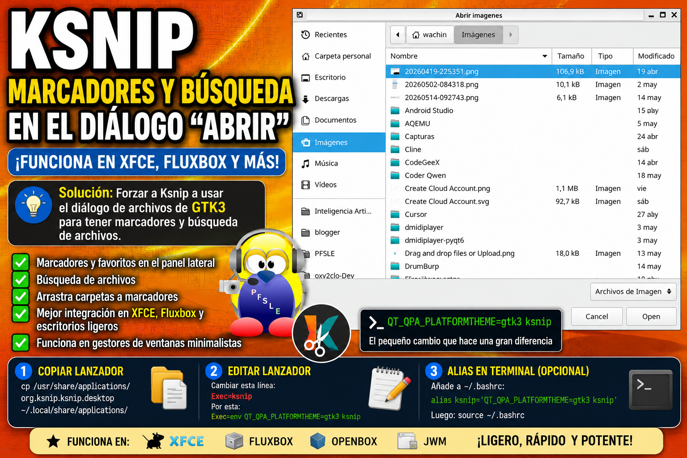

## Ksnip, cómo habilitar marcadores y búsqueda de archivos en el diálogo “Abrir”en escritorios no KDE ( XFCE, Fluxbox, etc)



Si usas Ksnip en Linux que no es KDE o basado en KDE alguna vez pensaste:

> “¿Por qué no puedo arrastrar carpetas a favoritos?”
> “¿Por qué el panel lateral está vacío?”
> “¿Por qué no puedo buscar archivos?”

Yo mismo llevo años usando Linux y nunca había escuchado claramente el término:

> **“diálogo de archivos”**

hasta que investigué el código fuente de Ksnip.

---

# ¿Qué es un “diálogo de archivos”?

Un **diálogo de archivos** es la ventana que aparece cuando haces clic en:

* Abrir
* Guardar
* Exportar
* Seleccionar carpeta

Es decir, la típica ventana donde ves:

* carpetas
* archivos
* panel lateral
* favoritos/marcadores
* búsqueda

Ejemplo:

* “Abrir imagen”
* “Guardar captura”
* “Exportar archivo”

---

# El gran detalle que casi nadie explica

Muchas aplicaciones Linux **NO crean su propia ventana para abrir archivos**.

En realidad usan la que proporciona:

* Qt
* GTK
* KDE
* el sistema operativo
* el entorno de escritorio

Y allí es donde está el problema.

---

# Ksnip usa el diálogo de archivos de Qt

Qt es el framework con el que está hecho Ksnip.

Por defecto, Ksnip usa el diálogo de archivos de Qt.

En escritorios KDE eso normalmente funciona muy bien.

Pero en escritorios ligeros como:

* XFCE
* Fluxbox
* Openbox
* JWM

pueden ocurrir problemas como:

* panel lateral vacío
* sin marcadores
* sin búsqueda
* integración pobre

Y eso hace que mucha gente piense:

> “Ksnip está roto”

pero realmente el problema es el diálogo de archivos que Qt decidió usar.

---

# ¿Por qué en KDE sí funciona?

Porque KDE usa tecnologías Qt/KDE de forma nativa.

Entonces Ksnip hereda automáticamente:

* favoritos
* lugares
* marcadores
* búsqueda
* integración completa

Por eso muchos usuarios KDE nunca notan el problema.

---

# La solución: forzar el diálogo GTK3

La solución es increíblemente sencilla.

Haz que Qt use el sistema GTK3 para el diálogo de archivos:

```bash
QT_QPA_PLATFORMTHEME=gtk3 ksnip
```

---

# ¿Qué cambia con eso?

Automáticamente aparecen:

✔ Marcadores
✔ Favoritos
✔ Búsqueda de archivos
✔ Mejor integración con XFCE
✔ Mejor integración con Fluxbox
✔ Panel lateral funcional

Incluso funciona muy bien en gestores de ventanas minimalistas X11. Yo mismo lo probé en:

* XFCE
* Fluxbox

y funciona perfectamente.

---

# Cómo hacerlo permanente (RECOMENDADO)

NO modifiques el archivo original del sistema.

La mejor práctica en Linux es copiar el lanzador al usuario local.

---

# 1. Copiar el lanzador de Ksnip

Ejecuta:

```bash
cp /usr/share/applications/org.ksnip.ksnip.desktop ~/.local/share/applications/
```

Así, si el sistema actualiza Ksnip, no perderás los cambios.

---

# 2. Editar el lanzador

**Nota:** Tenga instalado a Gedit.

Abre el archivo:

```bash
gedit ~/.local/share/applications/org.ksnip.ksnip.desktop
```

Busca esta línea:

```ini
Exec=ksnip
```

y cámbiala por:

```ini
Exec=env QT_QPA_PLATFORMTHEME=gtk3 ksnip
```

---

# 3. Opcional: arreglar también los accesos rápidos

Más abajo verás:

```ini
Exec=ksnip -r -c
Exec=ksnip -l -c
Exec=ksnip -m -c
Exec=ksnip -a -c
```

Puedes cambiarlos también.

Ejemplo:

```ini
Exec=env QT_QPA_PLATFORMTHEME=gtk3 ksnip -r -c
```

Haz lo mismo con las demás líneas.

---

# Archivo corregido (ejemplo)

```ini
[Desktop Entry]
Type=Application
Exec=env QT_QPA_PLATFORMTHEME=gtk3 ksnip
Icon=ksnip
Terminal=false
StartupNotify=false
Name=ksnip
GenericName=ksnip Screenshot Tool
Categories=Utility;

[Desktop Action Area]
Exec=env QT_QPA_PLATFORMTHEME=gtk3 ksnip -r -c

[Desktop Action LastArea]
Exec=env QT_QPA_PLATFORMTHEME=gtk3 ksnip -l -c

[Desktop Action FullScreen]
Exec=env QT_QPA_PLATFORMTHEME=gtk3 ksnip -m -c

[Desktop Action Window]
Exec=env QT_QPA_PLATFORMTHEME=gtk3 ksnip -a -c
```

---

# Alias para usarlo desde terminal

Si quieres que SIEMPRE se ejecute corregido desde terminal:

Abre:

```bash
gedit ~/.bashrc
```

y añade:

```bash
alias ksnip='QT_QPA_PLATFORMTHEME=gtk3 ksnip'
```

Luego recarga:

```bash
source ~/.bashrc
```

---

# Cómo ponerlo para lanzarse al inicio en Administradores de ventana minimalistas como ejemplo Fluxbox

en el archivo 

.fluxbox/startup

allí colocar esta línea:

QT_QPA_PLATFORMTHEME=gtk3 ksnip &

guardar y cerrar

**Nota:** En ese archivo siempre los comandos deben ir al final con "&" pues de lo contrario todo lo que se debería ejecutar debajo de él, no se ejecutará
