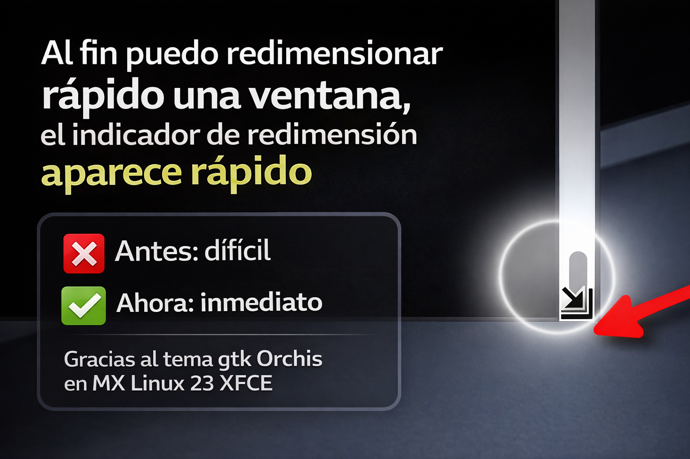

# Con el Tema de iconos Orchis en MX Linux 23 XFCE se pueden redimensionar mejor las esquinas de las ventanas porque aparece más rapido



Si algo tiene la comunidad de MX Linux es un gran apego a su estética por defecto. Es limpia, profesional y funciona a la perfección. Sin embargo, en **MX Linux 23**, sentía que me faltaba algo. No era el color, no eran los iconos... era la fluidez al hacer una de las acciones más básicas: **redimensionar una ventana**.

Seguramente te haya pasado: quieres ajustar el tamaño de una ventana desde la esquina inferior derecha, acercas el cursor, y parece que tienes que jugar al "busca el punto exacto" para que aparezca el icono de redimensionar. Ese pequeño retraso, esa milésima de segundo de espera, rompe la experiencia de un sistema que se supone rápido.

Busqué entre varios temas GTK en los repositorios, probé combinaciones, pero ninguno me convencía hasta que di con **Orchis**.

### ¿Qué es Orchis?

Orchis es un tema visual basado en **Material Design**, el lenguaje de diseño de Google, creado por el desarrollador [vinceliuice](https://github.com/vinceliuice/Orchis-theme) (y que a su vez se basa en el excelente *materia-theme* de nana-4). Visualmente es precioso, plano, con bonitos colores y transparencias sutiles. 

### La magia está en las esquinas

El motivo principal por el que Orchis se ha convertido, sin lugar a dudas, en **mi tema definitivo**, es su respuesta al redimensionar ventanas. 

Al instalarlo y aplicar cambiar el tema en MX Linux 23, noté el cambio de inmediato. Cuando acercas el cursor a cualquier esquina o borde de una ventana para hacerla más pequeña, más grande o rectangular, **el indicador de redimensión aparece rapido**:


### ¿Cómo instalarlo en MX Linux 23?

Abrimos nuestra terminal y tecleamos:

```bash
sudo apt install orchis-gtk-theme
```

*(Nota: Si también quieres los iconos, puedes buscar el paquete `orchis-icon-theme`. Además también lo puedes buscar en synaptic*

### ¿Cómo aplicarlo?

Una vez instalado, el proceso es el clásico de XFCE:

**1.)** Ve a **Menú de aplicaciones** y búsca la palabra **Apariencia**.


**2.)** En la ventan que aparece, en la pestaña **Estilos**, busca "Orchis" (verás que tiene varias variantes, como oscuro, claro, etc.) y seleccionalo:


allí el tema tiene algunas variantes con diferentes colores, puedes probar y ver la que te guste

**Acerca de los iconos.-** Si instalaste el paquete de los iconos, da clic en la pestaña "Iconos" y allí elíge una de las variantes


**3.)** Ahora ve a **Menú de aplicaciones** y búsca la palabra **Gestor de ventanas** y en la pestaña **Estilos**, busca "Orchis"


Dios te bendiga