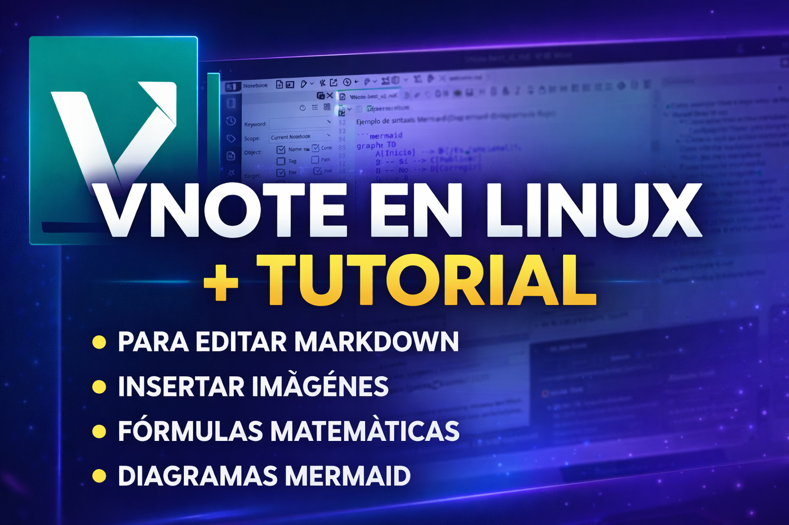
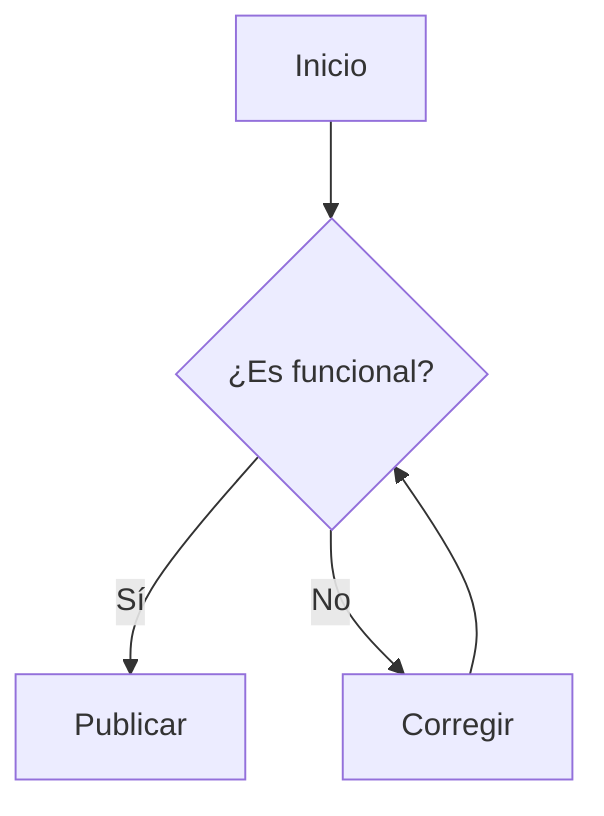

# Cómo usar VNote el mejor editor de Markdown gratis, para mí, en Linux + klatexformula (fórmulas matemáticas y científicas) + Tutorial



Para poderlo usar en Linux debes de usarlo como deb o como AppImage, vea los siguientes tutoriales:

**Paquetes deb de Vnote para MX Linux 21 de 32 y 64 bits + Cómo compilarlo desde código fuente**  
[https://facilitarelsoftwarelibre.blogspot.com/2022/07/vnote-for-mx-linux-deb-package.html](https://facilitarelsoftwarelibre.blogspot.com/2022/07/vnote-for-mx-linux-deb-package.html)

**Descargar y ejecutar VNote AppImage editor de markdown gratuito y hacerlo funcionar en Debian, Ubuntu, MX Linux, Mint, etc**  
[https://facilitarelsoftwarelibre.blogspot.com/2025/05/como-descargar-vnote-editor-de-markdown-y-hacerlo-funcionar-en-linux-debian-mx-ubuntu-mint-con-manual.html](https://facilitarelsoftwarelibre.blogspot.com/2025/05/como-descargar-vnote-editor-de-markdown-y-hacerlo-funcionar-en-linux-debian-mx-ubuntu-mint-con-manual.html)


# Manual de uso
El programa a esta fecha 2025 está en inglés disponible y no en español, aquí unas instrucciones de uso: 

## **Cómo abrir un archivo markdown con VNote AppImage**

A mi me gusta poner en un solo lugar todos los programas portables de Linux AppImage, en una carpeta llamada:

🗀 AppsLinux

ejemplo allí pongo una versión de VNote de 64 bit:

/home/wachin/AppsLinux/VNote-3.18.2-linux-x64.AppImage

le doy clic derecho y clic en Propiedades y clic en la pestaña "Permisos" y lo marco como ejecutable (en caso de que hubiera estado marcada así omitir), luego de doy doble clic y abro a VNote. Y para que siempre se abra un archivo en el administrador de archivo de Linux con clic derecho ejemplo con Thunar:

### Configurar Thunar para siempre abrir archivos markdown .md 

Para Thunar ecesitamos darle clic derecho a algún archivo markdown y dar clic en "Propiedades" y en "Abrir con.." dar clic en "Otra aplicación" y dar clic en "Usar una orden personalizada" y a la derecha dar clic en el botón "Navegar" y allí buscar el lugar donde está la AppImage y seleccionarla y darle clic y dar clic en "Abrir" y clic en "Aceptar". Y en caso de que no se pueda a la primera volverlo a intentar y si se podrá segunda vez o después que se reiniciel Sistema Operativo

## **Cómo abrir un archivo markdown con VNote paquete .deb**

Esta parte es sólo para el paquete deb que he compilado, para abrir un archivo de markdown con VNote 3.13.1, debe hacer clic derecho y abrir con VNote. La siguiente imagen es del Administrador de Archivos Thunar:


## Cómo editar markdown en VNote (Modos Lectura / Edición)

Para editar un archivo, haga clic en el botón lápiz:


## VNote genera marcadores
Este programa genera marcadores con tus encabezados:


## Cómo insertar encabezados
Los encabezados están en el botón H1:


## Cómo insertar imágenes
Para insertar una imagen en un archivo README.md para un proyecto de Github, puede arrastrar y soltar:


(se puede insertar una imagen en cualquier archivo markdown)

luego doble clic en insertar como "Insert As Image" dandole dos clics:


y yo generalmente elimino la sección "Título" (pero si usted lo necesita dejelo):


### Insertar enlaces de imagenes

Puede darle clic a una imagen que esté en su blog, o en algún sitio web en alguna página web, le da clic derecho (o también alguna que tenga subida a algún sitio de alojamiento de imagens) y copia el enlace en el navegador, y luego lo pega en VNote y debe dar clic en:

- Insert As Relative Image Link

---


### Insertar diagramas, gráficos y visualizaciones complejas Mermail

Mermaid es una herramienta basada en JavaScript que permite crear diagramas, gráficos y visualizaciones complejas utilizando texto simple y sintaxis inspirada en Markdown. Facilita la documentación técnica y la documentación "como código", ya que permite generar, editar y versionar diagramas (flujos, secuencias, clases) fácilmente en plataformas como GitHub, Obsidian o Notion

¡Muy importante!Para que el editor reconozca el código y dibuje el gráfico, siempre hay que poner la **etiqueta mermaid** inmediatamente después de abrir los **tres acentos graves** (```). Si solo pones los acentos graves sin la etiqueta, el programa pensará que es un bloque de código de texto normal y no mostrará el diagrama. 

**¿Cómo escribo los tres acentos graves (```)? **En los teclados en español hay dos teclas de acentos, pero solo una sirve, revisa tu teclado, depende de cómo esté:

-   **No uses** la tecla del acento normal (`` ´ ``)
-   **Usa** la tecla del acento invertido (`` ` ``)
-   Simplemente presiona esa tecla y luego la tecla barra espaciadora, hazlo tres veces en la misma secuencia (sin pulsar Mayús/Shift), escribe `mermaid`, y al final ciérralo con otros 3 acentos invertidos

**Ejemplo de sintaxis Mermaid (Diagrama de flujo):**

~~~

~~~


---

## VNote renderiza las cajas de código

Lo bueno de VNote es que en el modo de edición las cajas de código se ven bonitas:


y lo mejor es que no tenemos que hacer nada más para que aparezcan en github una vez que uno ha hecho push, porque aparecerán, ejemplo:

[https://github.com/wachin/Facilitar-el-Software-Libre/blob/main/Tutoriales/vnote/How%20to%20build%20VNote%20from%20source/how%20to%20build%20vnote%20-%20vnote%20help.md](https://github.com/wachin/Facilitar-el-Software-Libre/blob/main/Tutoriales/vnote/How%20to%20build%20VNote%20from%20source/how%20to%20build%20vnote%20-%20vnote%20help.md)


---

## Insertando Fórmulas matemáticas 

En este programa además se puede insertar fórmulas matemáticas, si usted sabe latex puede escribirlas directamente y se mostrará encima de lo escrito la formula, pero como yo no sé, se pueden usar los siguientes: 

**Visual Math Editor.-** Online 

**Online LaTeX Equation Editor.-** Online

**KLatexFormula.-** Este es un programa que está en los repositorios de Linux

y a continuación unos tutoriales para usarlos: 

### **Visual Math Editor - online** 
Entre en la siguiente dirección y de clic en "Get started Now":

[http://visualmatheditor.equatheque.net/](http://visualmatheditor.equatheque.net/)


y escribir formulas en el editor, aquí ejemplo voy a escribir una:


seleccionar el código obtenido y copiarlo:


en VNote clic al botón Math:


y como uno queda en medio, pegar con Ctrl + V:


**Nota:** VisualMathEditor también se puede usar offline según dice en: http://visualmatheditor.equatheque.net/site/download.html yo le di clic y me redirige a: https://sourceforge.net/projects/visualasciimath/files/ y viendo la fecha veo que el proyecto es bastante viejo, y abriendo el archivo VisualMathEditor.html con el navegador web no se ejecuta bien, no aparecen las partes del editor.


#### Online LaTeX Equation Editor 
Entrar en la siguiente página:

[https://editor.codecogs.com/ ](https://editor.codecogs.com/)

allí quiero crear una sencilla operación, en la imagen de abajo en la flecha izquierda está icono para insertar una fracción y a la derecha allí en la sección donde está el icono ∪ junto con otros que al acercar e cursor muestra además operaciones matemáticas como multiplicación:


y una vez que he creado la fórmula, la selecciono toda y copio el código, con clic derecho y copiar:


y lo pego a VNote:


 además tiene opciones de descarga:


y configuraciones posibles. También lo probé en mi celular con Android y se ve muy bien, sólo que al escribir números me pone uno de más, pero bueno ya lo han de corregir en algún momento

Ah, al darle clic en:

[https://editor.codecogs.com/purchase](https://editor.codecogs.com/purchase)

dice que la versión gratis tiene lo siguiente:


## KLatexFormula

**¿Qué es KLatexFormula?**

KLatexFormula es una aplicación gratuita y de código abierto diseñada para crear fórmulas matemáticas y científicas de manera rápida y visual. Su gran ventaja es que te permite aprovechar el potente motor de *LaTeX* para renderizar ecuaciones, pero sin la necesidad de escribir o compilar un documento LaTeX completo. 

Básicamente, funciona como un puente: tú creas o editas la fórmula usando su interfaz gráfica (ideal si no te sabes los códigos de memoria, ya que tiene paletas con cientos de símbolos) y el programa te permite exportar ese resultado en varios formatos:

*   **Como código LaTeX:** Para pegarlo directamente en editores como VNote.
*   **Como imagen vectorial (SVG):** Para insertarlo en programas de diseño como Inkscape sin perder calidad.
*   **Como imagen (PNG) o documento (PDF):** Para arrastrarlo y soltarlo o pegarlo en procesadores de textos como WPS Office o LibreOffice.

En resumen, es la herramienta perfecta para estudiantes, profesores o científicos que necesitan insertar fórmulas complejas en sus documentos de texto, presentaciones o archivos Markdown, haciéndolo tan sencillo como copiar y pegar.

Este programa es multiplataforma así como VNote, hay para Windows, MAX OS X, Linux:

[https://klatexformula.sourceforge.io/downloads](https://klatexformula.sourceforge.io/downloads) 

Para las distribuciones Linux está en los repositorios. 

En **MX Linux**, instalarlo así:

```bash
sudo apt install klatexformula texlive-science texlive-latex-extra
```

 el programa buscarlo entre sus programas y una vez abierto dar clic en el botón:

Show Latex Symbols palete 

o también con F7

para insertar formulas de por ejemplo algebra clic en:

**symbol category**

y clic en:

**Delimiters and Accents**


allí lo que quiero hacer es algo sencillo, clic en:

**fraction** 


y escribir los valores de la fracción:


ejemplo:

doce dividido para tres


y multiplicado por cuatro, para eso en :

Choose symbols category

elegir:

Relation Symbols


y allí elegir el símbolo de multiplicación:


y escribo el número cuatro y el igual en el teclado y el resultado que es 16 (eso lo hice en una calculadora):


ahora selecciono el código y lo copio:


y en VNote en el lugar donde quiero que quede la fórmula clic en el botón:

Math

o:

Ctrl + .

y aparecen los símbolos de dólar:


y allí pegar el código con:

Ctrl + V

y queda así: 


#### Exportando la fórmula en KLatexFormula a otros formatos (opcional) 
además KLatexFormula puede exportar la fórmula a algúnos formatos ejemplo:

* PNG
* SVG
* PDF

para ello primero hay que dar clic en el bóton

Run LaTeX


y ejemplo exportando a PNG


y clic en:

Copiar


y luego lo puede pegar ejemplo a:

WPS Office


otro ejemplo, exportando a SVG:


y hay que dar clic en Copiar como anteriormente

y después pegarla en Inkscape, y se puede aplastar la tecla 4 para maximizar:


También allí vemos que hay como exportar a LibreOffice (aunque LibreOffice tiene su propia herramienta para hacer fórmulas)

---

Que Dios les bendiga
