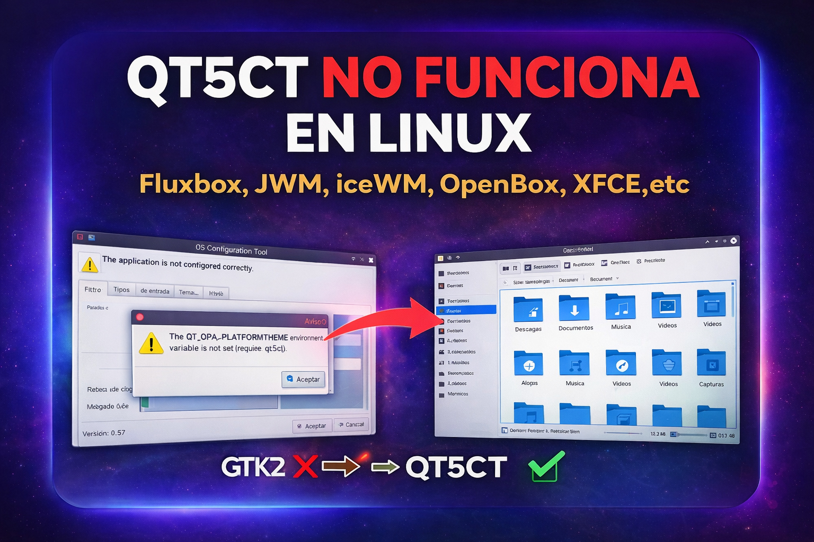

# Qt5ct no configura mis aplicaciones Qt5 de KDE ejem el Administrador de Archivos Dolphin, Kdenlive, Kate, Ksnip, etc



**Actualizado 20260409:** 

## **A quién está dirigido este tutorial**

Si tu eres un usuario de algún Linux y el ordenador no tiene los suficientes recursor puedes instalar un gestor de ventanas ligero como:

-   Fluxbox
-   JWM
-   Openbox
-   iceWM,etc 

pero para los programas escritos en Qt necesitarás poder configurar sus temas y sus iconos para que se vean bien, ejemplo el administrador de archivos Dolphin (y otras aplicaciones escritas en Qt) y es posible que aparezca sin iconos [Gestor o Administrador de Archivos Dolphin](https://facilitarelsoftwarelibre.blogspot.com/2019/11/instalar-correctamente-dolphin-en-entornos-no-kde.html) 

**Nota:** La mayoría de los programas usan qt5ct, puede que haya gluno que necesite qt6ct, ejemplo yo he hecho algunos programas escritos en Qt6 y ahí si instalo qt6ct para elegir por ejemplo el tema oscuro, pero esto es en escritorios no KDE.


### Instalar qt5ct

Primero actualiza los repositorios y los paquetes

sudo apt update && sudo apt upgrade 

Instalalo desde la terminal con:

```bash
sudo apt install qt5ct 
```

la mayoría de los programas usan Qt5

### Ejemplo de problema con programas Qt 

Les cuento que no solamente si uno instala gestores de ventanas ligeros como iceWM, JWM, Fluxbox, Openbox, etc hay que instalar qt5ct sino también en MX Linux 23 de 64 o 32 bits en la versión XFCE me da problemas el programa:

-   Ksnip

porque a veces se cuelga

Además no puedo personalizar las fuentes en el programa de edición de videos:

-   Kdenlive

lo cual es crucial para mi porque debe ponerle las letras más pequeñas debido a mi configuración personal con el monitor

además sino se puede configurar no se puede personalizar programas como:

-   Dolphin
-   Kate

---

## Solución en MX Linux 23 XFCE: qt5ct no reconoce QT_QPA_PLATFORMTHEME (se queda en gtk2)

Si estás usando MX Linux con entorno XFCE y al abrir qt5ct te aparece este mensaje:

```
The application is not configured correctly  
The QT_QPA_PLATFORMTHEME environment variable is not set (required value: qt5ct)
```


aunque hayas añadido correctamente en `.profile`  (lo cual antes funcinonaba en MX Linux 19, 21 -abajo del post están esas configuraciones-):

```bash
export QT_QPA_PLATFORMTHEME=qt5ct
```

y al verificar ves esto:

```bash
echo $QT_QPA_PLATFORMTHEME

```

te da esto:

```bash
gtk2
```

lo cual significa que no se está usando qt5ct

👉 entonces este tutorial es exactamente para ti.

---

## ❗ ¿Qué está pasando realmente?

En MX Linux 23 XFCE, el sistema **sobrescribe automáticamente** la variable:

```
QT_QPA_PLATFORMTHEME
```

Esto se hace mediante un script interno del sistema que fuerza el valor:

```
gtk2
```

👉 Es decir, **aunque tú configures qt5ct, MX Linux lo ignora** y aplica su propia configuración.

---

## 🔍 ¿Dónde ocurre esto?

MX Linux 23 usa [un script en](https://github.com/MX-Linux/desktop-defaults-xfce-mx/blob/main/56xfce4-qtconfig):

```
/etc/X11/Xsession.d/56xfce4-qtconfig
```

Este script:

* Detecta que estás usando XFCE
* Asigna automáticamente `QT_QPA_PLATFORMTHEME=gtk2`
* Sobrescribe cualquier configuración previa

Pero también tiene una solución integrada 👇

---

## ✅ SOLUCIÓN CORRECTA (forma oficial en MX Linux)

MX Linux permite cambiar este comportamiento mediante un archivo de configuración del usuario.

### Paso 1: Crear la carpeta (si no existe)

Con el siguiente comando será creada si no existe la carpeta "MX-Linux" dentro de "config", y si ya estuviera creada no se preocupe no se realizará ningún cambio:

```bash
mkdir -p ~/.config/MX-Linux
```

### Paso 2: Crear el archivo de configuración

pon el siguiente comando el cual creará el archivo qt_plugin.conf y escribirá dentro de el "qt5ct":

```bash
printf 'qt5ct\n' > ~/.config/MX-Linux/qt_plugin.conf
```

---

### Paso 3: Cerrar sesión COMPLETA

⚠️ Importante: no basta con reiniciar terminal.

Debes:

* Cerrar sesión desde el menú
* Volver a iniciar sesión

---

### Paso 4: Verificar

```bash
echo $QT_QPA_PLATFORMTHEME
```

Debe mostrar:

```bash
qt5ct
```

---

## Resultado

Ahora sí podrás abrir:

```bash
qt5ct
```

sin errores, y configurar correctamente:

* Tema Qt
* Iconos
* Fuentes
* Estilo visual

---

## ⚠️ Relación con problemas en aplicaciones (ej: Ksnip)

Este problema no es solo estético.

Aplicaciones Qt como:

* Ksnip

pueden:

* congelarse
* comportarse de forma extraña
* fallar al integrarse con GTK

👉 Esto ocurre porque el sistema fuerza el uso de `gtk2`, que es una tecnología antigua.

Al cambiar a `qt5ct`, muchas de estas inestabilidades desaparecen.

### ¿Cómo cambiar el tema de iconos para las aplicaciones KDE como ejem Dolphin?

Allí debe ir a la pestaña "Icon Theme":


por defecto el tema de iconos está en Adwaita (el cual no tiene iconos para ninguna de las aplicaciones KDE), debe usted de ponerlo en "Brisa" (el que acabamos de instalar con breeze) o en "Oxygen":

**Tema de iconos Brisa**


Así queda:


**Tema de iconos Oxygen**

Así queda:


### Eligiendo otro tipo de fuentes tipográficas

Configurando el tipo de fuentes usada, ejemplo FreeSans que me gusta mucho (hay fuentes que aunque uno use ejemplo el tamaño 9 tienen otro tamaño que otro tipo de fuente ejemplo Dejavú Sans):


### Kdenlive personalizado

Kadenlive en la pantalla que uso yo no entra bien, por eso tengo que personalizarlo, y me queda bien así;

- En qt5ct, Fuentes FreeSans 9
- Preferencias > Esquemas de color: Brisa claro
- Preferencias > Estilo: windows


### Consultas

**Configure Qt5 Application Style, Icons, Fonts And More With Qt5ct ~ Web Upd8: Ubuntu / Linux blog**  
[http://www.webupd8.org/2015/11/configure-qt5-application-style-icons.html](http://www.webupd8.org/2015/11/configure-qt5-application-style-icons.html)  

**desktop-defaults-xfce-mx /56xfce4-qtconfig**   
[https://github.com/MX-Linux/desktop-defaults-xfce-mx/blob/main/56xfce4-qtconfig](https://github.com/MX-Linux/desktop-defaults-xfce-mx/blob/main/56xfce4-qtconfig)  
Puedes revisarlo para entender cómo se detecta XFCE, se asigna `gtk2` por defecto, se permite sobrescribir mediante `qt_plugin.conf`.  

---

## SOLUCIÓN ARREGLAR EN .PROFILE PARA MX Linux 19, 21, antiX 19, 21, Debian 10, 11

En algún administrador de archivos vea los archivos ocultos y abra el archivo (yo lo habrí con Gedit): ,p

`.profile`


allí:


allí coloque lo siguiente:

```bash
export QT_QPA_PLATFORMTHEME="qt5ct"
```

debe quedar así:


y guardar y cerrar

Cerrar sesión y volver a entrar

Abra Qt5Ct, lo puede lanzar si lo tiene instalado desde la terminal así:

```bash
qt5ct
```

o también está entre sus aplicaciones

y verá que funciona

---

Dios les bendiga

---

## Consultas

**[Solved] Getting qt5ct and QT5 themes to work**  
[https://bbs.archlinux.org/viewtopic.php?pid=1930885#p1930885](https://bbs.archlinux.org/viewtopic.php?pid=1930885#p1930885)
