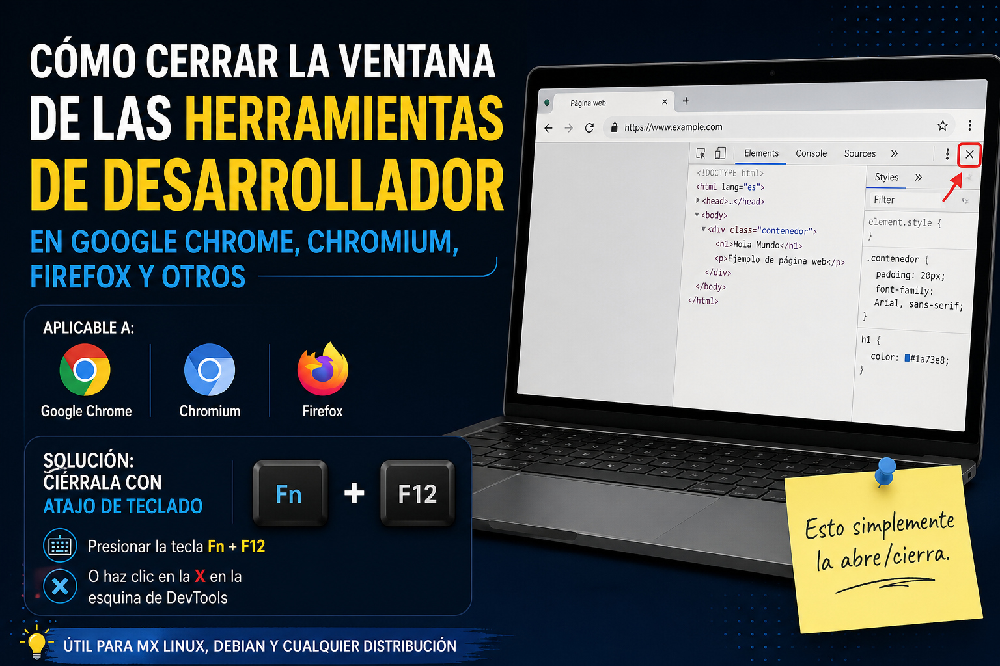

# Cómo cerrar la ventana de las herramientas de desarrollador en el Navegador Web Google Chrome, Chromium, Firefox y otros

Estaba navegando en internet en Google Chrome en MX Linux 23, y algo toqué que no recuedo y se abrieron las herramientas de desarrollador (DevTools una ventana se desplegó a la derecha y no sabía cómo cerrarla)

## Aplicable a:

- Google Chrome
. Chromium
- Firefox

# SOLUCIÓN: Cerrarla con atajo de teclado

* Se debería cerrar presionando: **F12**

Pero en mi caso uso un teclado externo Logitech Pebble Keys K 380s conectado por Bluetooth a la laptop Dell, e hice esto.

* Presionar la tecla **Fn + F12**
* O haz clic en la **X** en la esquina de DevTools

Esto simplemente la abre/cierra.

