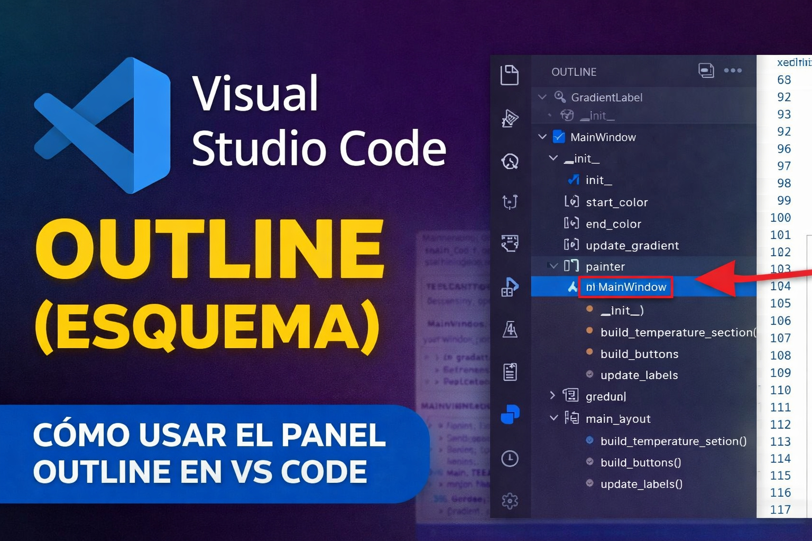

# Visual Studio Code “Outline” (Esquema de símbolos)



Para listar métodos, funciones, clases, etc en [Visual Studio Code](https://code.visualstudio.com/) esto se llama:

👉 **Outline (Esquema / Outline View)**

## Requisitos

**Para ver el esquema de símbolos en un archivo Python** necesitamos tener instalada la extesión Python de Microsoft:

[https://marketplace.visualstudio.com/items?itemName=ms-python.python](https://marketplace.visualstudio.com/items?itemName=ms-python.python)  

## ✅ Panel lateral

1. Ve al panel izquierdo, estando en el Explorer abre un archivo `.py`  
3. Busca búsca abajo la sección:  

👉 **OUTLINE**  


Dale clic y allí verás:  

* Clases
* Métodos
* Funciones
* Variables


## ¿Qué es lo que aparece debajo de una clase en Outline?

Cuando desplegamos una clase como la que se ve en el archivo de la imagen de arriba:

```python
class MainWindow(QMainWindow):
```

en el panel **Outline**, en este ejemplo veremos elementos como:

* `__init__`
* `temp_min`
* `temp_max`
* `brightness_min`
* `central`
* `main_layout`

👉 Estos elementos representan **los componentes internos de la clase**.

---

## Explicación sencilla

```
MainWindow (Clase)
 ├─ __init__           → Método (función de la clase)
 ├─ temp_min           → Variable (atributo)
 ├─ temp_max           → Variable (atributo)
 ├─ brightness_min     → Variable (atributo)
 ├─ central            → Objeto interno
 └─ main_layout        → Objeto interno
```

---

## Tipos de elementos que muestra Outline

### 1 Métodos

Ejemplo:

```python
def __init__(self):
```

👉 Es una función dentro de la clase
👉 Se ejecuta cuando se crea el objeto

---

### 2️ Atributos (variables)

Ejemplo:

```python
self.temp_min = 2000
self.temp_max = 6500
```

👉 Son datos que pertenecen a la clase

---

### 3️ Objetos internos

Ejemplo:

```python
self.central = QWidget()
self.main_layout = QVBoxLayout(self.central)
```

👉 Son componentes que la clase utiliza internamente

---

## ¿Para qué sirve esto?

El panel Outline permite:

* Navegar rápidamente por el código
* Ir directamente a variables o métodos
* Entender la estructura de una clase sin leer todo el archivo

---

## 💡 Nota importante

A diferencia de otros editores, Visual Studio Code no solo muestra:

* clases
* funciones

sino también:

✅ atributos (`self.variable`)  
✅ objetos internos  
✅ estructura completa de la clase  

---

# Extensión `AZ AL Dev Tools/AL Code Outline`

Alternativa para ver solo clases y métodos (como en [Kate en Linux](https://facilitarelsoftwarelibre.blogspot.com/2025/01/kate-habilitar-autocomplementado-con-python3-pylsp.html))

En Visual Studio Code, el panel **Outline** muestra una vista muy completa del código:

* Clases
* Métodos
* Funciones
* Variables (atributos)

Pero en algunos casos puede resultar **demasiado detallado**, ya que también muestra variables internas como:

```
temp_min
brightness_min
central
main_layout
```

---

## Solución: usar una extensión alternativa

Si deseas una vista más limpia (similar a **Kate en Linux**), puedes usar la extensión:

📎 **AZ AL Dev Tools/AL Code Outline**   
[https://marketplace.visualstudio.com/items?itemName=andrzejzwierzchowski.al-code-outline](https://marketplace.visualstudio.com/items?itemName=andrzejzwierzchowski.al-code-outline)  


---

## ¿Qué hace esta extensión?

Esta extensión añade un panel alternativo al **Outline**, donde puedes ver:

* Clases
* Métodos
* Estructura del código

👉 **sin mostrar variables internas**

---

## Ventaja principal

Permite navegar el código de forma más simple:

```
MainWindow
 ├─ __init__()
 ├─ build_temperature_section()
 ├─ build_buttons()
 └─ update_labels()
```

✅ Más limpio  
✅ Más enfocado  
✅ Ideal para archivos grandes  

---

## Dónde aparece

Una vez instalada:

* Se añade debajo del panel **OUTLINE**  
* Funciona como una vista alternativa  

---

## ⚠️ Nota importante

Esta extensión fue creada principalmente para el lenguaje **AL (Business Central)**, pero:

👉 También funciona con otros archivos (como Python, HTML, etc.)  
👉 Puede usarse como reemplazo del Outline estándar  

En la siguiente imagen gif el funcionamiento de AL OUTLINE:  


Dios les bendiga


