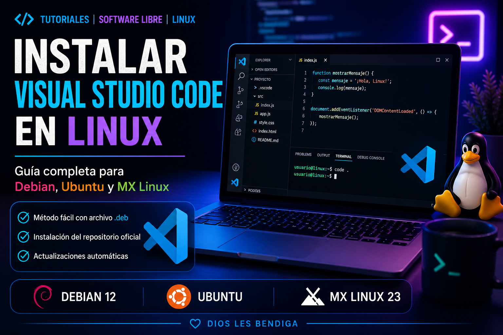

# Cómo instalar Visual Studio Code en Linux (Debian, Ubuntu, MX Linux 23)



Este tutorial te enseña cómo instalar Visual Studio Code en distribuciones basadas en Debian como:

* MX Linux ✅
* Debian 12 ✅
* Ubuntu ✅
* Etc

---

# Método 1 — Instalación fácil con archivo `.deb` (RECOMENDADO)

👉 Este es el método más sencillo y recomendado por Microsoft.

## Paso 1: Descargar VS Code

Ve a la página oficial:

👉 [https://code.visualstudio.com/download](https://code.visualstudio.com/download)

Descarga el archivo:

✔ `.deb (64-bit)`

## Paso 2: Instalar el paquete

### Instalación con clic derecho desde el administrador de archivos

En tu distro Linux debería estar disponible alguna herramienta para instalar paquetes deb, si es así solo dale clic derecho e instalar el paquete deb, siga las instrucciones. Y por un caso he hecho una entrada sobre cómo instalar paquetes deb en Linux [aquí](https://facilitarelsoftwarelibre.blogspot.com/2016/09/instalar-paquetes-deb-con-gdebi.html).

### Instalación desde terminal:

Abre una terminal en la carpeta donde descargaste el archivo y ejecuta:

```bash
sudo apt install ./code_*.deb
```

## Si estás en una distro antigua

Si por alguna razón falla, usa:

```bash
sudo dpkg -i code_*.deb
sudo apt-get install -f
```

## Paso 3: Actualizaciones automáticas

Cuando instalas el `.deb`, automáticamente:

✔ Se agrega el repositorio oficial  
✔ Se instala la clave de seguridad  

Puedes constatar el repositorio oficial revisando desde tu administrador de archivos la siguiente ruta:

```
/etc/apt/sources.list.d/
```

donde deberá estar el archivo:

```
vscode.sources
```

que si le das doble clic verás su contenido.

También lo podrás ver cuando hagas:

```bash
sudo apt update
```

Ejemplo a mi aparece así:

```bash
$ sudo apt update
[sudo] contraseña para wachin:     
Lo siento, pruebe otra vez.
[sudo] contraseña para wachin:     
Obj:1 https://mirror.cedia.org.ec/mx-workspace/mx/repo bookworm InRelease
Obj:2 https://dl.google.com/linux/chrome/deb stable InRelease                                      
Obj:3 http://security.debian.org/debian-security bookworm-security InRelease                       
Obj:4 https://brave-browser-apt-release.s3.brave.com stable InRelease                              
Des:5 http://deb.debian.org/debian bookworm-updates InRelease [55,4 kB]                            
Obj:6 https://dl.google.com/linux/chrome-stable/deb stable InRelease                               
Obj:7 http://deb.debian.org/debian bookworm InRelease                                              
Obj:8 https://downloads.cursor.com/aptrepo stable InRelease                                        
Obj:9 https://packages.microsoft.com/repos/code stable InRelease                  
Descargados 55,4 kB en 2s (35,2 kB/s)
Leyendo lista de paquetes... Hecho
Creando árbol de dependencias... Hecho
Leyendo la información de estado... Hecho
Todos los paquetes están actualizados.
```

Como ves allí está esta línea:

```
https://packages.microsoft.com/repos/code stable InRelease 
```

Si deseas puedes entrar allí desde el navegador web:

[https://packages.microsoft.com/repos/code](https://packages.microsoft.com/repos/code)

y sigue esta ruta:

pool > main > c > code

y busca la fecha más reciente, ejemplo a esta fecha 27 de abril de 2026 yo veo esta fecha:


y yo tengo en el programa:


VS Code se actualizará cuandos hagas `sudo apt install update && sudo apt install upgrade` o desde Synaptic al recargar los repositorios y marcar las actualizaciones y aplicarlas, o desde tu Sistema Operativo Linux con algún sistema de actualizaciones automáticas, **pero cuando envien la actualización para Linux**, por tal motivo cuando estés usando **Visual Studio Code** es posible que algún día te aparezca un mensaje de que está disponible una nueva versión, pero si tu tratas de instalarla desde los paquetes del Sistema es posible que no aparezca, no tengas cuidado, la solución es esperar a que la envien para Linux.

---


# Método 2 — Instalación manual del repositorio (Opcional)

Este método es más técnico, por si alguien no quiere instalar el deb y sólo instalarlo desde la línea de comandos:

## Paso 1: Instalar clave de seguridad

```bash
sudo apt-get install wget gpg &&
wget -qO- https://packages.microsoft.com/keys/microsoft.asc | gpg --dearmor > microsoft.gpg &&
sudo install -D -o root -g root -m 644 microsoft.gpg /usr/share/keyrings/microsoft.gpg &&
rm -f microsoft.gpg
```

## Paso 2: Añadir repositorio

Sólo si sabes usar **nano** pon:

```bash
sudo nano /etc/apt/sources.list.d/vscode.sources
```

Y pega esto:

```
Types: deb
URIs: https://packages.microsoft.com/repos/code
Suites: stable
Components: main
Architectures: amd64,arm64,armhf
Signed-By: /usr/share/keyrings/microsoft.gpg
```

Guarda y cierra (Por cierto he hecho un tutorial de cómo usar [nano](https://facilitarelsoftwarelibre.blogspot.com/2024/08/como-usar-nano-en-linux.html))

pero sino sabes usar **nano** más rapido usa **Gedit** que siempre me ha funcionado bien para cosas de terminal con permisos de super usuario, sino lo tienes instalado instalalo:

```bash
sudo apt install gedit
```

y luego:

```bash
sudo gedit /etc/apt/sources.list.d/vscode.sources
```

pon el anterior contenido, y Guarda y cierra.

## Paso 3: Instalar VS Code

```bash
sudo apt install apt-transport-https &&
sudo apt update &&
sudo apt install code
```

# ▶️ Ejecutar Visual Studio Code

Desde terminal:

```bash
code
```

O desde el menú de aplicaciones.

# 🔁 Actualizaciones

Para actualizar:

```bash
sudo apt update && sudo apt upgrade
```

---

# Nota 

En el sitio de microsoft hay un mensaje que dice:

👉 Debido al proceso de firma manual y al sistema de publicación que utilizamos, el repositorio de Debian podría tener un retraso de hasta tres horas y no obtener de inmediato la última versión de VS Code.

---

# Problemas con VS Code en Linux con X11 WM

Si usas un Gestor de Ventanas x11 (x11 Window Manager) minimalista como:

- JWM
- Fluxbobx
- Openbox
- iceWM
- etc, etc

es posible que alguna extensión no funciona, más si usted mismo lo ha instalado y configurado, ejemplo para Fluxbox encontré solucion:

**Visual Studio Code no arranca, no funciona con la extensión CodeGeeX en Fluxbox**  
[https://facilitarelsoftwarelibre.blogspot.com/2026/04/visual-studio-code-no-arranca-no-funciona-con-la-extension-codegeex-en-fluxbox.html](https://facilitarelsoftwarelibre.blogspot.com/2026/04/visual-studio-code-no-arranca-no-funciona-con-la-extension-codegeex-en-fluxbox.html)

---

Dios les bendiga

---


