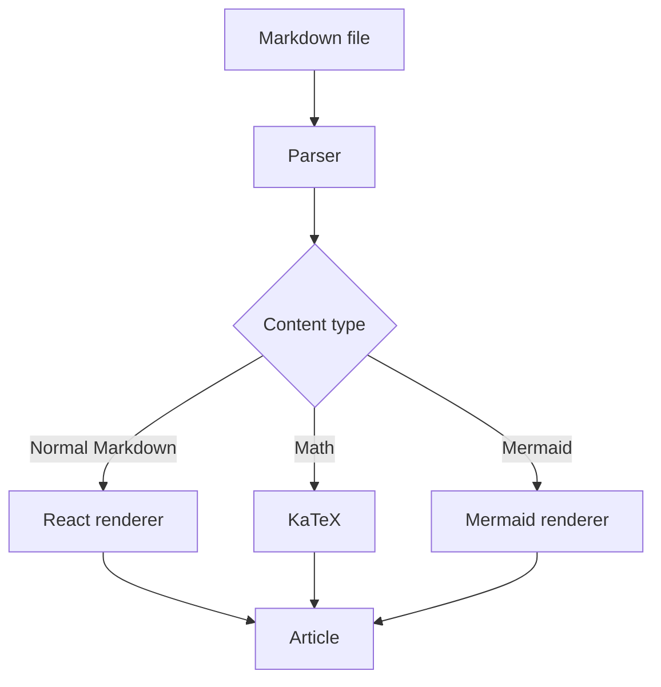
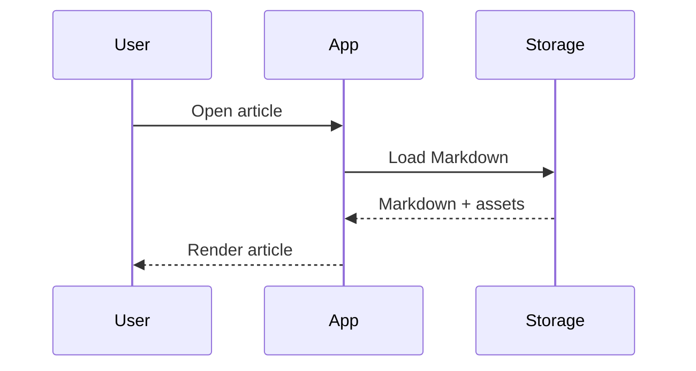
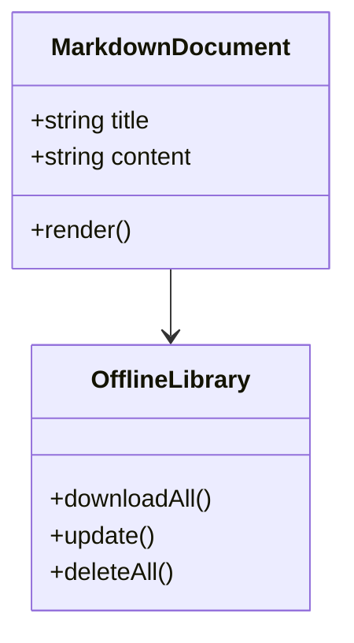
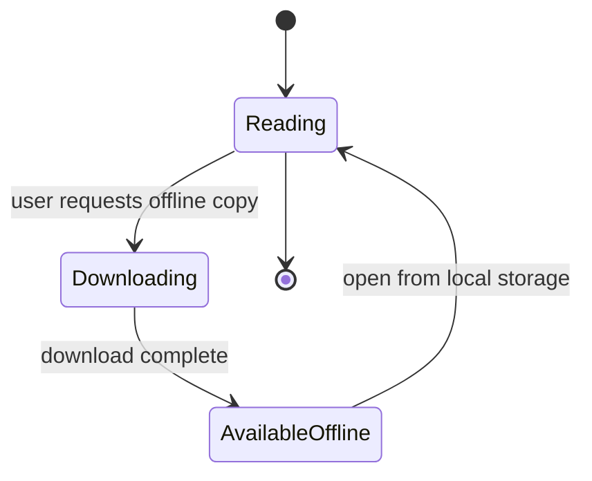
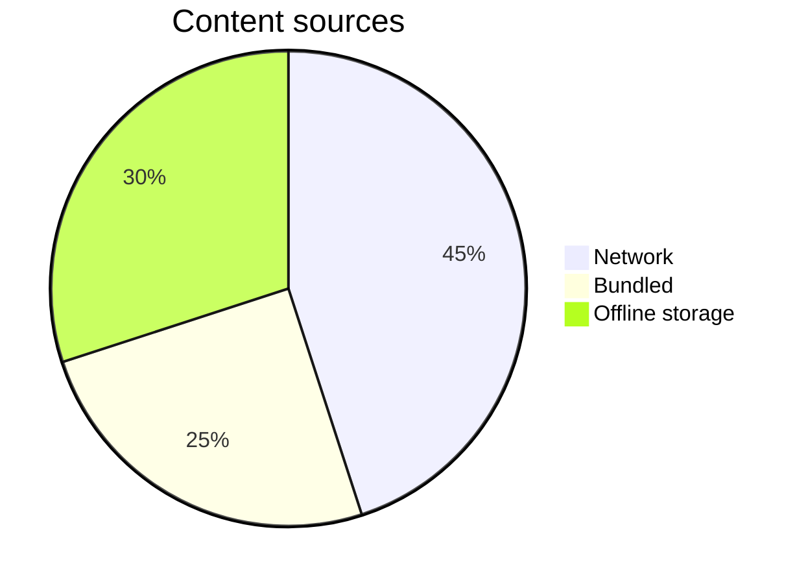

# MDHoriZon — Golden Test Document

This document is the permanent rendering fixture for MDHoriZon.

It is intentionally broad. It is not intended to be beautiful content; it is intended to expose rendering regressions.

---

# 1. Headings

## Heading level 2

### Heading level 3

#### Heading level 4

##### Heading level 5

###### Heading level 6

ATX headings may also be closed:

## Closed heading with trailing hashes ##

Setext headings use an underline instead of a leading hash:

Heading level 1 (setext)
========================

Heading level 2 (setext)
------------------------

Inline markup inside a heading must render without breaking the heading itself:

## Heading with **bold**, *italic* and `code`

Duplicate headings must receive deterministic and distinct anchor IDs, so that links to either one remain stable:

## Duplicate heading

## Duplicate heading

---

# 2. Paragraphs and Inline Formatting

This is a normal paragraph with **bold text**, *italic text*, ***bold italic text***, and ~~strikethrough~~.

Here is `inline code`, an escaped character \*that should not become italic\*, and special characters:

`& < > " ' © ® ™ € £ ¥`

---

# 3. Links

- External link: [GitHub](https://github.com/)
- Relative link: [Another article](../articles/example.md)
- Anchor link: [Go to Mermaid](#12-mermaid)
- Email-style text: `example@example.com`

GFM autolinks — bare URLs, `www.` hosts and angle-bracketed URLs must all become links:

- Bare URL: https://example.com/path?query=1#fragment
- Bare www host: www.example.com
- Angle-bracketed URL: <https://example.com/>
- Angle-bracketed e-mail: <example@example.com>

Reference-style links, with the definition placed later in this document:

- Full reference: [MDHoriZon repository][repo-ref]
- Collapsed reference: [repo-ref][]
- Shortcut reference: [repo-ref]

A link with a title attribute (the title must survive into the rendered `title`):

[GitHub with title](https://github.com/ "GitHub home page")

Line breaks. The two lines below are separated by a soft line break; the second pair is separated by two
trailing spaces, which must produce a hard line break.

Soft
break

Hard  
break

A backslash at the end of a line must also produce a hard line break:\
this text starts on a new line.

[repo-ref]: https://github.com/wachin/MDHoriZon "MDHoriZon on GitHub"

---

# 4. Images

Remote image example. This requires network access; with no network it must fail exactly as gracefully as the
missing-image case below:


Relative image example. The file exists at `tests/fixtures/images/example.png` and must resolve relative to this
document, not relative to the application or the page URL:


Redundant `./` and `..` segments must be normalized rather than treated as a literal path:


Image with a title attribute (the title must survive into the rendered `title`):


Decorative image with intentionally empty alt text. It must not be announced by assistive technology and must
not produce a broken-image placeholder:


Very wide image. It must stay inside the viewport, keep its aspect ratio, and scroll or shrink instead of
stretching the layout:


Very tall image. It must not force the page to become unusable without scrolling:


Missing image example. `tests/fixtures/images/does-not-exist.png` **intentionally does not exist**; this is a negative
test, not an unfinished task, and creating that file would delete this test case. Expected behavior: the
article keeps rendering, the alt text stays available, and nothing throws.


Image used as a link:

[](https://github.com/)

Image inside a list item:

- List item with an image: 
- Item after the image.

Image inside a table cell:

| Placement | Image |
|---|---|
| Table cell |  |

---

# 5. Lists

## Unordered

- First item
- Second item
  - Nested item
  - Another nested item
    - Third level
- Final item

## Ordered

1. First
2. Second
   1. Nested first
   2. Nested second
3. Third

## Task list

- [x] Completed item
- [ ] Pending item
- [ ] Another pending item

## Loose list (blank lines between items)

- First item, separated from the next by a blank line.

- Second item.

- Third item.

## List item containing multiple paragraphs

1. First paragraph of the item.

   Second paragraph of the same item, which must stay inside the item rather than escaping into the document.

2. Next item.

## Ordered list starting at a number other than 1

5. Fifth
6. Sixth
7. Seventh

The rendered list must preserve the starting number rather than silently renumbering from 1.

## List item containing a fenced code block

- Item with code:

  ```bash
  echo "code inside a list item"
  ```

- Item after the code block.

## Mixed nested list

- Unordered item
  1. Ordered child
     - Unordered grandchild
  2. Second ordered child
- Final unordered item

---

# 6. Blockquotes

> This is a blockquote.
>
> It contains multiple paragraphs.

> Nested example:
>
> > Inner quotation.

---

# 7. Code Blocks

## Bash

```bash
#!/usr/bin/env bash

echo "Hello from MDHoriZon"
printf 'Current directory: %s\n' "$PWD"
```

## Python

```python
from pathlib import Path

root = Path(".")
for path in root.rglob("*.md"):
    print(path)
```

## JavaScript

```javascript
const message = "Hello, MDHoriZon!";
console.log(message);
```

## TypeScript

```typescript
interface Article {
  title: string;
  tags: string[];
  offline: boolean;
}

const article: Article = {
  title: "Golden Test",
  tags: ["markdown", "testing"],
  offline: true,
};
```

## JSON

```json
{
  "name": "MDHoriZon",
  "offline": true,
  "features": ["GFM", "KaTeX", "Mermaid"]
}
```

## HTML

```html
<article>
  <h1>Example</h1>
  <p>HTML should be handled according to the project's security policy.</p>
</article>
```

## CSS

```css
.article {
  max-width: 72rem;
  margin-inline: auto;
  padding: 1rem;
}
```

## Unknown language

```not-a-real-language
This must still render as readable code.
```

## Long line

```text
This is intentionally an extremely long line intended to verify horizontal scrolling rather than forcing the entire document or viewport to become unnecessarily wide on desktop or mobile devices.
```

## Unbroken long token

```text
https://example.com/a/deliberately/long/unbroken/path/that/cannot/wrap/at/all/and/must/instead/scroll/horizontally/without/stretching/the/viewport/0123456789abcdefghijklmnopqrstuvwxyzABCDEFGHIJKLMNOPQRSTUVWXYZ0123456789
```

## Plain text block with no language declared

```
No language is declared for this fence, and it must still render as a readable code block.
```

## Empty code block

```text
```

## Indented code block (four spaces, no fence)

    indented code block, first line
    indented code block, second line

## Language alias and uppercase identifier

```JS
console.log("Alias and uppercase language identifiers must not crash the highlighter")
```

---

# 8. Tables

## Small table

| Name | Type |
|---|---|
| Markdown | Content |
| React | UI |
| Mermaid | Diagram |

## Three columns

| Feature | Web | Mobile |
|---|---:|---:|
| Markdown | Yes | Yes |
| Offline | Optional | Yes |
| Mermaid | Yes | Yes |

## Five columns

| Feature | Web | Mobile | Offline | Notes |
|---|---|---|---|---|
| Markdown | Yes | Yes | Yes | One core for every target |
| Tables | Yes | Yes | Yes | Horizontal scrolling on narrow screens |
| Mermaid | Yes | Yes | Yes | Lazy-loaded |

## Eight columns

| F1 | F2 | F3 | F4 | F5 | F6 | F7 | F8 |
|---|---|---|---|---|---|---|---|
| a | b | c | d | e | f | g | h |
| i | j | k | l | m | n | o | p |

## Wide table — 12 columns

| C1 | C2 | C3 | C4 | C5 | C6 | C7 | C8 | C9 | C10 | C11 | C12 |
|---|---|---|---|---|---|---|---|---|---|---|---|
| A1 | A2 | A3 | A4 | A5 | A6 | A7 | A8 | A9 | A10 | A11 | A12 |
| B1 | B2 | B3 | B4 | B5 | B6 | B7 | B8 | B9 | B10 | B11 | B12 |

## Formatted cells

| Feature | Example |
|---|---|
| Bold | **important** |
| Italic | *emphasis* |
| Code | `npm install` |
| Link | [GitHub](https://github.com/) |
| Long text | This is a deliberately long cell that should remain readable without breaking the table layout. |

## Alignment variants

| Left | Center | Right | Default |
|:---|:---:|---:|---|
| l | c | r | d |
| a longer cell | a longer cell | a longer cell | a longer cell |

## Table without leading or trailing pipes

Name | Value
--- | ---
Alpha | 1
Beta | 2

## Escaped pipe and pipe inside inline code

| Case | Rendered as |
|---|---|
| Escaped pipe | a \| b |
| Pipe inside inline code (escaped for the table) | `a \| b` |
| Pipe escaped inside a link label | [a \| b](https://github.com/) |

## Empty cells

| A | B | C |
|---|---|---|
| 1 |  | 3 |
|  | 2 |  |

## Mathematical expressions inside cells (where supported)

| Formula | Meaning |
|---|---|
| $E = mc^2$ | mass-energy equivalence |
| $\frac{a}{b}$ | fraction |
| $\sum_{i=1}^{n} i$ | sum |

## Wide table — 20 columns

| C1 | C2 | C3 | C4 | C5 | C6 | C7 | C8 | C9 | C10 | C11 | C12 | C13 | C14 | C15 | C16 | C17 | C18 | C19 | C20 |
|---|---|---|---|---|---|---|---|---|---|---|---|---|---|---|---|---|---|---|---|
| A1 | A2 | A3 | A4 | A5 | A6 | A7 | A8 | A9 | A10 | A11 | A12 | A13 | A14 | A15 | A16 | A17 | A18 | A19 | A20 |
| B1 | B2 | B3 | B4 | B5 | B6 | B7 | B8 | B9 | B10 | B11 | B12 | B13 | B14 | B15 | B16 | B17 | B18 | B19 | B20 |

---

# 9. Horizontal Rule

Content before the rule.

---

Content after the rule.

---

# 10. Escaping and Special Characters

Literal Markdown characters:

\*asterisk\*  
\_underscore\_  
\[brackets\]  
\# hash  
\> greater-than

HTML entities:

`&amp;` &amp;  
`&lt;` &lt;  
`&gt;` &gt;

## Unicode, bidirectional text and emoji

Accented Latin: á é í ó ú ñ ü ç ß Å Æ Ø å æ ø

CJK: 日本語のテキスト、中文文本、한국어 텍스트

Right-to-left: العربية and עברית must render with correct direction, including when they contain punctuation.

Mixed direction on one line: English text, العربية text, more English text.

Emoji: 😀 🚀 🧪 🇦🇷 👩‍💻 — the last one is a zero-width-joiner sequence and must not be split apart.

Mathematical and typographic symbols: ∀x ∈ ℝ, ∑ ± × ÷ ≤ ≥ ≠ ∞ → ⇒ ⌘ € £ ¥ © ® ™ …

## CJK emphasis and the CommonMark flanking rules

CommonMark decides whether `**` may open or close by *flanking* rules. One of them is: a closing `**` that is
preceded by a punctuation character may only close if it is followed by whitespace or punctuation. Chinese,
Japanese and Korean prose is written without spaces, so a construction that is completely normal in those
languages — bold around a quoted phrase, immediately followed by more text — fails that test and the asterisks are
rendered literally:

- **「重要」**中文 — the closing `**` is preceded by punctuation (`」`) and followed by a letter (`中`), so
  CommonMark refuses to close it. The expected rendering today is **literal asterisks**, not bold.
- **（注）**の続き — the same shape with Japanese brackets and kana.
- 中文**强调**。 — this one must **become bold**: the closing `**` is preceded by a letter, so it is right-flanking.

An implementation can fix the first two with a parser extension — one that allows `**` to close after Unicode
punctuation when the next character is CJK. Whether MDHoriZon adopts one is a Phase 1 decision; the survey of prior
art is in [`docs/references.md`](../../docs/references.md). That class of fix applies to asterisks only, so
underscore emphasis (`__…__`) keeps the CommonMark behavior.

This section is pinned on purpose: if the extension is adopted, the expected output of the first two lines changes
and this section must be updated deliberately, with the decision recorded.

---

# 11. Mathematics

## Inline

Einstein's famous equation is $E = mc^2$.

Another example: $a^2 + b^2 = c^2$.

## Display

$$
\int_0^\infty e^{-x}\,dx = 1
$$

## Fraction

$$
\frac{a}{b} + \frac{c}{d}
$$

## Sum

$$
\sum_{i=1}^{n} i = \frac{n(n+1)}{2}
$$

## Matrix

$$
\begin{bmatrix}
1 & 2 & 3 \\
4 & 5 & 6 \\
7 & 8 & 9
\end{bmatrix}
$$

## Long expression

$$
\frac{\partial}{\partial t}
\left(
\frac{1}{2}\rho |\mathbf{u}|^2
\right)
+
\nabla \cdot
\left[
\left(
\frac{1}{2}\rho |\mathbf{u}|^2 + p
\right)\mathbf{u}
\right]
= 0
$$

## Superscripts, subscripts and Greek letters

Inline: $x^2 + y_1$, $a_{n+1}$, $\alpha$, $\beta$, $\gamma$, $\Delta$, $\Omega$, $\theta$.

## Text inside math

$$
\text{rate} = \frac{\Delta x}{\Delta t}
$$

## Aligned expressions

$$
\begin{aligned}
a &= b + c \\
  &= d + e
\end{aligned}
$$

## Formulas inside lists

- Inline math in a list item: $E = mc^2$.
- Display math inside a list item:

  $$
  \sum_{i=1}^{n} i = \frac{n(n+1)}{2}
  $$

- Item after the math.

## Formulas inside blockquotes

> Inline math inside a blockquote: $a^2 + b^2 = c^2$.
>
> Display math inside a blockquote:
>
> $$
> \int_0^1 x\,dx = \frac{1}{2}
> $$

Formulas inside table cells are covered in section 8.

## Missing and invalid math must degrade gracefully

An unterminated delimiter must stay literal instead of swallowing the rest of the paragraph: $E = mc^2

An unknown command must produce an error (or a literal fallback) without crashing the article:
$\thisCommandDoesNotExist{x}$

Currency must not be mistaken for mathematics: the item costs $5 and the other costs $10 today.

An escaped dollar renders as a literal dollar sign: \$100.

---

# 12. Mermaid

## Flowchart



## Sequence diagram



## Class-style example



## State diagram



## Additional supported diagram type



## Invalid diagrams must not crash the article

The first block below is malformed Mermaid syntax; the second is not Mermaid at all. Both must produce visible
error feedback (or a readable fallback) while the rest of the document keeps rendering.

```mermaid
flowchart TD
    A[Unclosed label --> B
```

```mermaid
this is not a valid mermaid diagram at all
```

---

# 13. Frontmatter

The following is an example of frontmatter syntax:

```yaml
---
title: Golden Test Document
description: MDHoriZon renderer validation fixture
date: 2026-09-13
tags:
  - markdown
  - testing
  - mdhorizon
---
```

The application must decide whether frontmatter is removed before rendering and how metadata is consumed.

Frontmatter is only recognized at the very start of a file, so this golden document cannot test it directly — the
block above documents the syntax, it is not a live frontmatter block. Real frontmatter parsing must be covered by a
separate fixture whose first bytes are the opening delimiter.

---

# 14. Raw HTML and Security

The following is intentionally included to verify the project's raw-HTML policy.

```html
<strong>Raw HTML test</strong>
```

Potentially dangerous examples must be tested by automated security fixtures rather than relying on visual inspection:

```html
<script>alert("unsafe")</script>
```

```html

```

```html
<a href="javascript:alert('unsafe')">unsafe link</a>
```

Dangerous SVG, embedded documents and other unsafe external resources:

```html
<svg><script>alert("unsafe")</script></svg>
```

```html
<svg onload="alert('unsafe')"><circle r="10" /></svg>
```

```html
<iframe src="https://example.com"></iframe>
```

```html
<object data="https://example.com"></object>
```

```html
<embed src="https://example.com">
```

```html
<style>body { display: none }</style>
```

```html
<base href="https://evil.example/">
```

```html
<meta http-equiv="refresh" content="0;url=https://evil.example/">
```

```html
<form action="https://evil.example/"><input name="secret" type="password"></form>
```

Obfuscated unsafe URLs, which must be rejected by normalization rather than by naive string matching:

```html
<a href="JaVaScRiPt:alert('unsafe')">mixed-case javascript URL</a>
```

```html
<a href="java&#x73;cript:alert('unsafe')">entity-encoded javascript URL</a>
```

```html
<a href="  javascript:alert('unsafe')">javascript URL with leading whitespace</a>
```

Markdown-native unsafe URLs must also be rejected, not only the raw-HTML ones:

[Markdown link to javascript:](javascript:alert('unsafe'))

%3C%2Fscript%3E%3C%2Fsvg%3E)

[Markdown link with a data:text/html URI](data:text/html,%3Cscript%3Ealert('unsafe')%3C%2Fscript%3E)

Expected behavior is determined by the project's explicit sanitization policy.

---

# 15. Nested Content

> **Important note**
>
> - List inside a quote
> - Another item
>
> ```bash
> echo "code inside quote"
> ```

---

# 16. Content Mixing

A document can contain **bold**, `code`, [links](https://github.com/), formulas such as $x^2$, and lists together.

1. Install dependencies.
2. Run the application.
3. Open the article.
4. Test the Mermaid diagram.
5. Disable the network.
6. Open the same article from offline storage.

---

# 17. Offline Content Test

This section is specifically for the mobile offline feature.

The article must render correctly when loaded from:

1. Network.
2. Bundled application content.
3. Downloaded offline storage.

The rendered result should be equivalent regardless of source.

The application should also be able to resolve the relative image and relative link examples after the content has been downloaded.

---

# 18. Accessibility Checks

The rendered result should expose:

- A logical heading hierarchy.
- Keyboard-accessible links.
- Keyboard-accessible copy buttons.
- Meaningful image alternative text.
- Semantic tables.
- Visible focus indicators.
- Sufficient contrast.

Content that exercises those requirements:

- A decorative image that must be ignored by assistive technology: 
- A meaningful image that must be announced: 
- Collapsible content that must be keyboard operable (subject to the raw-HTML policy — if `<details>` is
  stripped, this case documents that decision rather than failing):

<details>
<summary>Expand for the hidden sentence</summary>

The hidden sentence.

</details>

---

# 19. Video

A video is media, not decoration. A YouTube URL must preview on the page, and it must be usable as an entry's
cover image when that entry has no image of its own — or when the video comes first. That is why the cover rule
counts images and videos together.

A video URL that makes up a whole paragraph is the case the in-page player is for. A video URL *inside a sentence*
stays an ordinary link, because replacing it with a player would break the prose around it:

[DeepSeek Harness: Tu propio Claude Code GRATIS](https://youtu.be/G7ZqUvFMSes?si=Qpzhs52nIY8xvdHv)

The same video as a bare URL must be turned into a link, and must still be recognised as a video, query string and
all:

https://youtu.be/G7ZqUvFMSes

The same video, this time inside a sentence, which must stay a link: mira este vídeo sobre [DeepSeek
Harness](https://www.youtube.com/watch?v=G7ZqUvFMSes) y dime qué te parece.

---

# 20. Final Regression Checklist

- [ ] H1–H6, setext and closed ATX headings render correctly.
- [ ] Duplicate headings receive deterministic, distinct anchors.
- [ ] Inline formatting renders correctly.
- [ ] Unicode, bidirectional text and emoji render correctly.
- [ ] CJK strong emphasis behaves as this document specifies, including the punctuation-adjacent cases.
- [ ] Links work, including autolinks, reference-style links, titled links and relative links to another document.
- [ ] Hard and soft line breaks behave as specified.
- [ ] Images work or fail gracefully, including the deliberately missing one.
- [ ] Decorative images expose empty alternative text and are not announced.
- [ ] Very wide and very tall images keep their aspect ratio without breaking the layout.
- [ ] Relative assets resolve correctly, including paths with redundant `./` and `..` segments.
- [ ] Lists render correctly, including loose lists, multi-paragraph items and lists starting at 5.
- [ ] Blockquotes render correctly, including nested ones.
- [ ] Code blocks highlight correctly, including unknown languages, aliases and indented blocks.
- [ ] Long code lines and unbroken tokens scroll horizontally.
- [ ] Copy button works and is keyboard accessible.
- [ ] Tables scroll horizontally on narrow screens.
- [ ] Wide tables (up to 20 columns) do not break the viewport.
- [ ] Table alignment, escaped pipes, empty cells and math inside cells render correctly.
- [ ] KaTeX renders correctly, including inside lists and blockquotes.
- [ ] Invalid or missing math degrades gracefully without crashing the article.
- [ ] Mermaid renders correctly, including state diagrams and additional diagram types.
- [ ] Mermaid errors do not crash the article and produce visible feedback.
- [ ] A YouTube link that stands alone is recognised as a video and previews without loading a third party.
- [ ] A video URL inside a sentence stays a link.
- [ ] A video URL with a query string is recognised.
- [ ] Themes remain readable.
- [ ] Unsafe content is sanitized according to policy, including SVG, iframes, `data:` URIs and obfuscated `javascript:` URLs.
- [ ] The complete document works offline.
- [ ] The complete document works inside Android WebView.
- [ ] The complete document works inside iOS WebView when available.

---

**This file is a rendering specification and regression fixture. Do not simplify it merely because the current application does not yet support every feature. Unsupported sections should become explicit roadmap/test targets.**
